import T from "../../components/i18n/T.astro";
import PressToLight from "../../components/content/PressToLight.astro";
import Explain from "../../components/content/Explain.astro";
import Quiz from "../../components/content/Quiz.astro";
import buttonBefore from "../../assets/images/blog/3d-printing-culture-festival/button-before.jpg";
import buttonLit from "../../assets/images/blog/3d-printing-culture-festival/button-lit.jpg";

<T>
  
    Last fall, I had the opportunity to run a stall at my town's culture
    festival. It's a chance for the townspeople to show off what they've been
    working on. From ceramics, to flower arrangements, to paintings, to games
    made in Scratch (a simple coding language that even kids can use), everyone
    shows off their creativity. This year, I got to have my own booth
    representing the board of education.
  
  
    去年の秋、私は町の文化祭で出店する機会がありました。文化祭は、町の人たちが取り組んできたものを披露する場です。陶芸作品から、生け花、絵画、そしてScratch（子どもでも使える簡単なプログラミング言語）で作ったゲームまで、みんなが自分の創造性を披露します。今年、私は教育委員会を代表して自分のブースを持つ機会を得ました。
  
  
    Last year, I had a table at the culture festival in Takko town. There are many different kinds of art there. 
  
</T>

## <T>Cris's Sparkly Circuit Challengeクリスのピカピカ回路チャレンジSparkly Circuit Challenge</T>

<figure>
  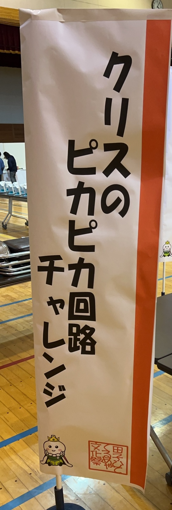
  <figcaption>
    <T>
      The banner for my booth.
      私のブースののぼり。
      My banner.
    </T>
  </figcaption>
</figure>

<T>
  
    My booth was named Cris's Sparkly Circuit Challenge. I built it around a
    hobby I've enjoyed for a while: electronics projects. I just love
    making small, usually useless gadgets out of cheap DIY parts. I also like to take apart broken electronics and try my best to fix them, especially things like old cameras or game systems, which are plentiful in the Japanese used market.
  
  
    私のブースは「クリスのピカピカ回路チャレンジ」という名前でした。前からずっと楽しんでいる趣味、つまり電子工作を中心にブースを作りました。安いDIYの部品で、たいてい役に立たない小さなガジェットを作るのが大好きなんです。それに、壊れた電子機器を分解して、なんとか直そうとするのも好きです。特に古いカメラやゲーム機など、日本の中古市場にたくさん出回っているものが好きです。
  
  
    My booth was called Cris's Sparkly Circuit Challenge. I love
    electronics projects. I like to fix old electronics too. I like to fix cameras and games. 
  
</T>

<T>
  
    I wanted to introduce the people of Takko to this amazing world. So I set up
    an experience where participants could build three circuits of increasing
    difficulty. My goals were to make it accessible to elementary schoolers,
    safe, and fun!
  
  
    私は田子の人たちに、この素晴らしい世界を紹介したいと思いました。そこで、参加者が難易度の上がっていく3つの回路を組み立てられる体験を用意しました。私の目標は、小学生でも取り組めて、安全で、楽しいものにすることでした！
  
  
    I wanted to show this world to the people of Takko. So I made three projects. There were easy, and hard ones. 
  
</T>

## <T>Preparation準備Getting Ready</T>

<T>
  
    Getting the experience ready took a lot of planning. I had to pick the
    projects, decide on the parts, write the instructions, and arrange everything
    on the day. It was tough! Even though I'd made my own projects before, making
    something that elementary schoolers could understand was a real challenge.
    It also had to be short, and within budget. 
  
  
    体験の準備にはかなりの計画が必要でした。プロジェクトを選び、部品を決め、説明書を作り、当日にすべてを並べなければなりませんでした。大変でした！以前に自分で工作をした経験はありましたが、小学生が理解できるように作るのはなかなかの挑戦でした。しかも、短くて予算内に収めるものにしないといけないのですから。
  
  
    Getting ready was a lot of work. I picked the projects. I chose the parts. I
    wrote the instructions. It was tough! Making it easy for kids was hard.
  
</T>

### <T>The Parts部品Parts</T>

<figure>
  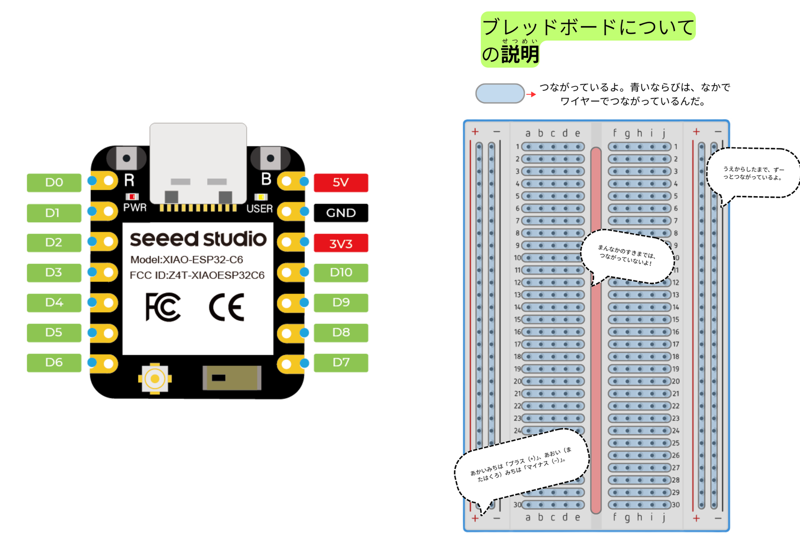
  <figcaption>
    <T>
      Left: the MCU I used for the projects. Right: a diagram I made about the breadboard.
      左：プロジェクトに使ったMCU。右：私が作ったブレッドボードの説明図。
      These are pictures to help the students.
    </T>
  </figcaption>
</figure>

<T>
  
    But I figured it out in the end. For the MCU (microcontroller unit), the{" "}
    <Explain meaning="most important part">heart of the project</Explain>, I
    used the cheap [XIAO ESP32-C6](https://www.seeedstudio.com/Seeed-Studio-XIAO-ESP32C6-p-5884.html) board. It's small, cheap, and had all the
    capabilities I needed. On top of that were parts like wires, sensors,
    buzzers, and LEDs. All easy to find and cheap. I ordered everything well in
    advance from AliExpress to keep the price as low as possible!
  
  
    でも、最終的にはなんとかなりました。プロジェクトの心臓部となるMCU（マイコン）には、安価な[XIAO ESP32-C6](https://www.seeedstudio.com/Seeed-Studio-XIAO-ESP32C6-p-5884.html)ボードを使いました。小さくて安く、必要な機能がすべて揃っていました。そのほかには、ワイヤー、センサー、ブザー、LEDといった部品を使いました。どれも簡単に手に入る安い部品です。できるだけ安くするために、AliExpressでかなり前もって注文しておきました！
  
  
    But I figured it out! For the brain, I used a cheap MCU called the
    [XIAO ESP32-C6](https://www.seeedstudio.com/Seeed-Studio-XIAO-ESP32C6-p-5884.html).
    It is small and cheap. I also used wires, sensors, buzzers, and
    LEDs. They are cheap and small.
  
</T>

### <T>The Instructions説明書Instructions</T>

<figure>
  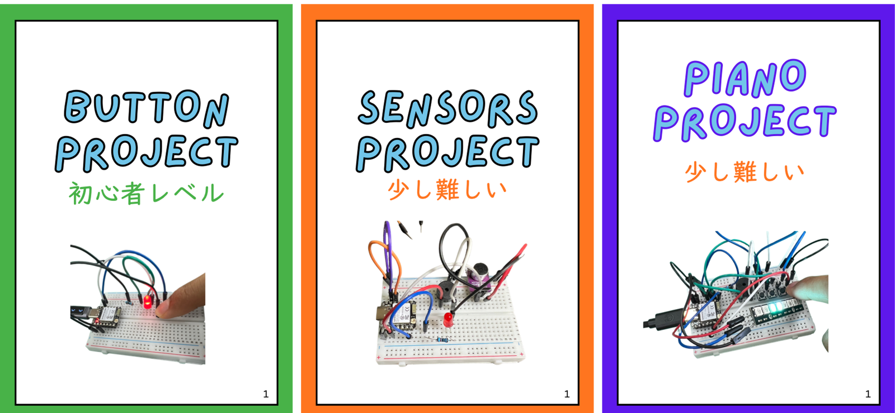
  <figcaption>
    <T>
      Three booklets, from easy to hard: Button, Sensors, and Piano.
      簡単なものから難しいものへ、3冊の説明書：ボタン、センサー、ピアノ。
      The green one is the easy one. The orange and purple ones are harder.
    </T>
  </figcaption>
</figure>

<T>
  
    This is where my teaching experience really{" "}
    <Explain meaning="became useful">came into play</Explain>. I made three
    instruction booklets showing exactly where to place each component and wire.
    I knew that if I made them too vague, they'd be too hard for the students.
    Even with precise instructions, many kids struggled, but most got there in
    the end.
  
  
    ここで、私の教員としての経験が本当に役立ちました。私は、どの部品とワイヤーをどこに置くかを正確に示した3冊の説明書を作りました。あいまいに作ってしまうと、生徒には難しすぎるとわかっていたからです。正確な説明書があっても、多くの生徒は苦戦しました。それでも、ほとんどの子は最後にはやり遂げました。
  
  
    I made three instruction books. They
    show where every part and wire goes.
  
</T>

<figure>
  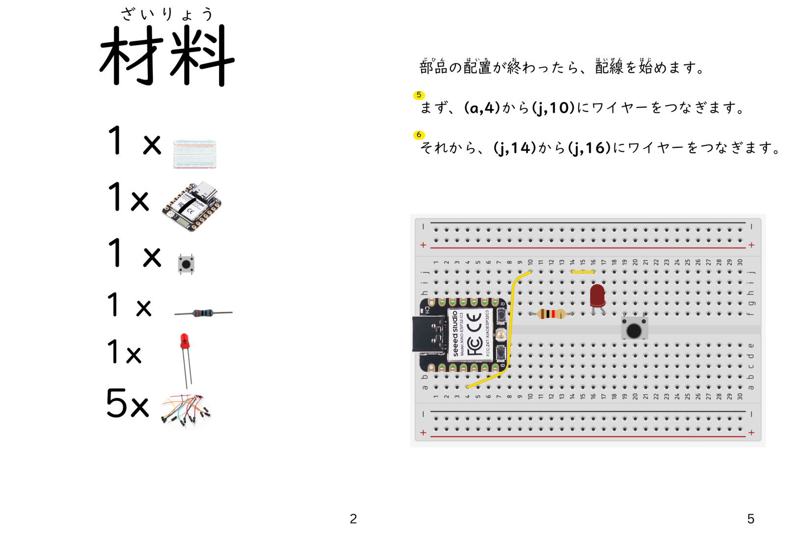
  <figcaption>
    <T>
      A peek inside the booklets.
      説明書の中身。
      Inside the books.
    </T>
  </figcaption>
</figure>

### <T>Programming the MCUMCUのプログラミングProgramming</T>

<figure>
  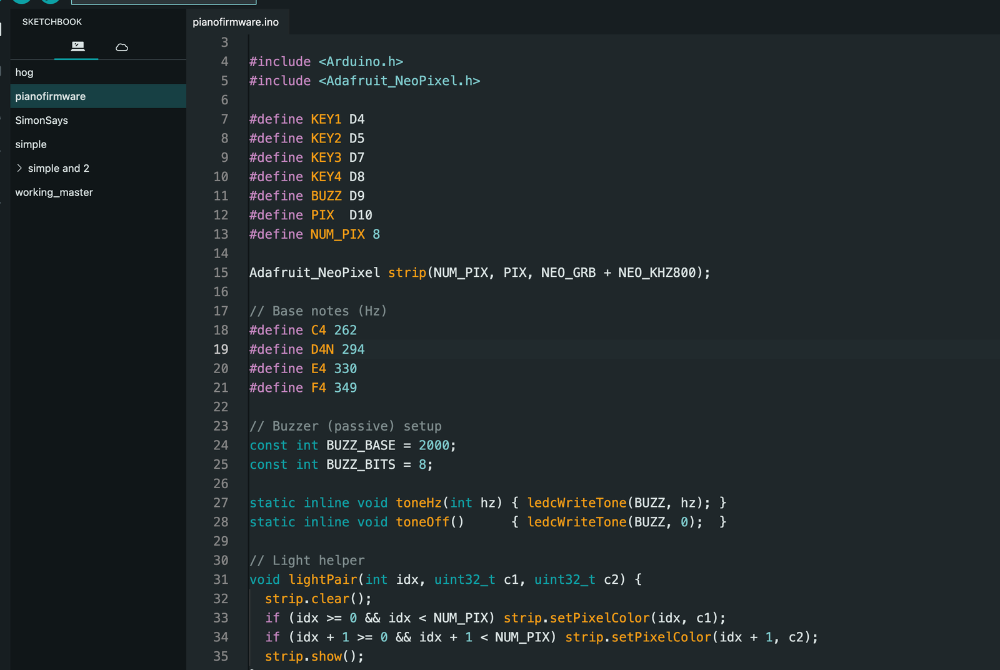
  <figcaption>
    <T>
      I used Arduino IDE to add the code to the MCU. 
      Arduino IDEを使って、MCUにコードを書き込みました。
      The code. I used Arduino IDE.
    </T>
  </figcaption>
</figure>

<T>
  
    Of course, it would have been fun to have the students write the firmware
    too, but I was short on time, so I pre-loaded it to keep the focus on the
    hands-on part. Luckily, for simple projects like these, there are lots of
    examples online, so it didn't take me long to work out. My programming skills helped too!
  
  
    もちろん、生徒たちにファームウェア（プログラム）も書いてもらえたら楽しかったのですが、時間が限られていたので、体験そのものに集中できるよう、あらかじめ書き込んでおきました。幸い、こうした簡単なプロジェクトなら、オンラインにたくさんの例があるので、私にとってはそれほど時間はかかりませんでした。私のプログラミングの経験も役立ちました！
  
  
    I made the program. It was hard, but I am good at programming, so it was ok!
  
</T>

### <T>Putting It All Together組み立てPutting It Together</T>

<figure>
  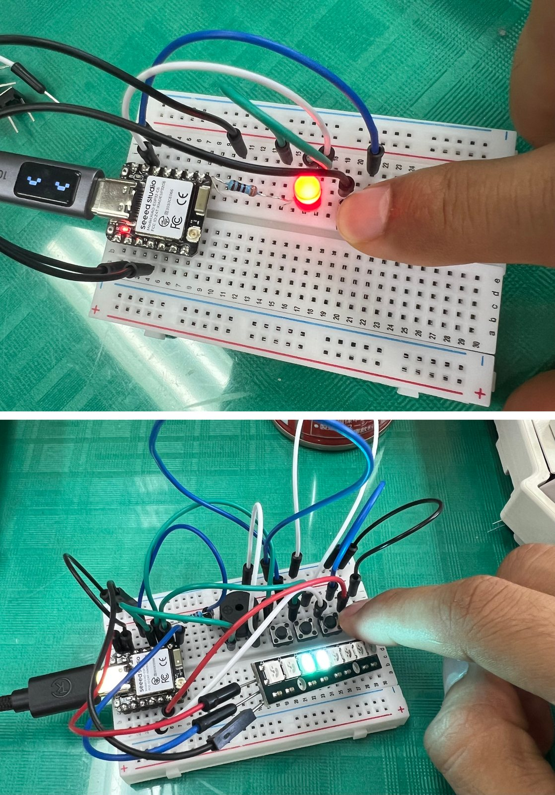
  <figcaption>
    <T>
      Testing the button and sensor circuits before the big day.
      本番前に、ボタンとセンサーの回路をテスト。
      Testing!
    </T>
  </figcaption>
</figure>

<T>
  
    After a lot of testing, both by myself and with my friend Kuriki, I finally
    got everything working, with instructions that actually made sense. With the
    circuits done, I turned my attention to the other, more showcase-y side of
    the booth.
  
  
    自分自身で、そして友人のクリキと一緒に何度もテストを重ねた末に、ようやくすべてが動くようになり、理解できる説明書もできあがりました。回路の準備が整ったので、私はブースのもう一つの、より「見せる」側面へと意識を向けました。
  
  
    I tested a lot. My friend Kuriki helped me. Finally, it all worked!
  
</T>

## <T>My 3D Printer私の3Dプリンター3D Printer</T>

<figure>
  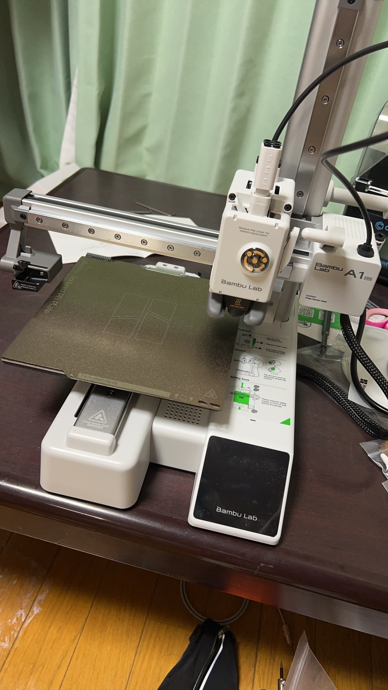
  <figcaption>
    <T>
      My A1 mini. It's my first 3D printer! I got it in Japan.
      私のA1 mini。初めての3Dプリンターです！日本で買いました。
      My 3D printer.
    </T>
  </figcaption>
</figure>

<T>
  
    The circuit experience wasn't the only thing I was showing off. I'd also
    recently gotten an A1 mini, a small, fairly cheap 3D printer, and this was
    the perfect chance to show it off! Back in America, it's common to find 3D
    printers at a library or a university, but out here in the countryside, many
    people have never seen one in person. Quite a few told me they'd only seen
    them in videos.
  
  
    回路の体験だけが、私が披露していたものではありません。実は、少し前に小型で比較的安価な3DプリンターであるA1 miniを手に入れていて、これはそれを披露する絶好の機会でした！アメリカでは図書館や大学に3Dプリンターがあるのはよくあることですが、ここ田舎では、実物を見たことがない人がたくさんいます。とはいえ、動画では見たことがあると言う人も多かったです。
  
  
    I got a small, cheap 3D printer.
    It is called the A1 mini. In America,
    libraries have 3D printers. But here in the Japanese countryside, many people never
    saw one. Some only saw them in videos.
  
</T>

## <T>What Can It Do?何ができるの？What Can It Do?</T>

<T>
  
    I decided to show three kinds of 3D prints at the festival: useful prints
    like the containers I used all over the booth, simple toys the kids loved,
    and a custom model I made of the town's mascot. I even printed a 3D map of my town with buildings. I didn't even know that was possible until I saw someone do it online! I wanted to show that you can
    make useful things, fun things, and things you design yourself, whether
    that's art or something practical.
  
  
    文化祭では、3種類の3Dプリントを見せることにしました。まず、ブースのあちこちで使った容器のような実用的なプリント。次に、子どもたちが大好きな簡単なおもちゃ。そして最後に、自分で作った町のマスコットのオリジナルモデルです。さらに、建物の付いた町の3Dマップも印刷しました。オンラインで誰かがやっているのを見るまで、そんなことができるとは知りませんでした！実用的なもの、楽しいもの、そしてアートであれ実用品であれ、自分で創り出したものが作れるということを見せたかったのです。
  
  
    I showed everyone the 3D prints. Useful things, like containers. Fun toys
    for the kids. And a model of the town mascot that I made. You can make useful
    things, fun things, and your own designs!
  
</T>

<Quiz
  id="favorite-one-piece-character"
  correctAnswerIndex={0}
  question={{
    en: "Can you guess my favorite One Piece character?",
    ja: "私の好きなワンピースのキャラクターを当てられますか？",
    en_simple: "Who is my favorite One Piece character?",
  }}
  options={[
    { en: "Zoro", ja: "ゾロ" },
    { en: "Luffy", ja: "ルフィ" },
    { en: "Chopper", ja: "チョッパー" },
    { en: "Sanji", ja: "サンジ" },
  ]}
/>

<figure>
  
  <figcaption>
    <T>
      Me holding my 3D-printed Zoro sword on Halloween.
      ハロウィンに、3Dプリントしたゾロの刀を持っているところ。
      That's me!
    </T>
  </figcaption>
</figure>

<T>
  
    But I think the swords were the biggest{" "}
    <Explain meaning="very popular">hit</Explain>. I was surprised myself to
    learn you can easily print the expanding swords that were so common in my
    childhood. They were cool and fun, but there were also models for more
    realistic swords, like Zoro's sword from One Piece, which I'm holding in the
    picture above! Instead of a collapsible sword printed in one piece, you print
    the separate parts and snap them together. It came out way better than I
    expected, and it was a huge hit!
  
  
    でも、一番人気だったのは刀（剣）だったと思います。子どもの頃によく遊んだ、伸びる剣が簡単に印刷できると知って、自分でも驚きました。それらはかっこよくて楽しかったのですが、もっとリアルな刀のモデルもありました。上の写真で私が持っている、ワンピースのゾロの刀のようなものです！その場で一体で印刷する折りたたみ式の剣とは違い、刀の各パーツを印刷してから、パチッとはめ合わせます。想像以上にうまく仕上がって、大人気でした！
  
  
    The swords were the best! Everyone liked Zoro's sword. I printed small parts, and then put them together. It's so cool!
  
</T>

## <T>At the Event当日At the Event</T>

<figure>
  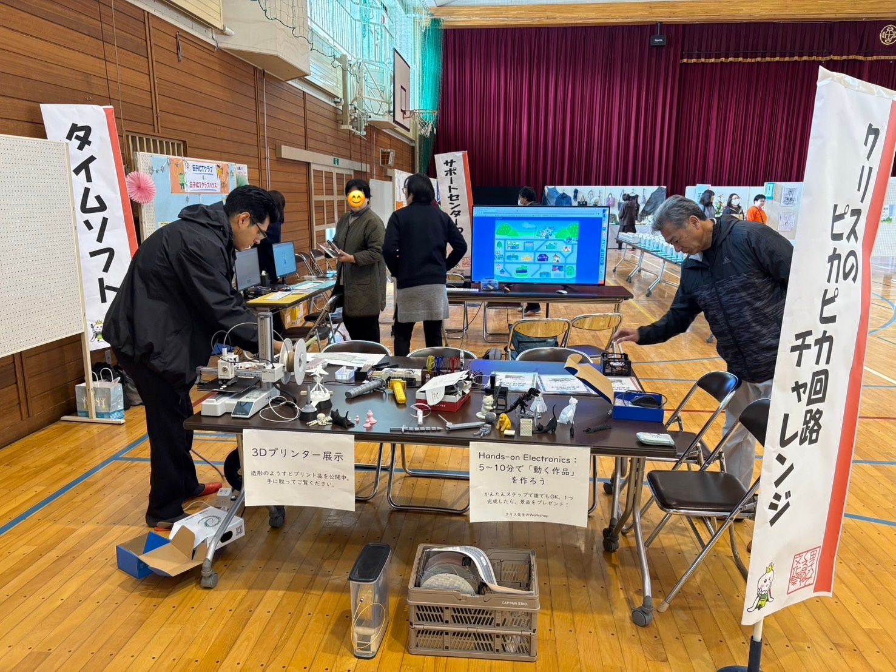
  <figcaption>
    <T>
      The booth, all set up.
      設営が終わったブース。
      Our booth.
    </T>
  </figcaption>
</figure>

<T>
  
    On the day of the event, Sato and Mr. Kuriki gave me a lot of help with
    setup and running the booth. Without them, it would have been a huge mess!
    I'm so grateful they were there.
  
  
    イベント当日は、佐藤さんとクリキさんが、設営と運営をたくさん手伝ってくれました。二人がいなければ、大混乱になっていたでしょう！本当にいてくれて感謝しています。
  
  
    On the day, Sato and Mr. Kuriki helped a lot. They helped me set up and run
    the booth. Thank you!
  
</T>

<figure>
  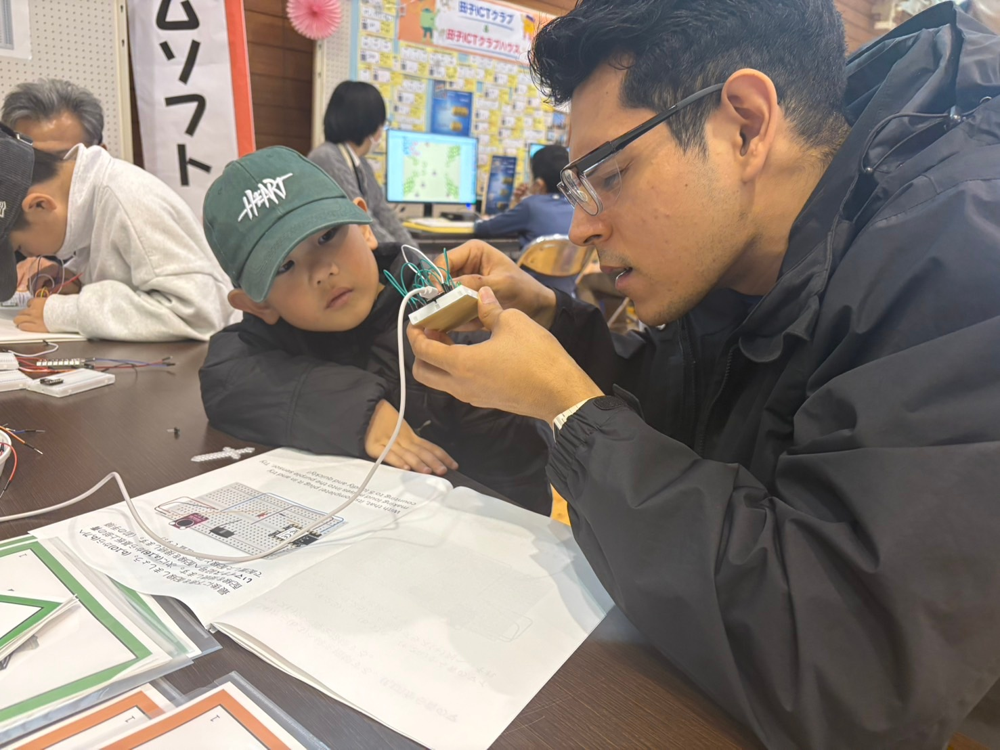
  <figcaption>
    <T>
      Helping a student. Even 1st graders took on the challenge! I was happy.
      生徒を手伝っているところ。1年生でもチャレンジしてくれました！うれしかったです。
      Helping a student. He was a 1st grader!
    </T>
  </figcaption>
</figure>

<T>
  
    I found that every student needed at least a little help. There were a few
    mistakes in my instructions, and some steps were just too messy for a young
    child to follow. It didn't help that the cheap breadboard I bought has
    misaligned numbers! Next time, I'd definitely{" "}
    <Explain meaning="spend more money">splurge</Explain> on nicer ones.
  
  
    どの生徒も、少なくとも少しは手助けが必要だとわかりました。私の説明書にはいくつか間違いがありましたし、幼い子どもには複雑すぎる手順もありました。さらに、私が買った安いブレッドボードは番号がずれていたのです！次回は、間違いなくもう少し良いものにお金をかけると思います。
  
  
    Every student needed help. My instructions had a few mistakes. Some
    steps were too hard for little kids. 
  
</T>

<figure>
  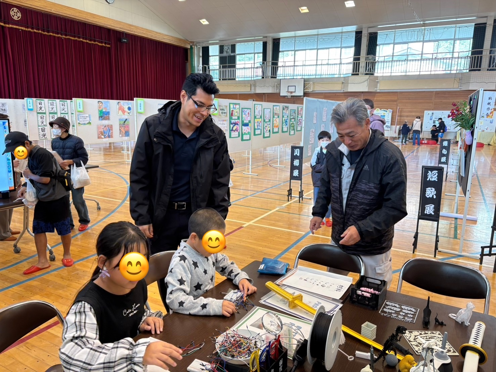
  <figcaption>
    <T>
      Two students working through the projects.
      プロジェクトに取り組む二人の生徒。
      Two students working hard!
    </T>
  </figcaption>
</figure>

<T>
  
    Despite the <Explain meaning="small problems">hiccups</Explain>, I think it
    went really well. Most students finished all three projects, and got a
    3D-printed item from my stash as a reward. 
  
  
    小さなトラブルはありましたが、とてもうまくいったと思います。ほとんどの生徒が3つのプロジェクトすべてを完成させ、ご褒美として私のストックから3Dプリントした品を受け取りました。
  
  
    Even with problems, it went well! Most students finished all three projects.
    They got a 3D-printed prize. 
  
</T>

<PressToLight
  off={buttonBefore}
  on={buttonLit}
  altOff="A student pressing the button, LED off"
  altOn="The LED strip lighting up"
/>

<T>
  
    I was glad so many students decided to take on the challenge. It was so satisfying to see the light turn on after assembling the maze of wires!
  
  
    たくさんの生徒がチャレンジしてくれて、うれしかったです。配線の迷路のような回路を組み立てたあとに明かりがつくのを見るのは、本当に気持ちよかったです！
  
  
    A lot of people took on the challenge! 
  
</T>

<figure>
  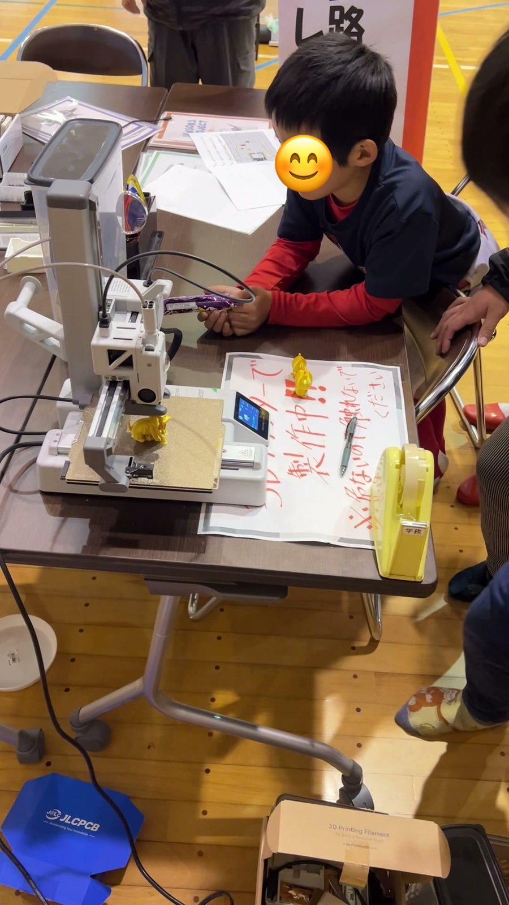
  <figcaption>
    <T>
      Many people stopped to watch the printer. 
      プリンターを見ようと、多くの人が足を止めました。
      Looking at the printer. 
    </T>
  </figcaption>
</figure>

<T>
  
    The 3D printer was an even bigger hit. It was such a strange sight in my town,
    especially with it printing live. Most people were shocked when I told them it was only 28,000 yen! I'm glad 3D printers have become so much more accessible. You really can
    make some amazing things.
  
  
    3Dプリンターは、さらに大人気でした。私の町では本当に珍しい光景で、しかも実際に印刷しているところを見せていました。たった28,000円だと伝えると、ほとんどの人が驚いていました！3Dプリンターがこんなに手に入りやすくなって、うれしいです。本当にすごいものが作れるんですよ。
  
  
    The 3D printer was popular. 3D printers are easy to
    get now. You can make amazing things.
  
</T>

<figure>
  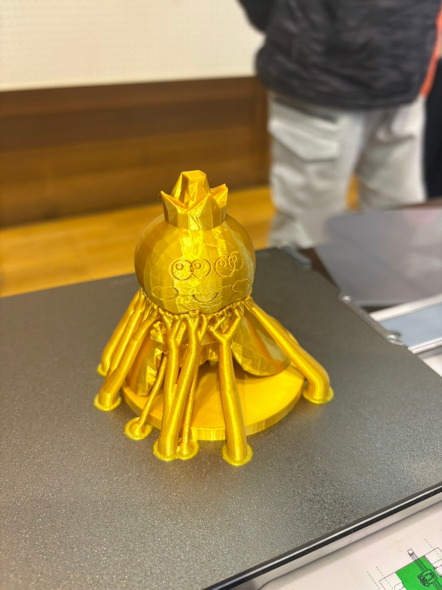
  <figcaption>
    <T>
      Takko Oji, still covered in printing supports.
      サポートに覆われたままのたっこ王子。
      Takko Oji, with supports.
    </T>
  </figcaption>
</figure>

<T>
  
    Speaking of amazing things, this was my model of the town's mascot, Takko
    Oji. If you can't tell, I messed up the face a little, but most people
    recognized him right away anyway! He's covered in tentacles in the picture,
    but those are just supports to hold him up while printing, and they come
    right off. I also made plenty of mini versions that kids could pick as prizes
    for finishing the experience.
  
  
    すごいものといえば——これは町のマスコット、たっこ王子の私のモデルです。わかるかもしれませんが、顔を少し失敗してしまいました。それでも、ほとんどの人はすぐに彼だとわかってくれました！写真では触手に覆われていますが、これは印刷中に支えておくためのサポートで、簡単に取れます。体験を終えた子が景品として選べるように、ミニサイズもたくさん作りました。
  
  
    This is my model of the town mascot, Takko Oji! I messed up the face a
    little. But it was ok. The long lines are supports for
    printing. They come off. I made many mini ones for prizes, too.
  
</T>

<figure>
  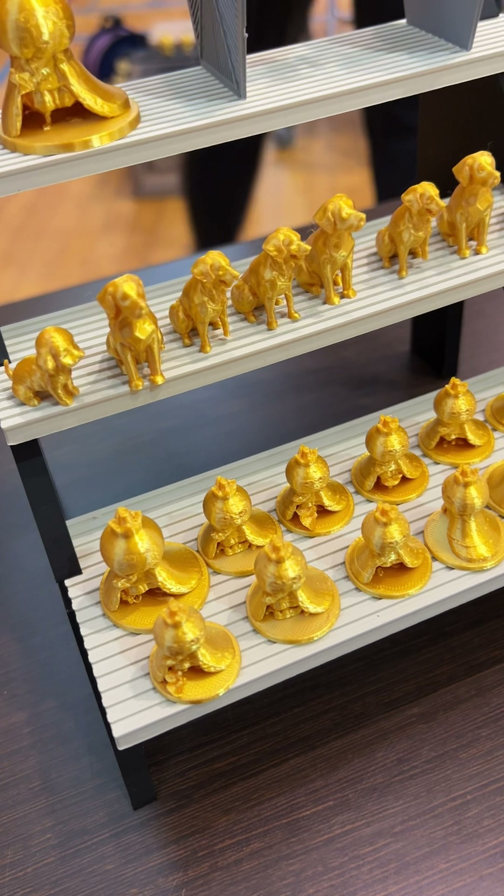
  <figcaption>
    <T>
      Various items I printed as prizes for those that completed the projects, and to showcase!
      プロジェクトを完成させた子への景品として、そして展示用に印刷したいろいろな品々です！
      Some of my 3D prints.
    </T>
  </figcaption>
</figure>

## <T>Finish!おわりにFinish!</T>

<T>
  
    All in all, it was a ton of work to set up, and it wasn't perfect, but
    showing off my hobbies at the town culture festival was wonderful, and it's
    easily become one of my{" "}
    <Explain meaning="most important memories">core memories</Explain>. I'm
    grateful to everyone who took part and helped out, and I hope a few people
    came away just a little more curious about the world of electronics and 3D
    printing!
  
  
    全体として、準備には膨大な手間がかかりましたし、完璧ではありませんでした。それでも、町の文化祭で自分の趣味を披露できたのは素晴らしい体験で、間違いなく私の大切な思い出の一つになりました。参加してくれた皆さん、手伝ってくれた皆さんに感謝しています。そして、電子工作や3Dプリンターの世界に、ほんの少しでも興味を持ってくれる人がいたら嬉しいです！
  
  
    It was a lot of work. It was not perfect. But sharing my hobbies at the
    festival was wonderful. It is now a special memory for me. Thank you to
    everyone who came and helped! I hope some people now like electronics and 3D
    printing a little more!
  
</T>
