import T from "../../components/i18n/T.astro";
import Explain from "../../components/content/Explain.astro";
import Gallery from "../../components/content/Gallery.astro";

<T>
  
    Today, I would like to share my experience at my first badminton tournament. It was an interesting experience that I never expected to have in Japan. I had never played badminton before I came to Japan. To be honest, I did not even think it was really a sport. I thought it was a fun game that was played at parties and such for fun. However, I <Explain meaning="learned through a difficult or surprising experience, not from being told">learned the hard way</Explain> just how serious it really is! I was introduced to badminton by my Japanese buddy, Kuriki. He is my coworker and has been playing for many years. He is amazing!
  
  
    今日は、私の初めてのバドミントン大会について話したいと思います。日本で経験するとは全く思っていなかった、とても面白い体験でした。日本に来るまで、バドミントンをしたことがありませんでした。正直に言うと、バドミントンが本格的なスポーツだとも思っていませんでした。パーティなどで楽しむカジュアルなゲームだと思っていたのです。しかし、実際にやってみて、本当に本格的なスポーツだということを身をもって学びました！バドミントンに出会ったのは、日本人の友人、栗木さんのおかげです。彼は同じ職場で働いており、長年バドミントンを続けています。本当に上手です！
  
  
    I went to my first badminton tournament. It was interesting! I started badminton when I came to Japan. It's a difficult game. My friend Kuriki taught me. We work at the same place. He is very good!
  
</T>

## <T>Let's Go to the Tournament!大会に出発！Let's Go!</T>

<figure>
  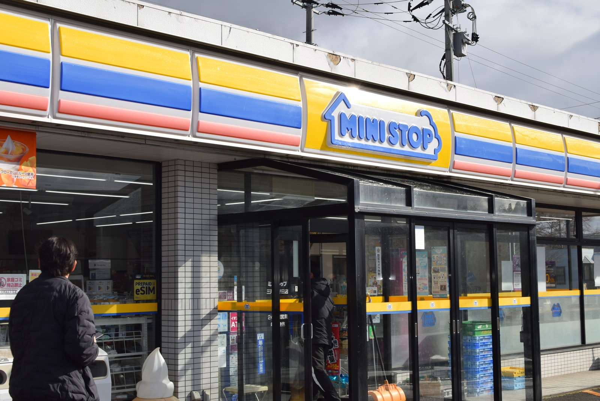
  <figcaption>
    <T>
      Mini stop is a conbini known for their desserts!
      ミニストップはデザートで有名なコンビニです！
      Ministop is a conbini. They are famous for desserts!
    </T>
  </figcaption>
</figure>

<T>
  
    The tournament was held in a nearby town known as Gonohe. Kuriki drove me and Luis, another American living in Takko who was my teammate today, to the venue. We stopped at a convenience store along the way for some snacks.
  
  
    大会は、五戸という近くの町で開催されました。栗木さんが、今日チームメートになる田子在住のもう一人のアメリカ人、ルイスと私を会場まで車で連れて行ってくれました。途中でコンビニに立ち寄ってお菓子を買いました。
  
  
    The tournament was in Gonohe town. Kuriki drove me and my teammate, Luis. We bought snacks at a conbini.
  
</T>

<figure>
  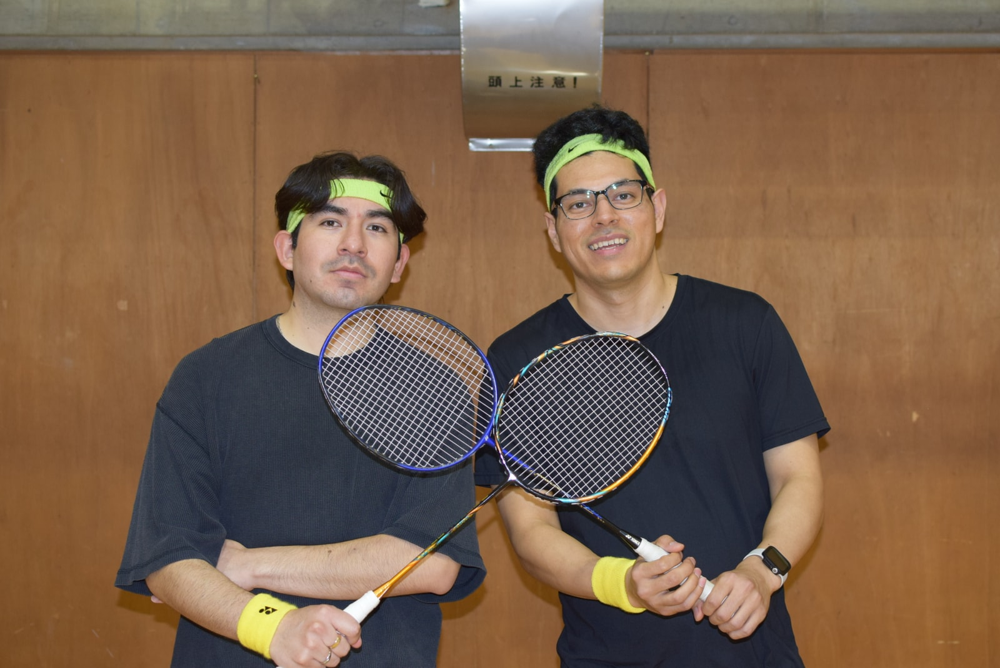
  <figcaption>
    <T>
      Me and Luis, matching!
      ルイスとお揃いコーデ！
      Me and Luis, matching!
    </T>
  </figcaption>
</figure>

<T>
  
    In preparation for our tournament together, we got matching headbands and wristbands so that everyone knew we were a team. It was also obvious we were a team since we were the only foreigners there.
  
  
    一緒に大会に出るにあたって、みんなに私たちがチームだとわかるよう、おそろいのヘアバンドとリストバンドをつけました。とはいえ、私たちが唯一の外国人だったので、チームだということはひと目でわかったと思いますが。
  
  
    We wore the same headbands and wristbands. This showed everyone we were a team. But, we were the only foreigners, so it was easy to tell!
  
</T>

<figure>
  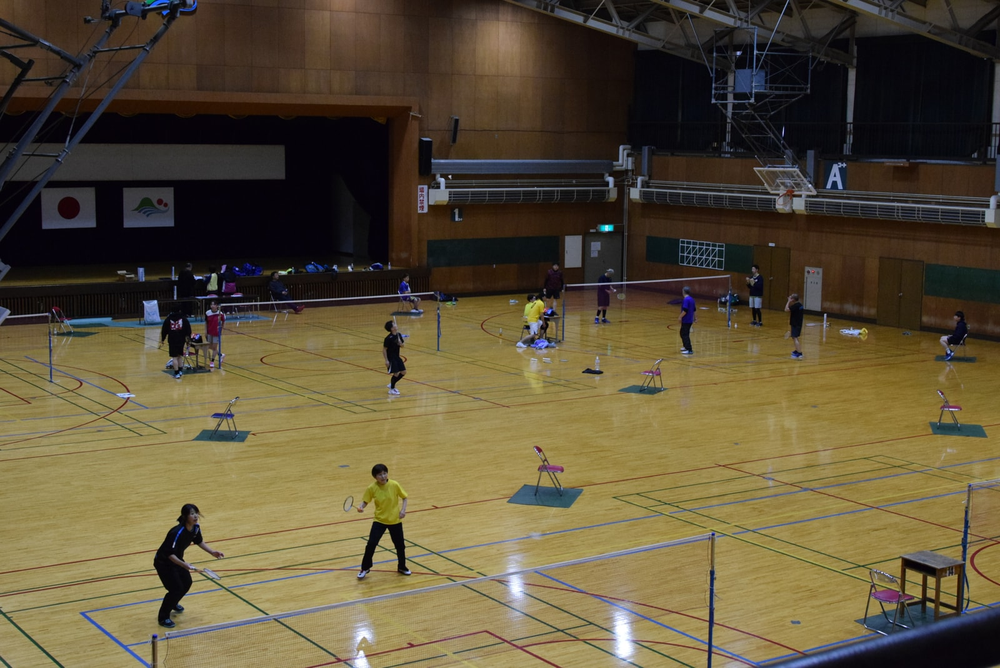
</figure>

<T>
  
    There was a wide range of people <Explain meaning="present at the event">in attendance</Explain>. It seemed like a mix of skilled players and people having fun joining their first tournament. Luis and I <Explain meaning="belonged to that group — we were the beginners">fell into the second category</Explain>. We had some time before our first match, so we warmed up and watched Kuriki play his first match. It was my first time seeing Kuriki play in a real game, so I got to see him in his <Explain meaning="how he really plays at his best — his full skill on display">true form</Explain>!
  
  
    参加者は幅広い層でした。熟練したプレイヤーもいれば、初めて大会に参加する人もいるように見えました。ルイスと私は後者でした。最初の試合まで時間があったので、ウォームアップをしながら栗木さんの最初の試合を観戦しました。栗木さんが実際の試合でプレーするのを見るのは初めてで、本領発揮の姿を見ることができました！
  
  
    Many different people were there. Some were very good players, and some were beginners like Luis and me. We watched Kuriki's first game. It was amazing to see him play!
  
</T>

<figure>
  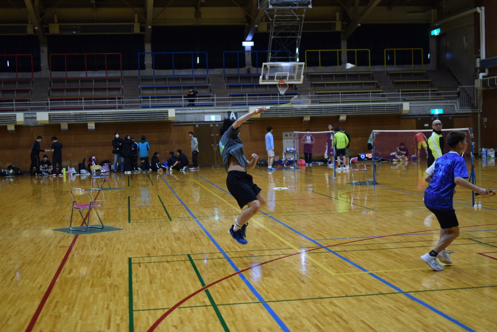
  <figcaption>
    <T>
      Kuriki in action!
      栗木さんのプレー！
      Kuriki playing!
    </T>
  </figcaption>
</figure>

## <T>Go Time!いざ試合！Go Time!</T>

<T>
  
    When the time came for our first match, I was nervous. I was not sure who our opponents would be, and I was worried we would be <Explain meaning="not good enough to compete — certain to lose">no match</Explain>!
  
  
    最初の試合が始まったとき、緊張しました。相手がどんな人たちかわからず、全く歯が立たないのではないかと心配でした！
  
  
    When our first game started, I was nervous. I worried we would lose.
  
</T>

<figure>
  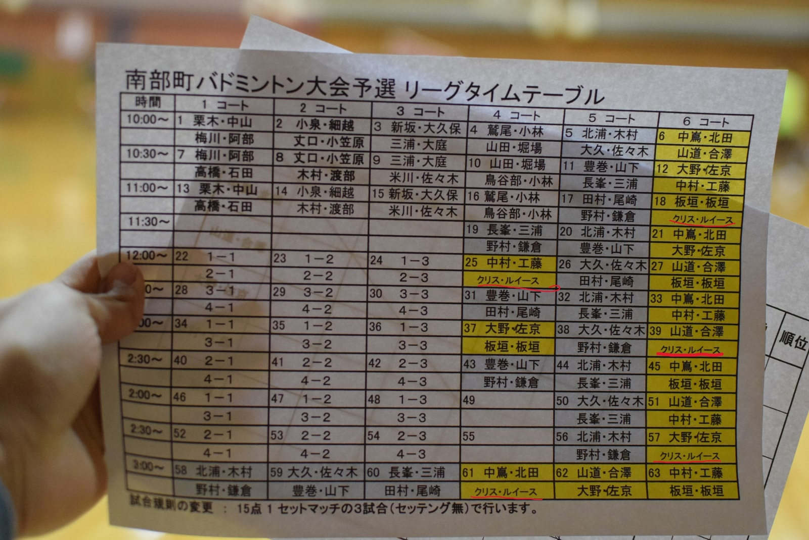
  <figcaption>
    <T>
      The tournament schedule. We played 5 matches. 
      大会のスケジュール表。5試合しました。
      The game schedule! We played 5 matches.
    </T>
  </figcaption>
</figure>

<T>
  
    However, to my surprise, we won the first match! Our opponents were also beginners, and though they fought <Explain meaning="bravely and with great effort">valiantly</Explain>, we managed to pull out the win! There were more games to go, but I was able to relax from then on.
  
  
    しかし、驚いたことに、最初の試合に勝ちました！相手も初心者で、よく頑張っていましたが、なんとか勝利を掴みました！まだ試合は続きますが、そこからはリラックスできました。
  
  
    We won the first game! Our opponents were beginners, too. I felt much better after we won.
  
</T>

<figure>
  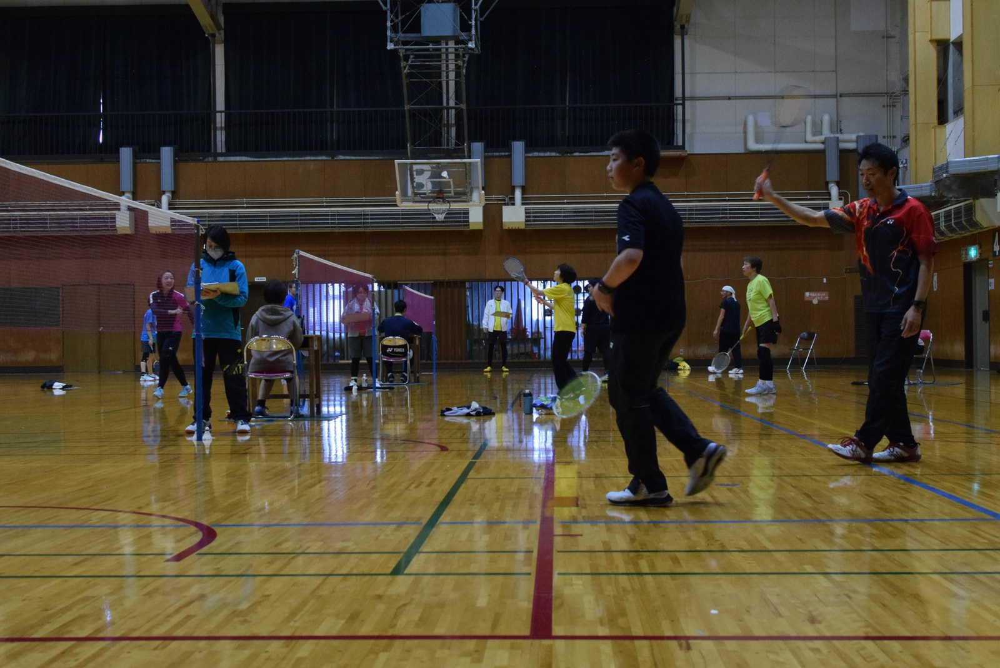
</figure>

<T>
  
    In the end, we went on to win a couple more matches, and we lost the last two. We were never officially told, but I think we got 3rd place! I was very happy with the results of our first tournament.
  
  
    結局、さらにいくつかの試合に勝ち、最後の2試合は負けました。公式には教えてもらいませんでしたが、3位だったと思います！初めての大会にしては、とても満足のいく結果でした。
  
  
    We won a few more games and lost some games too. I think we won 3rd place! I was very happy with the result.
  
</T>

<figure>
  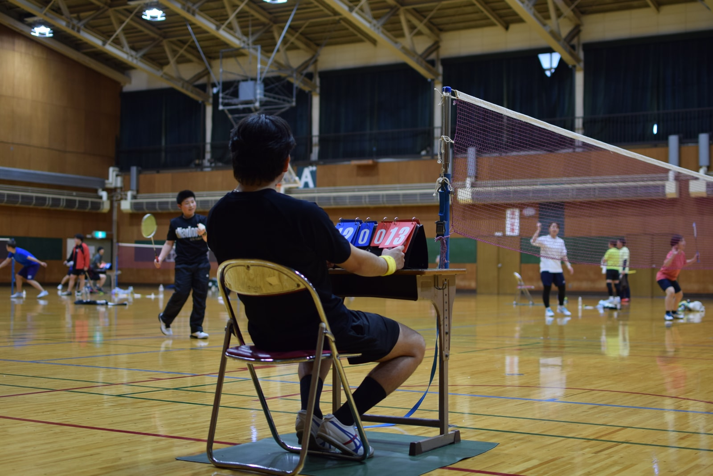
  <figcaption>
    <T>
      Luis on scorekeeping duty!
      スコア係のルイス！
      Luis is keeping score!
    </T>
  </figcaption>
</figure>

<T>
  
    We <Explain meaning="stayed nearby with nothing specific to do — just waiting and watching">hung around</Explain> until the end of the tournament for Kuriki and others to finish their matches. Kuriki and his partner also got third place! We did not win anything, but we did get a sandwich and a drink for free!
  
  
    大会の終わりまで残って、栗木さんや他の人たちの試合を見ていました。栗木さんとそのパートナーも3位でした！賞品はもらえませんでしたが、サンドイッチと飲み物を無料でもらいました！
  
  
    We watched Kuriki play. Kuriki also got 3rd place! We did not win a prize, but we got a free sandwich and drink!
  
</T>

<figure>
  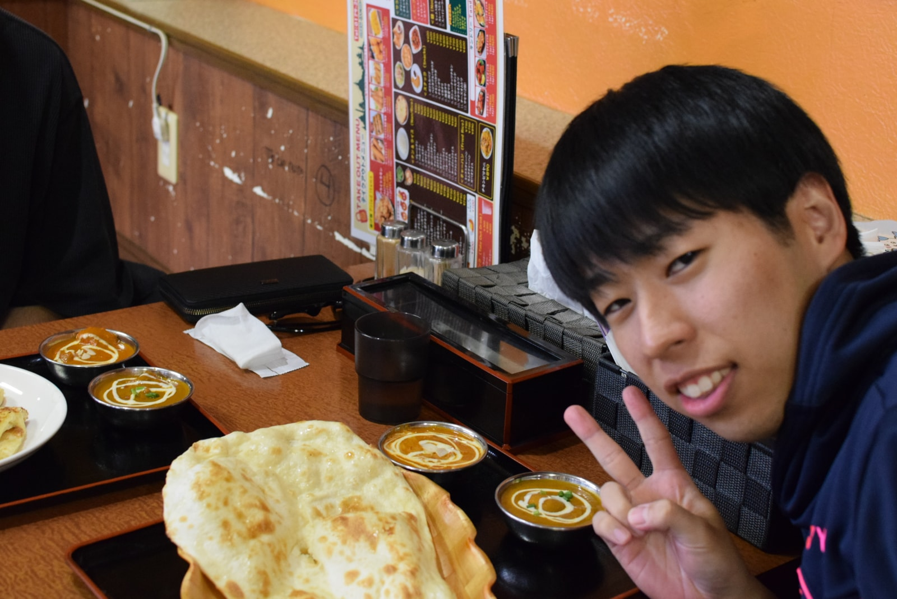
    <figcaption>
    <T>
      Peace!✌️
      ✌️
      ✌️
    </T>
  </figcaption>
</figure>

<T>
  
    After the tournament, Kuriki, Luis, and I ate at a nearby Nepalese restaurant with giant naan bread. I am very grateful to have been able to enjoy such an amazing experience here in the Japanese countryside. I never expected I would join my first badminton tournament in the Japanese countryside, but every day is filled with surprises here. I am looking forward to next time!
  
  
    大会の後、栗木さん、ルイス、私の3人で近くのネパール料理店に食べに行きました。ナンがとても大きかった！日本の田舎でこんなに素晴らしい体験ができて、本当に感謝しています。日本の田舎で初めてのバドミントン大会に参加するとは思っていませんでしたが、毎日がサプライズの連続です。次回が楽しみです！
  
  
    After the tournament, Kuriki, Luis, and I ate at a Nepalese restaurant. The naan bread was huge! I had an amazing time. It was nice to join a badminton tournament in the Japanese countryside. I want to play again!
  
</T>

<figure>
  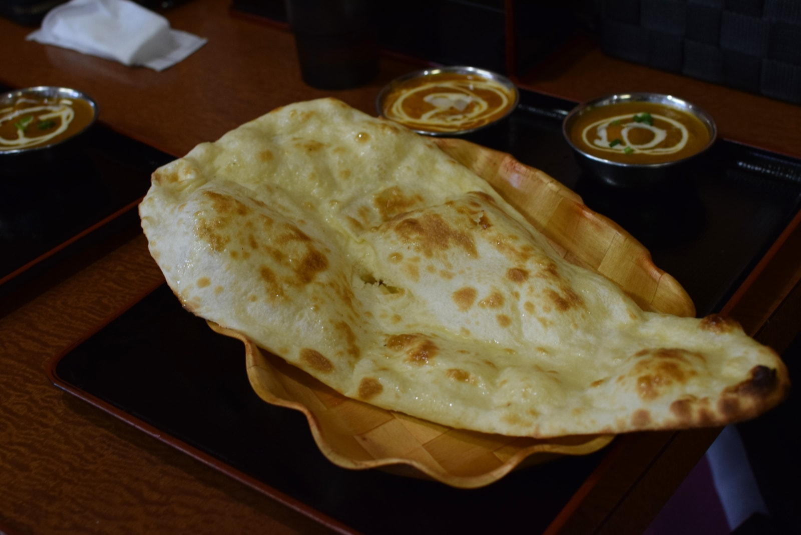
  <figcaption>
    <T>
      Look at that naan!
      このナン、見て！
      Big naan bread!
    </T>
  </figcaption>
</figure>

## <T>Extra pictures!残りの写真Pictures!</T>

<Gallery>
  <figure>
    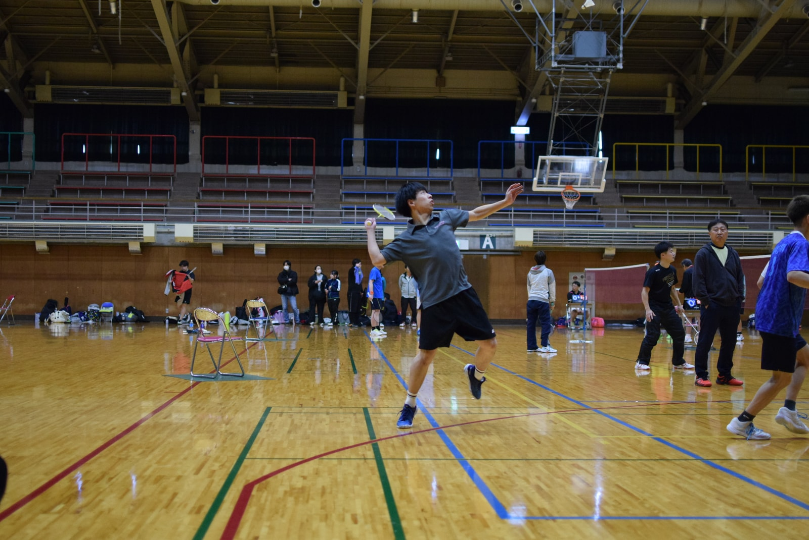
    <figcaption>
      <T>
        Go Kuriki!
        栗木さん、頑張れ！
        Go Kuriki!
      </T>
    </figcaption>
  </figure>
  <figure>
    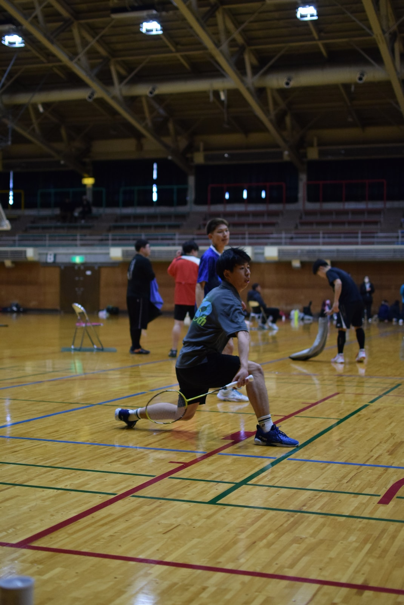
    <figcaption>
      <T>
        Nice!
        ナイス！
        Nice!
      </T>
    </figcaption>
  </figure>
  <figure>
    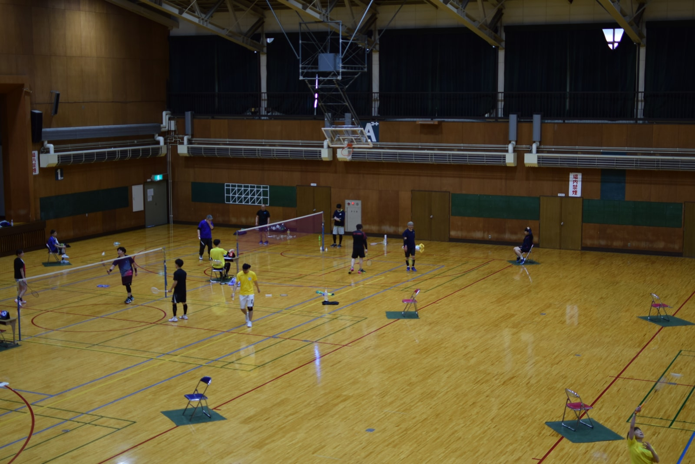
    <figcaption>
      <T>
        Another view
        別アングル
        Another view
      </T>
    </figcaption>
  </figure>
  <figure>
    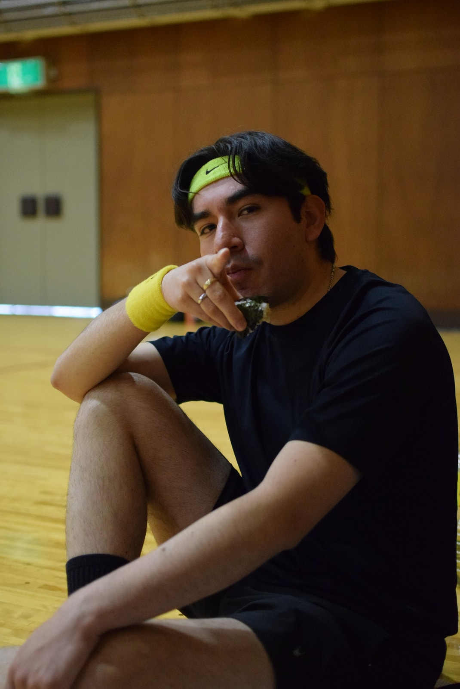
    <figcaption>
      <T>
        Luis looks cool!
        ルイス、かっこいい！
        Luis looks cool!
      </T>
    </figcaption>
  </figure>
  <figure>
    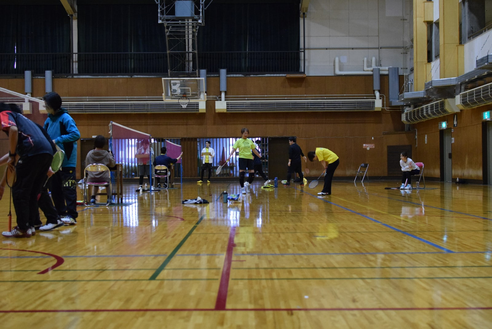
    <figcaption>
      <T>
        Colorful!
        カラフル！
        Colorful!
      </T>
    </figcaption>
  </figure>
  <figure>
    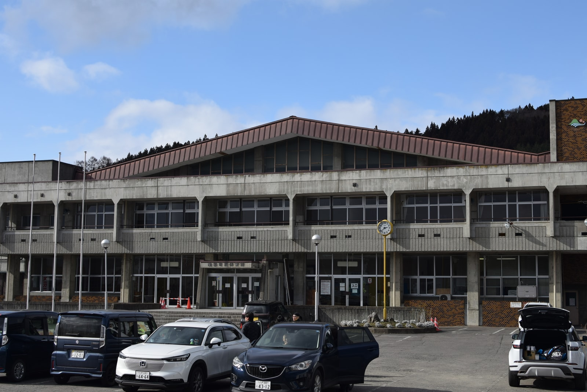
    <figcaption>
      <T>
        Venue outside view
        会場の外観
        Outside!
      </T>
    </figcaption>
  </figure>
</Gallery>

---
