import T from "~/components/i18n/T.astro";
import Gallery from "~/components/content/Gallery.astro";
import Explain from "~/components/content/Explain.astro";
import TwoImages from "~/components/content/TwoImages.astro";
import imgBagelDisplay from "../../assets/images/blog/bread-festival/bagel-display.JPG";
import imgBagelDisplay2 from "../../assets/images/blog/bread-festival/bagel-display2.JPG";
import imgDaisyDisplay from "../../assets/images/blog/bread-festival/daisy-display.JPG";
import imgDaisyDisplay2 from "../../assets/images/blog/bread-festival/daisy-display2.JPG";
import imgCroissantTruck from "../../assets/images/blog/bread-festival/croissant-truck.JPG";
import imgFoodTruckYellow from "../../assets/images/blog/bread-festival/food-truck-yellow-infinite.JPG";

<T>
  
    Recently I helped run a bread festival in Takko. There were 15 shops selling various bread-related foods from all over the local area, including from Takko town itself. Over 700 people attended, so I think it was quite a successful event. Even as a volunteer, I had a lot of fun and took a lot of pictures.
  
  
    最近、田子町でパン祭りの運営を手伝いました。田子町を含む地元各地から15店舗が参加し、様々なパン関連の食べ物が販売されました。700人以上が来場したので、とても成功したイベントだったと思います。ボランティアとしての参加でしたが、とても楽しく、写真もたくさん撮りました。
  
  
    There was a bread festival in town. There were 15 shops from Aomori. Over 700 people came! It was fun!
  
</T>

### <T>Interesting Venue趣のある会場The Venue</T>

<T>
  
    It was held at an abandoned elementary school known as Kamigo Elementary School. Actually, I was one of the last ALTs there, as it closed just a few months after I arrived in Takko, so it was a bit nostalgic to return. Since closing, it's often used for events like this.
  
  
    開催場所は、上郷小学校という廃校になった小学校でした。実は、私が田子に来て数ヶ月後に閉校したため、私はここで働いた最後のALTの一人でした。久しぶりに訪れると、少し懐かしい気持ちになりました。閉校後は、こういったイベントに頻繁に使われています。
  
  
    The festival was at Kamigo Elementary School. The school is closed now, so there are no students.
  
</T>

<figure>
  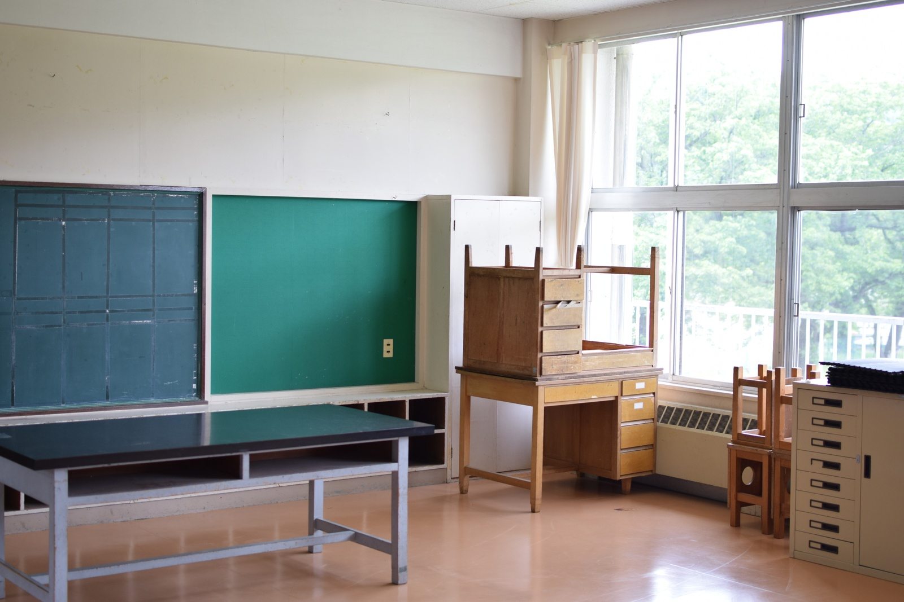
  <figcaption>
    <T>
      A real Japanese classroom!
      本物の日本の教室！
      Classroom
    </T>
  </figcaption>
</figure>

<T>
  Each store was allocated half a classroom to share with another store.
  各店舗には、他の店舗と半分ずつ共有する形で教室が割り当てられました。
  Each shop was in a classroom.
</T>

<figure>
  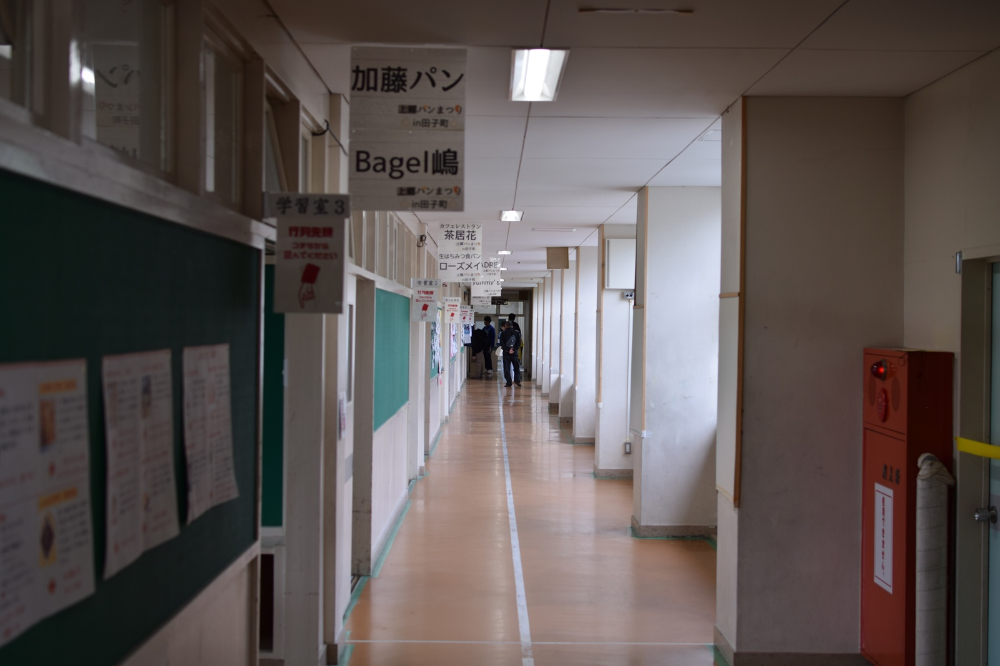
  <figcaption>
    <T>
      10 shops on this floor!
      このフロアに10店舗！
      10 shops!
    </T>
  </figcaption>
</figure>

<T>
  This is the main hall where most of the shops set up. This year it was on the second floor, so we worked up a sweat getting the shops' stands and breads up the stairs!
  ここがほとんどのお店が出店したメインホールです。今年は2階だったので、スタンドやパンを階段で運ぶのに一汗かきました！
  This is the main area. It's upstairs!
</T>

<figure>
  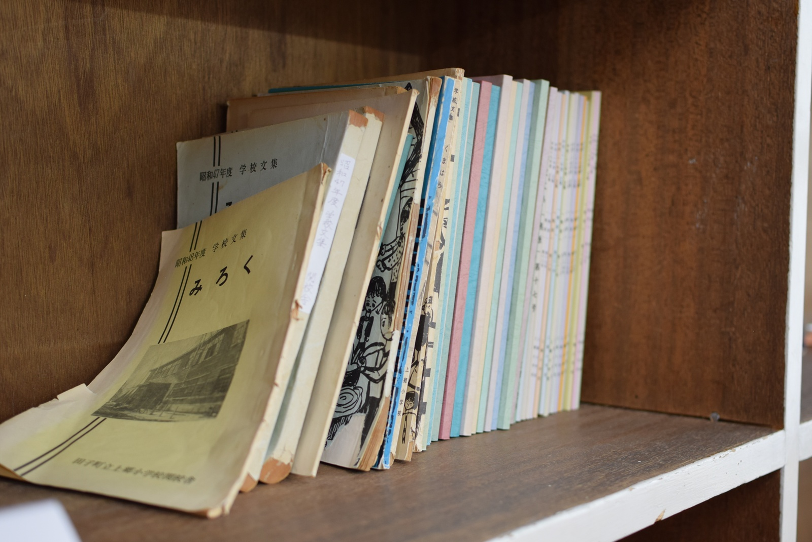
  <figcaption>
    <T>
      Old books.
      古い本。
      Old books.
    </T>
  </figcaption>
</figure>

<T>
  There were lots of old items to look at since the school building was built in the 80s. It was like being in a museum.
  校舎は1980年代に建てられたため、見ごたえのある古い品々がたくさんありました。まるで博物館にいるようでした。
  The school building is old. It's like a museum.
</T>

#### <T>HelpersヘルパーたちHelpers</T>

<T>
  
    Other than myself, there were many volunteers from the local area who came to help. We worked hard from early in the morning until the afternoon to make sure everything went smoothly. This is only half of the team that came to help that day.
  
  
    私以外にも、地元から多くのボランティアが手伝いに来てくれました。すべてがスムーズに進むよう、朝早くから午後まで一生懸命働きました。これは当日手伝いに来てくれたチームの半分だけです。
  
  
    A lot of people helped. We worked hard!
  
</T>

<figure>
  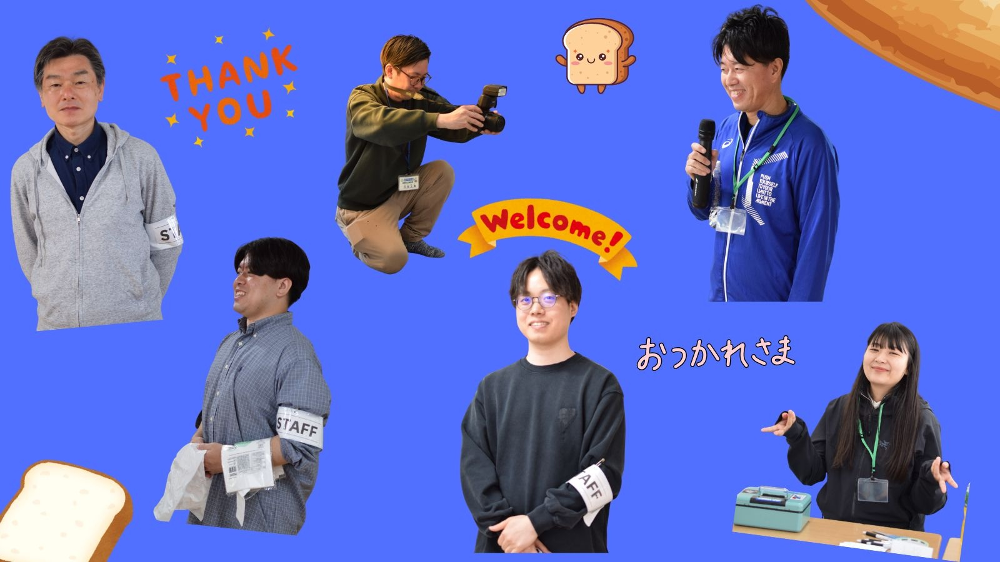
  <figcaption>
    <T>
      A few staff. So photogenic!
      スタッフの数人。フォトジェニック！
      Some staff!
    </T>
  </figcaption>
</figure>

### <T>The Shopsお店の紹介The Shops</T>

<T>
  
    There were 15 shops in total that day. They were all quite unique and came from all over the local area. I think I knew about 10 of them!
  
  
    その日は合計15店舗が出店しました。どのお店もとてもユニークで、地元の各地から集まりました。10店舗くらいは知っていたと思います！
  
  
    15 stores came. I knew 10 of them.
  
</T>

<figure>
  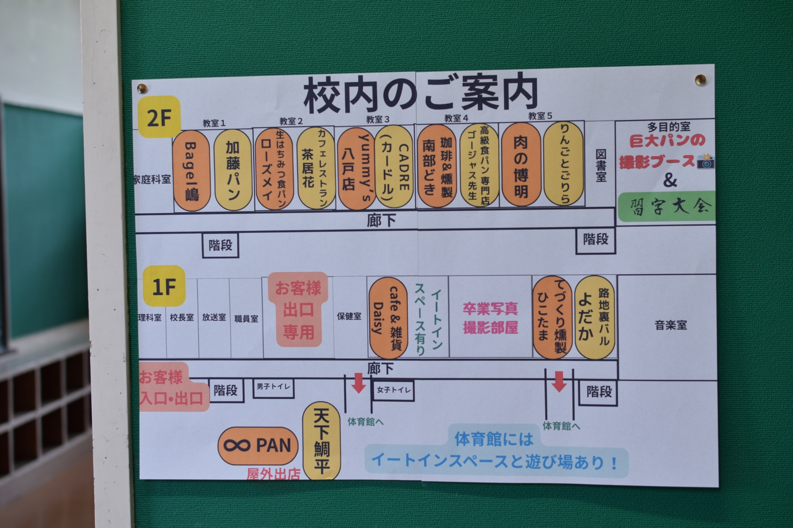
  <figcaption>
    <T>
      Map of the venue.
      会場の地図。
      Map of the venue.
    </T>
  </figcaption>
</figure>

#### <T>Bagel 島Bagel 島Bagel Shima</T>

<figure>
  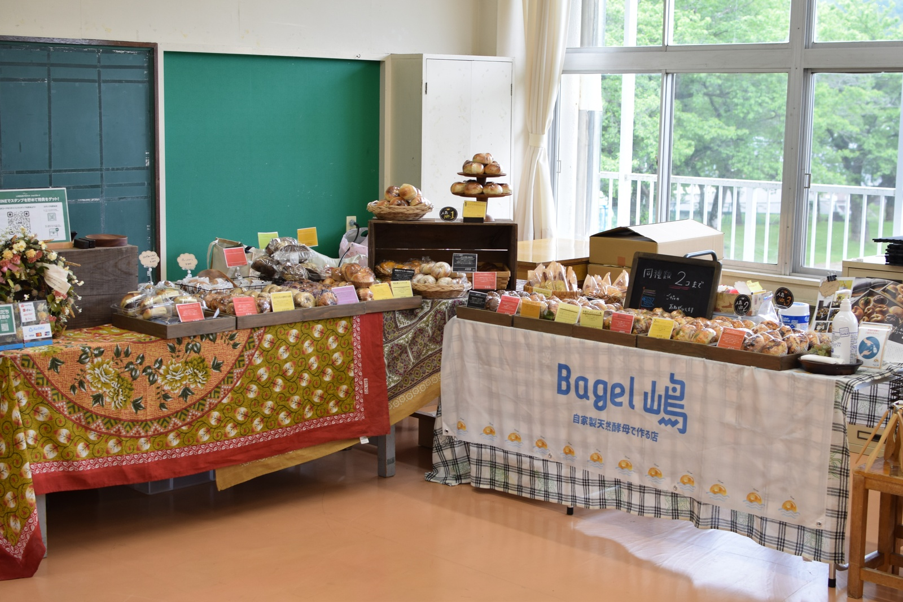
  <figcaption>
    <T>
      So many bagels!
      ベーグルがいっぱい！
      Many bagels!
    </T>
  </figcaption>
</figure>

<T>
  
    Bagel Shima (shima means island in Japanese) is a bagel store from Hachinohe. Bagels are quite rare in Japan, especially in the countryside, so perhaps for that reason they were one of the most popular shops. Everything looked so delicious!
  
  
    Bagel Shima（「島」は英語でIslandの意味）は、八戸にあるベーグル専門店です。ベーグルは日本では珍しく、特に田舎ではなかなか見かけません。そのためかどうかはわかりませんが、最も人気のあるお店の一つでした。どれも本当においしそうでした！
  
  
    This is Bagel Shima. It's from Hachinohe. Bagels are rare in Japan. They are popular.
  
</T>

<TwoImages src1={imgBagelDisplay} src2={imgBagelDisplay2} />

<T>
  
    The staff was also very kind. They told me about their shop, which has an ocean view! Also, on Google Maps it says temporarily closed, but it's actually open! Please check out their store if you get a chance.
  
  
    スタッフもとても親切でした。海が見えるお店だと教えてくれました！また、Googleマップでは「一時休業」と表示されていますが、実際は営業しているそうです！機会があればぜひ行ってみてください。
  
  
    The staff was kind. I want to go to their store!
  
</T>

<figure>
  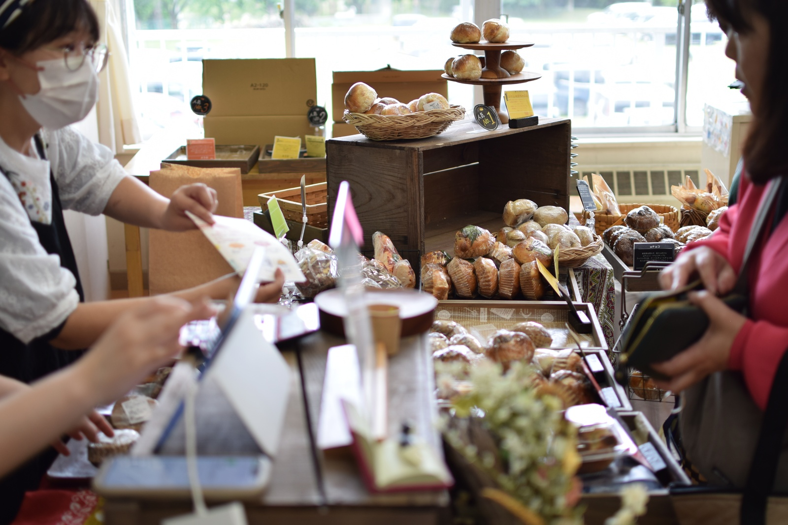
  <figcaption>
    <T>
      Hard at work!
      一生懸命働いています！
      Working hard!
    </T>
  </figcaption>
</figure>

#### <T>加藤パン加藤パンKatou Pan</T>

<figure>
  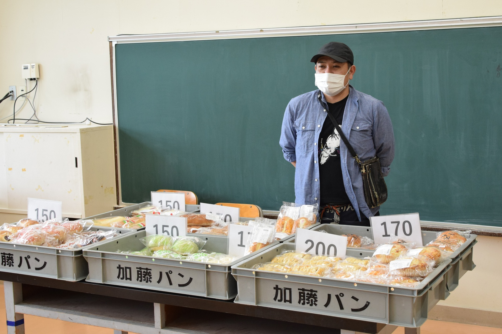
  <figcaption>
    <T>
      Simple and efficient!
      シンプルで効率的！
      Simple and efficient!
    </T>
  </figcaption>
</figure>

<T>
  
    Katou Pan is a small bakery from Sannohe. I often see their breads sold around town at places like the farmers market.
  
  
    加藤パンは三戸にある小さなパン屋さんです。ファーマーズマーケットなど、町のあちこちでよく見かけます。
  
  
    This is Katou Pan. It's from Sannohe.
  
</T>

<figure>
  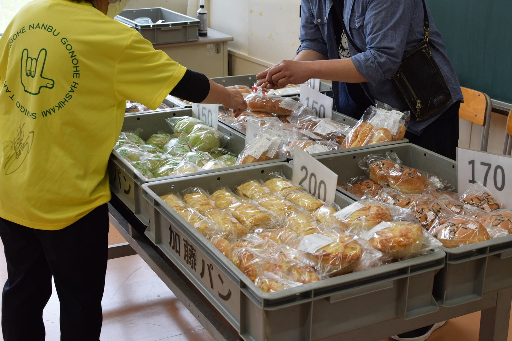
  <figcaption>
    <T>
      Working hard!
      一生懸命！
      Working hard!
    </T>
  </figcaption>
</figure>

<T>
  
    I think it's more of a traditional Japanese bread. They have the classics like melon bread! If you are ever in Sannohe, their shop is located across the street from the Apple Dome.
  
  
    どちらかというと昔ながらの日本のパンが多いです。メロンパンなどの定番もそろっています！三戸に行く機会があれば、アップルドームの向かいにあるお店もぜひ。
  
  
    The shop is close to the Apple Dome.
  
</T>

#### <T>はちみつ食パンローズメイはちみつ食パンローズメイHoney Bread Rosemay</T>

<figure>
  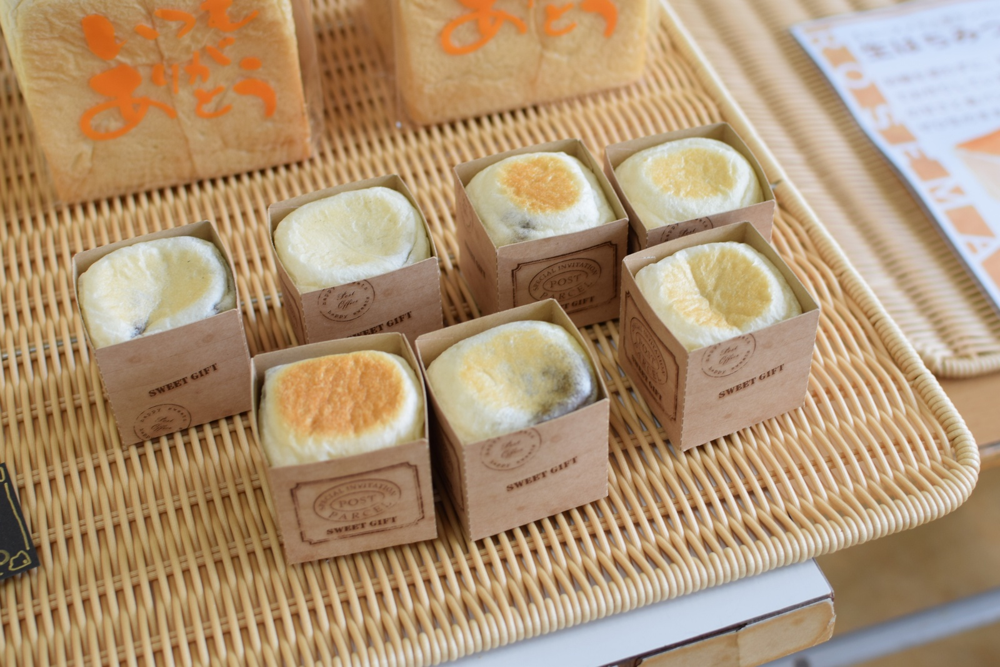
  <figcaption>
    <T>
      Honey breads
      はちみつパン
      Honey breads
    </T>
  </figcaption>
</figure>

<T>
  
    This is a shop specializing in honey breads. Their shop in Hachinohe is a cute small store. Unfortunately I didn't take a good picture of their shop!
  
  
    はちみつを使った食パン専門店です。八戸にあるお店はとてもかわいい小さなお店です。残念ながら、お店の写真をうまく撮れませんでした！
  
  
    This store has honey bread. The store is in Hachinohe. It's cute.
  
</T>

<figure>
  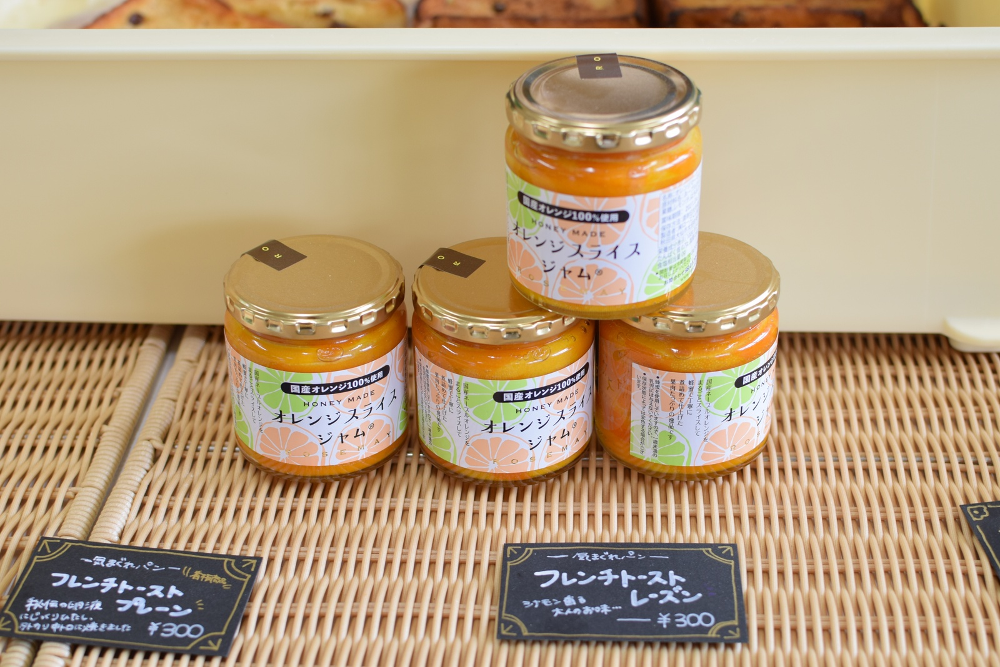
  <figcaption>
    <T>
      Orange slice jam
      オレンジスライスのジャム
      Orange slice jam
    </T>
  </figcaption>
</figure>

<T>
  
    They also sell jam among other items. I was able to try some bread from my friend who bought some, and it was quite tasty. The Hachinohe location is in a convenient spot, so check it out if you can.
  
  
    ジャムなども販売しています。友人が買ってきてくれたパンを試食させてもらいましたが、とてもおいしかったです。八戸の店舗はアクセスしやすい場所にあるので、ぜひ行ってみてください。
  
  
    The bread was yummy.
  
</T>

#### <T>茶居花茶居花Chaihana</T>

<figure>
  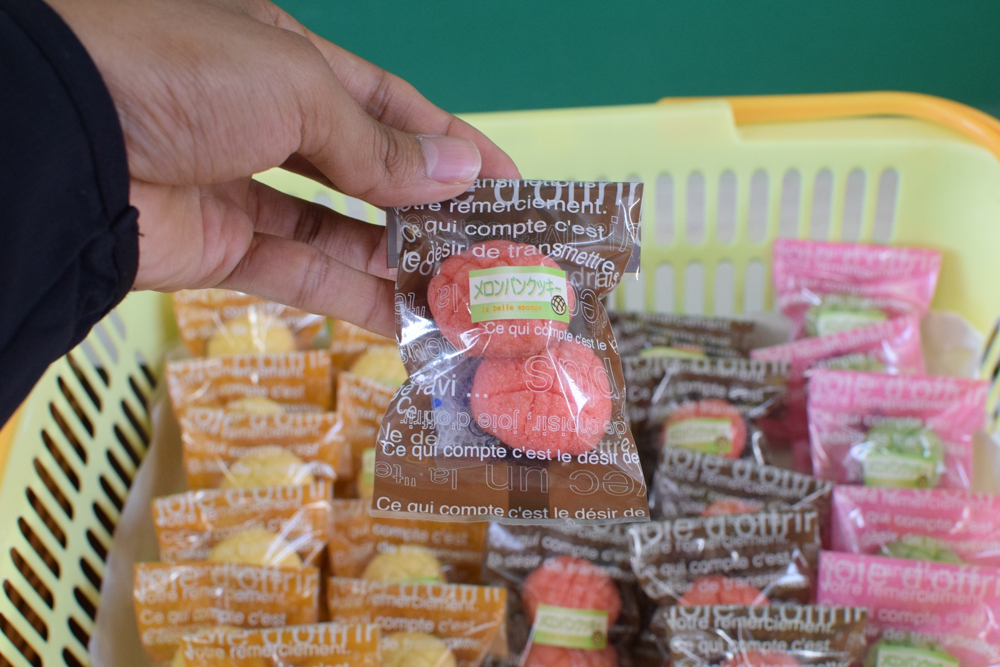
  <figcaption>
    <T>
      Tiny melon bread!
      小さなメロンパン！
      Small melon bread!
    </T>
  </figcaption>
</figure>

<T>
  
    Chaihana is a restaurant and cafe in Hachinohe that I haven't been to yet. They had lots of bread, including a savory salmon croissant.
  
  
    茶居花は、八戸にあるレストラン兼カフェで、まだ行ったことがありません。サーモンのクロワッサンなど、惣菜系のパンもたくさんありました。
  
  
    This is Chaihana. It's a restaurant and cafe. It's in Hachinohe.
  
</T>

<figure>
  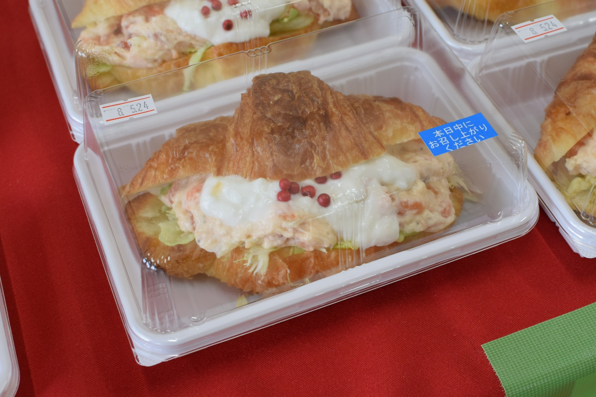
  <figcaption>
    <T>
      Salmon sandwich
      サーモンサンドイッチ
      Salmon sandwich
    </T>
  </figcaption>
</figure>

<T>
  
    However, my favorite was this tiny melon bread. It was so small and cute. I had planned to buy one, but it sold out quickly!
  
  
    でも一番気に入ったのは、この小さなメロンパンです。とても小さくてかわいかったです。買おうと思っていたのですが、すぐに売り切れてしまいました！
  
  
    They had tiny melon bread. It's cute!
  
</T>

<figure>
  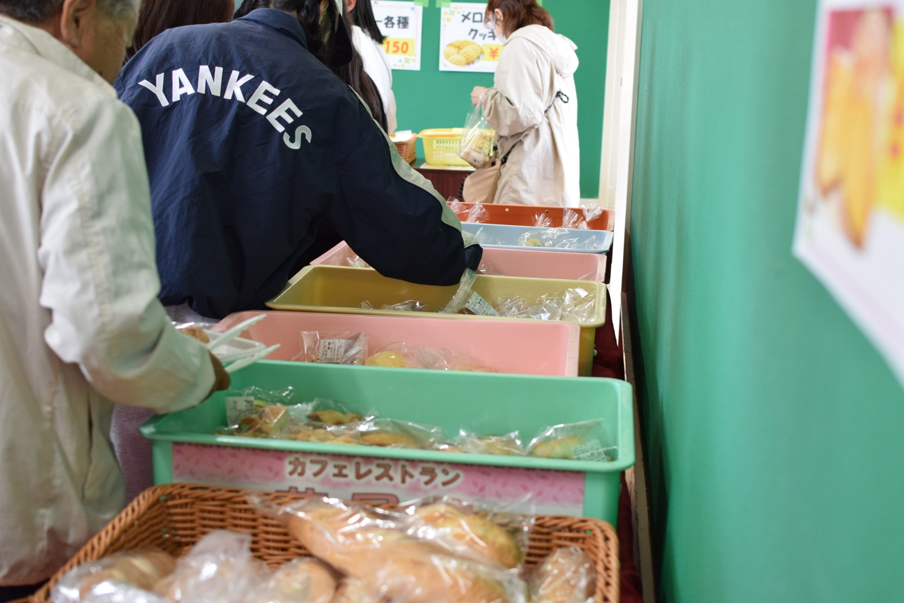
  <figcaption>
    <T>
      Lots of bread
      たくさんのパン
      Many breads
    </T>
  </figcaption>
</figure>

<T>
  
    I want to visit their store, even if just to try the tiny melon bread.
  
  
    あの小さなメロンパンを食べるためだけにでも、お店に行ってみたいと思っています。
  
  
    I want to try it.
  
</T>

#### <T>Yummy'sYummy'sYummy's</T>

<figure>
  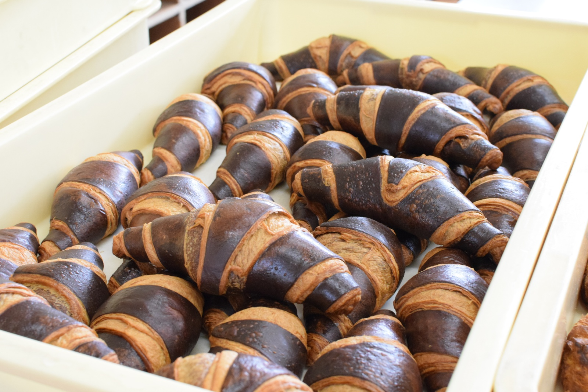
  <figcaption>
    <T>
      It looks so good!
      とっても美味しそう！
      Looks good!
    </T>
  </figcaption>
</figure>

<T>
  
    Yummy's is another Hachinohe bakery that I have never been to. It seems they specialize in croissants.
  
  
    Yummy'sも八戸のパン屋さんで、まだ行ったことがありません。クロワッサンが専門のようです。
  
  
    This is Yummy's. They have a lot of croissants.
  
</T>

<figure>
  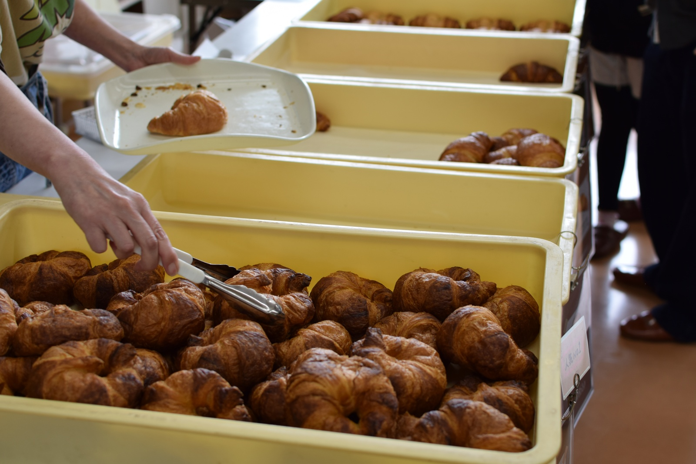
  <figcaption>
    <T>
      Working hard!
      一生懸命！
      Working hard!
    </T>
  </figcaption>
</figure>

<T>
  
    Actually, they had more than croissants. There were donuts too. I tried the chocolate donut before it sold out. It was quite good!
  
  
    でも、クロワッサンだけじゃありませんでした。ドーナツもありました。売り切れる前にチョコレートドーナツを食べることができました。とてもおいしかったです！
  
  
    They have donuts too. I tried it. It was very good.
  
</T>

<figure>
  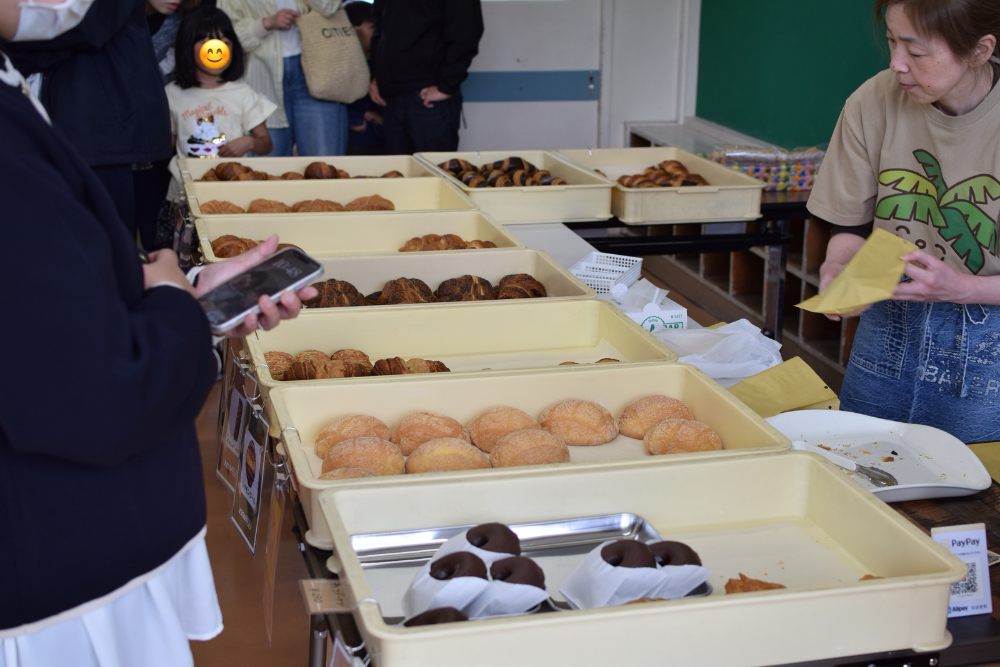
  <figcaption>
    <T>
      Working hard!
      一生懸命！
      Working hard!
    </T>
  </figcaption>
</figure>

#### <T>CADRECADRECADRE</T>

<figure>
  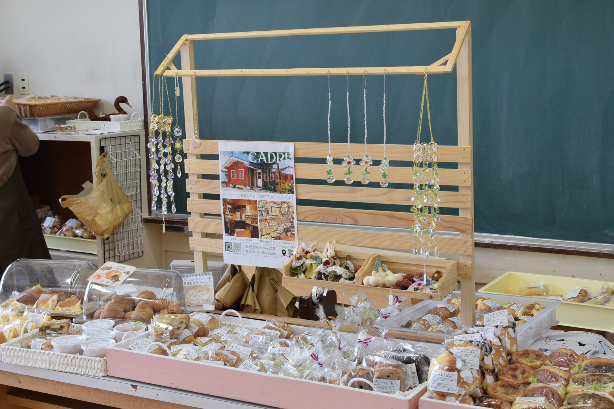
  <figcaption>
    <T>
      Jewelry and bread!
      ジュエリーとパン！
      Jewelry and bread!
    </T>
  </figcaption>
</figure>

<T>
  
    Cadre is a shop in Ninohe. They also sell small crafts among other items. Unfortunately I was too full, so I didn't try their bread, but since Ninohe is quite close I want to drop by one day!
  
  
    CADREは二戸のお店です。パン以外にも小さなクラフト品なども販売しています。残念ながら、お腹がいっぱいで試食できませんでしたが、二戸はかなり近いので、いつかぜひ立ち寄ってみたいです！
  
  
    This is Cadre from Ninohe. They have bread and crafts. Ninohe is nearby, so I want to visit.
  
</T>

<figure>
  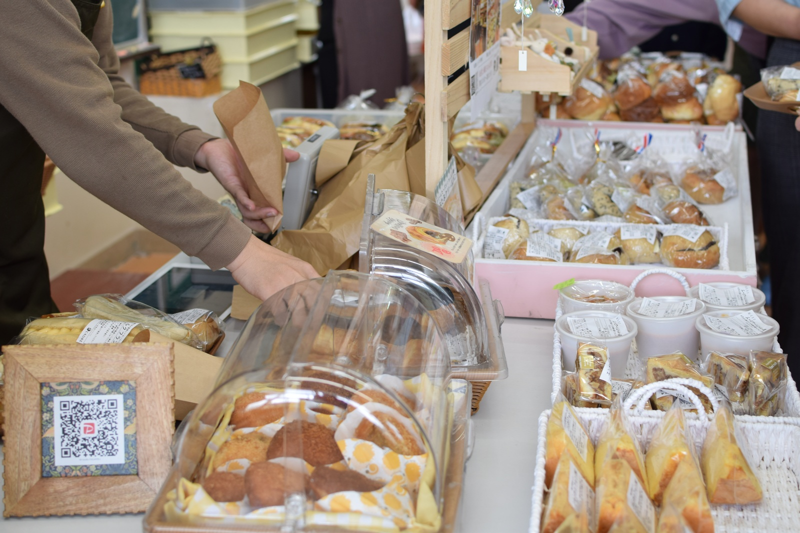
  <figcaption>
    <T>
      Working hard!
      一生懸命！
      Working hard!
    </T>
  </figcaption>
</figure>

<T>
  
    Apparently it's only open on Saturdays. However, please don't take my word for it. I'm always making mistakes when speaking in Japanese!
  
  
    土曜日しか営業していないとのことでした。ただ、私の言うことを鵜呑みにしないでください。日本語で話すといつも間違えてしまうので！
  
  
    I think they are open on Saturday.
  
</T>

#### <T>南部どき南部どきNambudoki</T>

<figure>
  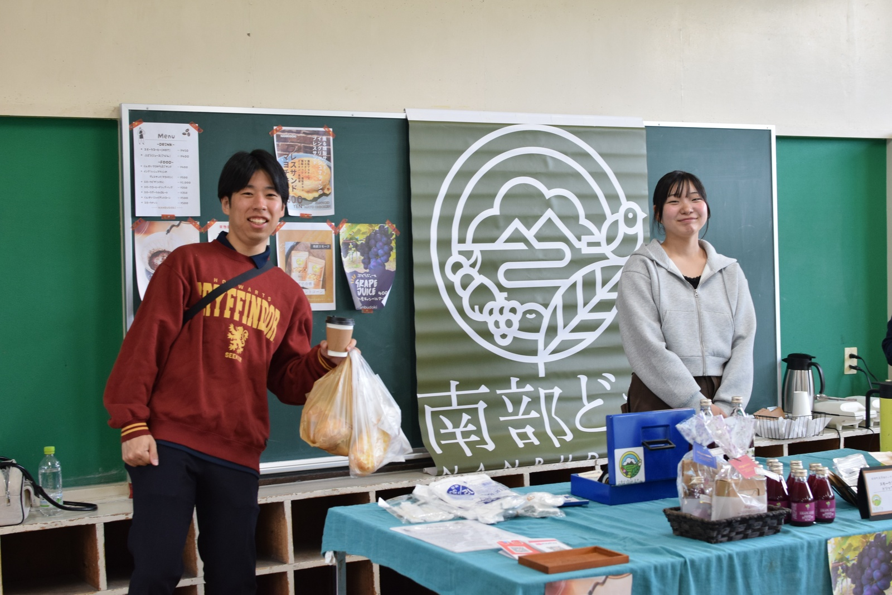
  <figcaption>
    <T>
      Happy customer
      嬉しそうなお客さん
      Happy!
    </T>
  </figcaption>
</figure>

<T>
  
    Nambudoki is a cafe I know well. It's located near Sannohe Station, which is where I go every time I visit my girlfriend in Kanto.
  
  
    南部どきはよく知っているカフェです。関東にいるガールフレンドに会いに行くたびに利用する三戸駅の近くにあります。
  
  
    This is Nambudoki. I go there often because it's near Sannohe Station. When I visit Kanto, I go there.
  
</T>

<figure>
  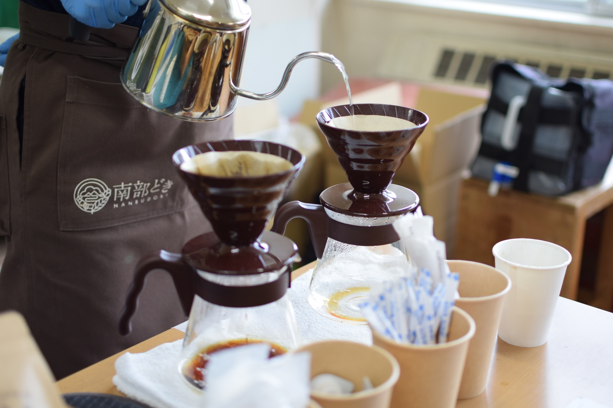
  <figcaption>
    <T>
      Drip coffee is delicious!
      ドリップコーヒーは美味しい！
      Yummy coffee!
    </T>
  </figcaption>
</figure>

<T>
  
    Usually I have a soy green tea latte when I visit their shop, but today I tried their coffee. It was delicious!
  
  
    いつもは豆乳抹茶ラテを飲むのですが、今日はコーヒーを試しました。とてもおいしかったです！
  
  
    I like the green tea latte. The coffee is good too!
  
</T>

<figure>
  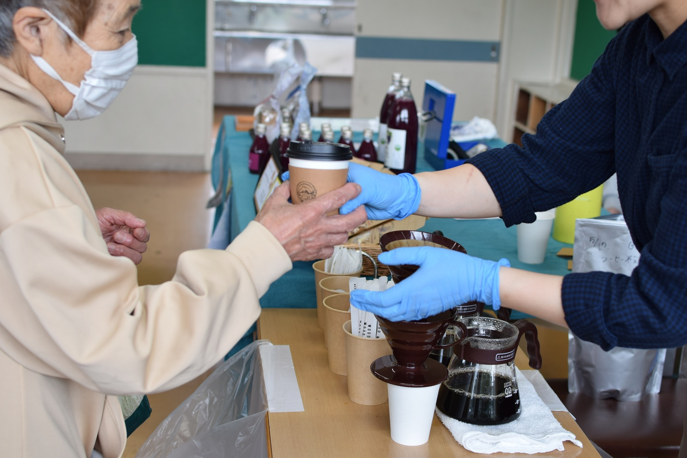
  <figcaption>
    <T>
      Please enjoy!
      どうぞ、召し上がれ！
      Please enjoy!
    </T>
  </figcaption>
</figure>

<T>
  
    When I first visited this store, I was shocked. I called it "the secret Starbucks in the countryside." I think it's very rare to find a shop like this in this area. I'm going to keep visiting!
  
  
    最初にこのお店を訪れたとき、驚きました。「田舎の秘密のスターバックス」と呼んでいます。この地域でこのようなお店を見つけるのはとても珍しいことだと思います。これからも通い続けます！
  
  
    The shop is great. Please try it out!
  
</T>

#### <T>Gorgeous 先生Gorgeous 先生Gorgeous Sensei</T>

<figure>
  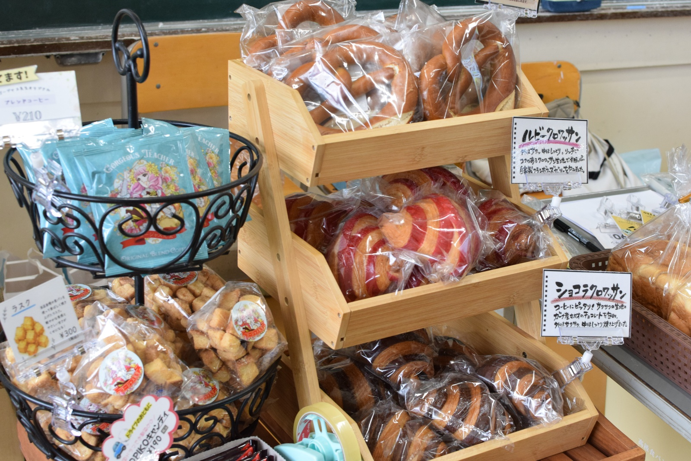
  <figcaption>
    <T>
      Pretty packaging
      きれいなパッケージ
      Cute!
    </T>
  </figcaption>
</figure>

<T>
  
    Gorgeous sensei is a cool-looking shop in Towada City. I actually visited it somewhat recently when I went to see the famous ice walls. The mascot is quite amazing, isn't it?
  
  
    Gorgeous先生は十和田市にあるおしゃれなお店です。最近、有名な氷の壁を見に行ったときに訪れました。マスコットがとてもすごいですよね？
  
  
    This is Gorgeous Sensei. It's cool! It's in Towada. The mascot is cute.
  
</T>

<figure>
  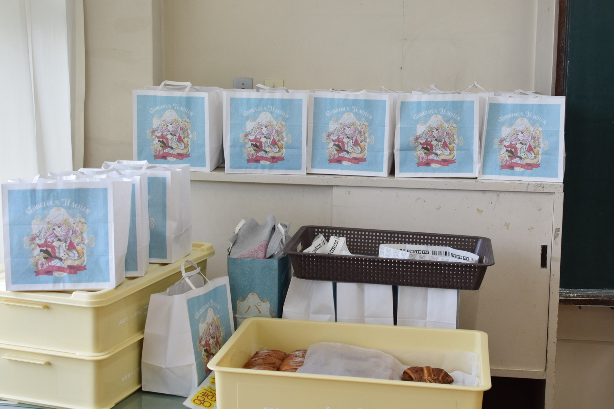
  <figcaption>
    <T>
      Great logo!
      素敵なロゴ！
      Nice logo!
    </T>
  </figcaption>
</figure>

<T>
  
    If I remember correctly, they also have gelato at their store! I think it's a must-see if you visit the Towada area. I loved their fruit sandwich.
  
  
    確か、お店にはジェラートもあったと思います！十和田エリアを訪れるなら、ぜひ立ち寄ってほしいお店です。フルーツサンドが特にお気に入りです。
  
  
    I think they have gelato, too. I also like the fruit sandwiches.
  
</T>

#### <T>肉の博明肉の博明Niku no Hiroaki</T>

<figure>
  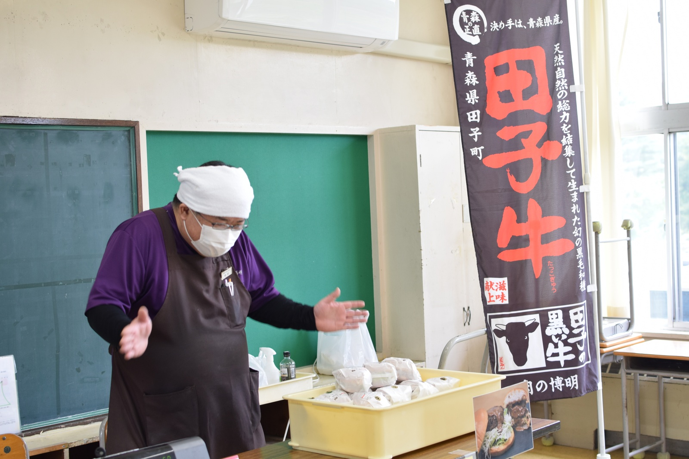
  <figcaption>
    <T>
      Nice pose!
      いいポーズ！
      Nice pose!
    </T>
  </figcaption>
</figure>

<T>
  
    This is a local butcher shop that I visit almost every day after work. The location is convenient for someone without a car like me, so it's essentially my grocery store. They sell fruit, vegetables, and other grocery products as well as meat.
  
  
    ここは、仕事の帰りにほぼ毎日立ち寄る地元の精肉店です。車を持っていない私には便利な場所にあるので、実質的に私のスーパーマーケットです。肉だけでなく、果物や野菜などの食料品も販売しています。
  
  
    This is a butcher shop from Takko. I go there every day. It's like a grocery store.
  
</T>

<figure>
  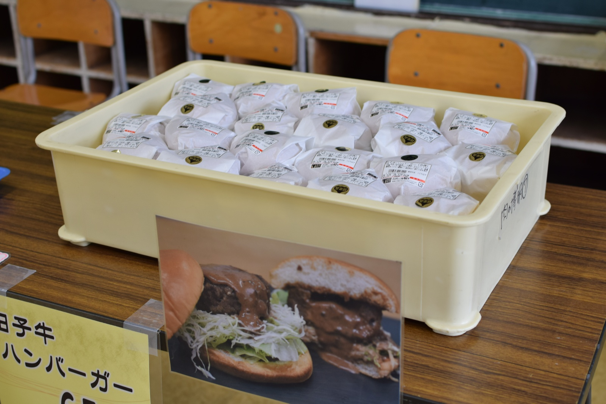
  <figcaption>
    <T>
      Burger box
      バーガーボックス
      Burger box
    </T>
  </figcaption>
</figure>

<T>
  
    At the festival, they brought nothing but their most popular product: a burger made with Takko gyuu, which you can think of as a local version of wagyu. Of course, it's always delicious!
  
  
    お祭りでは、最も人気の商品だけを持ってきていました。田子牛（和牛の地元版とも言えます）で作ったバーガーです。もちろん、いつも通りおいしかったです！
  
  
    Today they had beef hamburgers. It's delicious. It's made from Takko beef.
  
</T>

#### <T>りんごとゴリラりんごとゴリラApple and Gorilla</T>

<figure>
  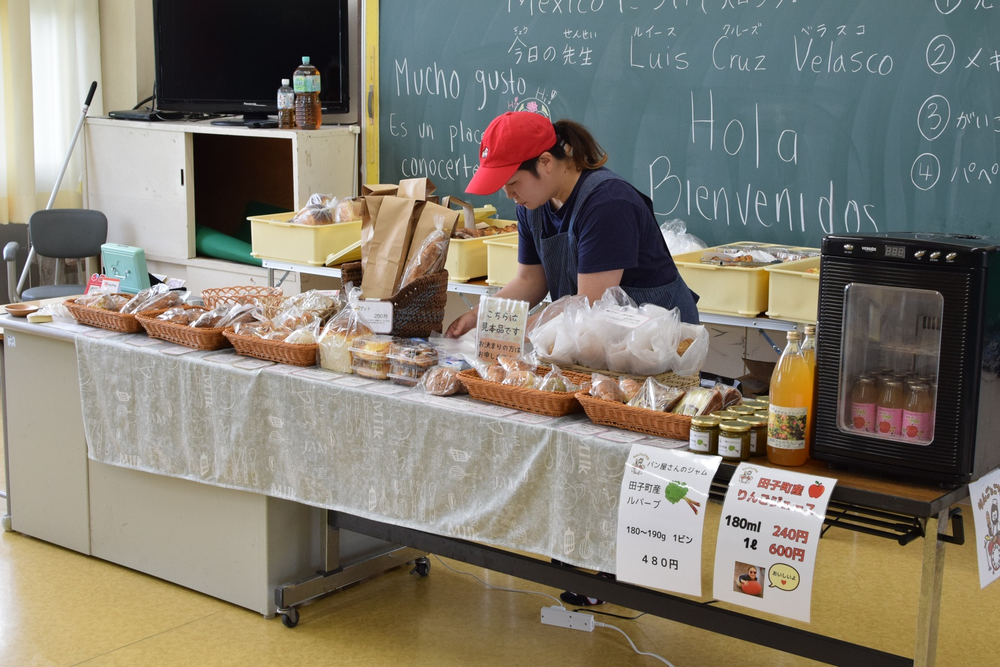
  <figcaption>
    <T>
      Setting up
      準備中
      Getting ready
    </T>
  </figcaption>
</figure>

<T>
  
    Ringo to Gorilla, or "apple and gorilla," is a new bakery in town (also the only bakery) run by a couple. Their bread is delicious and I eat it often.
  
  
    「りんごとゴリラ」は、町で新しくオープンしたパン屋さん（町で唯一のパン屋さんでもあります）で、ご夫婦で経営されています。パンはとてもおいしく、よく食べています。
  
  
    This is Apple and Gorilla. It's from Takko. The bread is delicious.
  
</T>

<T>
  
    They are working hard to make their dream come true. It must be rough starting a new business in such a small town!
  
  
    夢を実現するために一生懸命頑張っています。こんな小さな町で新しいビジネスを始めるのは、大変なことに違いありません！
  
  
    They are working hard!
  
</T>

<figure>
  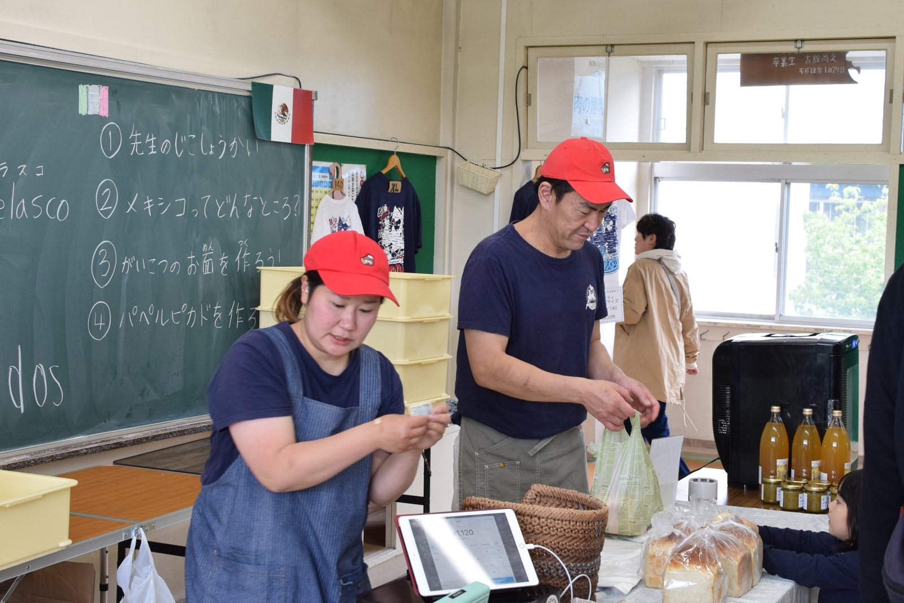
  <figcaption>
    <T>
      Working hard!
      一生懸命！
      Working hard!
    </T>
  </figcaption>
</figure>

<T>
  
    Apparently Mr. Gorilla here stayed up until 11pm the night before to make sure they were prepared! I hope he was able to get some rest after!
  
  
    ゴリラさんは前日の夜11時まで準備をしていたそうです！終わった後はゆっくり休めたといいですね！
  
  
    He is very sleepy. I hope he can sleep soon.
  
</T>

<figure>
  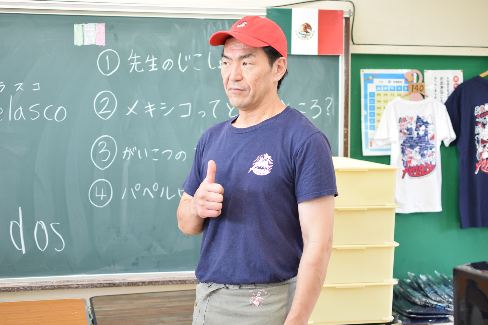
  <figcaption>
    <T>
      Well done!
      よくできました！
      Good job!
    </T>
  </figcaption>
</figure>

#### <T>Cafe DaisyCafe DaisyCafe Daisy</T>

<figure>
  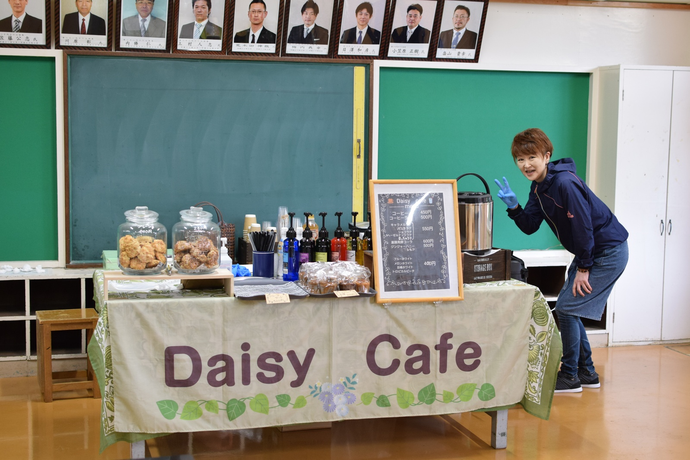
  <figcaption>
    <T>
      Ready to go!
      準備完了！
      I'm ready!
    </T>
  </figcaption>
</figure>

<T>
  
    This is Daisy Cafe. It's a small cafe in my town located very close to my house. I always see them at every local event. They sell drinks and various yummy food items.
  
  
    こちらはDaisy Cafeです。私の家のすぐ近くにある、小さなカフェです。地元のイベントには必ずいつも見かけます。ドリンクやいろいろなおいしい食べ物を販売しています。
  
  
    This is Daisy Cafe. It's from Takko. It's close to my house. The drinks and food are good.
  
</T>

<TwoImages src1={imgDaisyDisplay} src2={imgDaisyDisplay2} />

<T>
  
    The scones and sandwiches are always a nice treat. I'm looking forward to the next time I can try one!
  
  
    スコーンやサンドイッチはいつもおいしいですよ。次に食べられるのが楽しみです！
  
  
    I like the scones and the sandwiches.
  
</T>

#### <T>ひこたまひこたまHikotama</T>

<figure>
  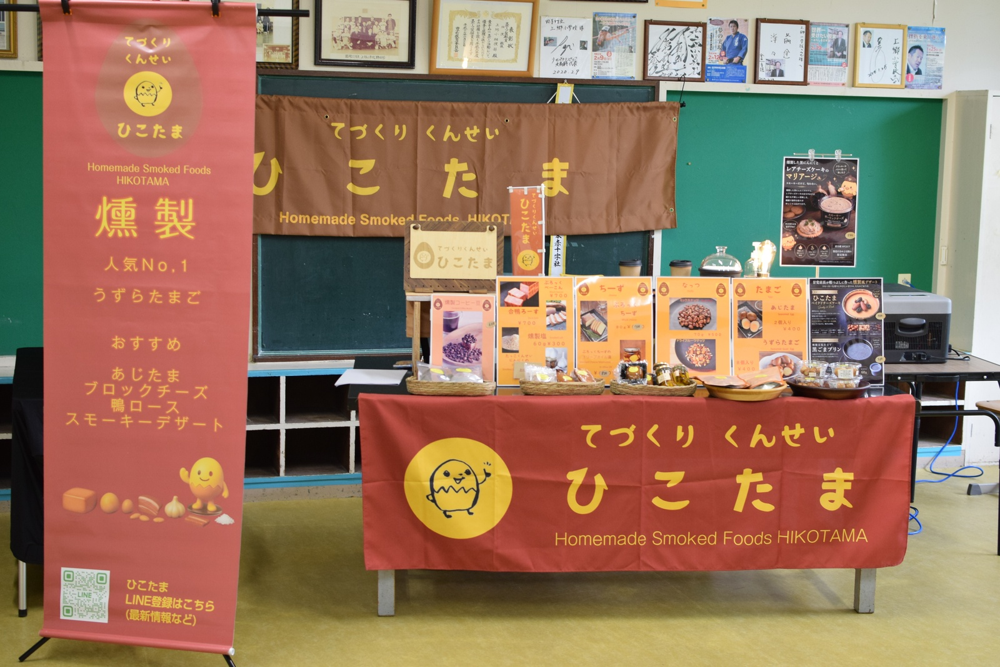
  <figcaption>
    <T>
      Nice colors
      きれいな色
      Nice colors
    </T>
  </figcaption>
</figure>

<T>
  
    Hikotama is another one I see often. Actually, I'm not sure where they're from exactly, but their items are always around town. Everything is smoked!
  
  
    ひこたまも、よく見かけるお店です。実は、どこから来ているのかよくわからないのですが、町のあちこちで見かけます。全品燻製です！
  
  
    This is Hikotama. I see them often. They sell smoked foods.
  
</T>

<figure>
  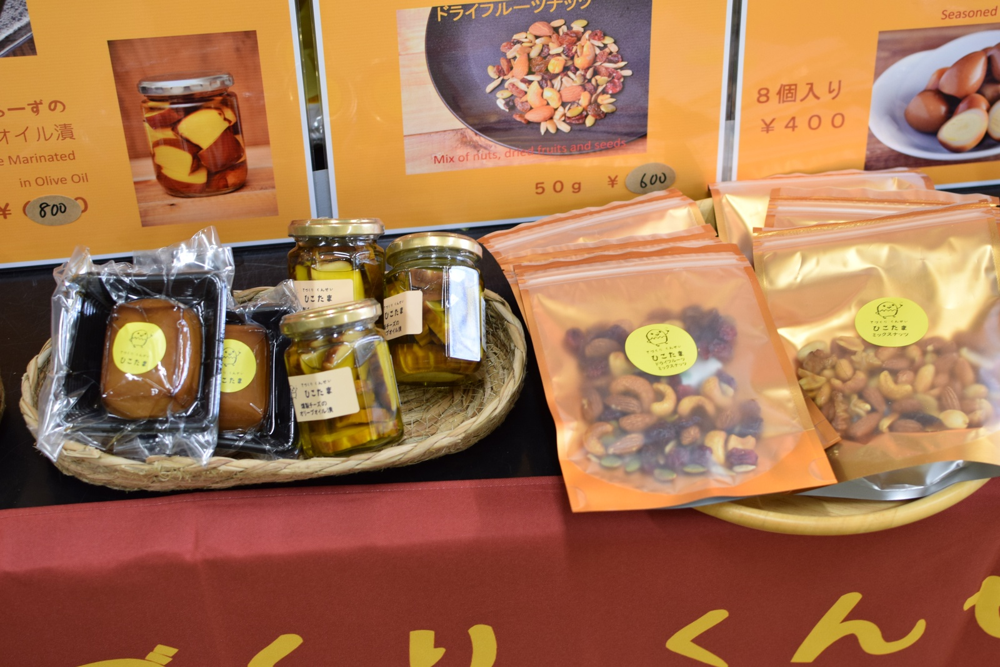
  <figcaption>
    <T>
      Nuts and cheese
      ナッツとチーズ
      Nuts and cheese
    </T>
  </figcaption>
</figure>

<T>
  
    They have the obvious things like nuts and meats, but they always have desserts like smoked ice cream. It seems they experiment often! My favorite item, however, is the smoked marinated eggs. The flavor is amazing.
  
  
    ナッツやお肉はもちろん、燻製アイスクリームなどのデザートもあります。いろいろと実験しているようです！でも私のお気に入りは燻製の味付き卵です。風味が最高です。
  
  
    There are smoked nuts, meats, desserts, and even ice cream. My favorite is the smoked eggs.
  
</T>

#### <T>Yodaka夜鷹Yodaka</T>

<figure>
  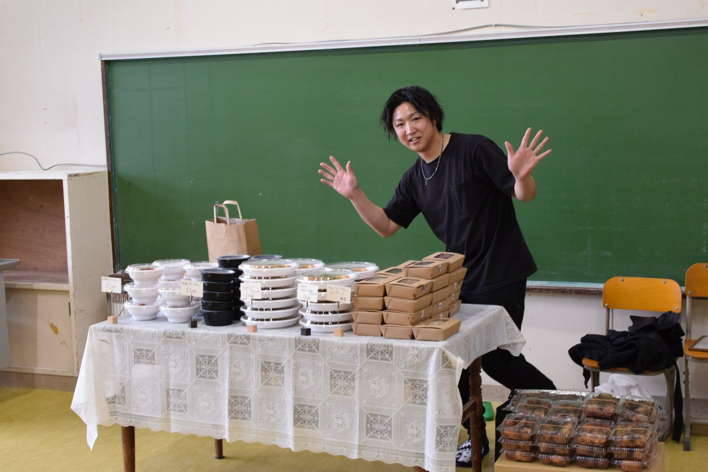
  <figcaption>
    <T>
      Lots of savory foods
      惣菜がたくさん
      Many foods!
    </T>
  </figcaption>
</figure>

<T>
  
    Yodaka is another local shop. This one is an Italian restaurant, and today they had some bread items like sandwiches. I've been to this shop often, mostly for drinking parties as it's usually open at night. The food is great, and a nice change from the typical style you find in the countryside. My favorite is the senbei nachos, which are a unique version of an American/Mexican dish using local ingredients.
  
  
    夜鷹も地元のお店です。イタリアンレストランで、今日はサンドイッチなどのパン系のメニューがありました。このお店にはよく行っていて、夜営業していることが多いので、飲み会でよく使います。料理はとてもおいしく、田舎でよく見られる料理とは一味違います。私のお気に入りはせんべいナチョスで、地元の食材を使ったアメリカ/メキシコ料理のユニークなバージョンです。
  
  
    This is Yodaka. It's from Takko. It's Italian food. I go there often. The food is delicious. My favorite is the senbei nachos.
  
</T>

<figure>
  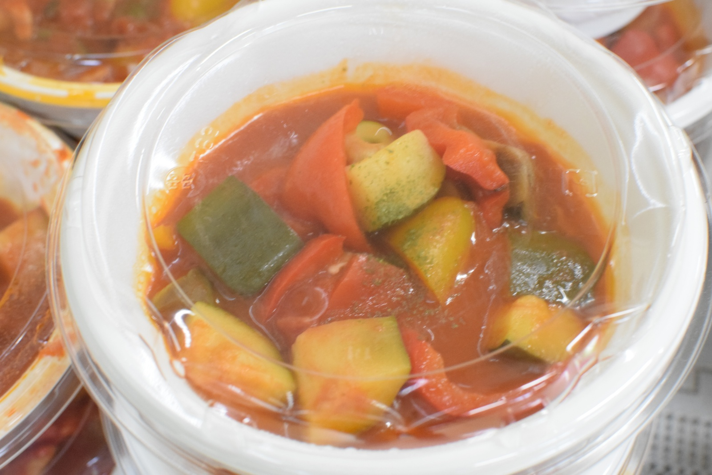
  <figcaption>
    <T>
      Ratatouille
      ラタトゥイユ
      Ratatouille
    </T>
  </figcaption>
</figure>

<T>
  
    That day I tried something I hadn't seen before in Japan called ratatouille. It's an Italian dish probably most well known from the movie of the same name. I love vegetables, so I had to try it, and as expected, it was delicious!
  
  
    その日は、日本では見たことのないラタトゥイユを試してみました。同名の映画で有名なイタリア料理ですね。野菜が大好きなので試さずにはいられませんでした。やはりおいしかったです！
  
  
    Have you heard of ratatouille? It's like the famous Disney movie. It's made with vegetables. I love vegetables.
  
</T>

#### <T>Food TrucksフードトラックFood Trucks</T>

<TwoImages src1={imgCroissantTruck} src2={imgFoodTruckYellow} />

<T>
  
    There were also two food trucks in front of the venue with more bread! The yellow truck was called Infinite PAN, and the other was 天下鯛平 (Tenka Taihei). It seems they are food trucks that stop by at events around Aomori. I wish I had more of a chance to look at them, but sadly I was stationed indoors for the event.
  
  
    会場の前にも2台のフードトラックがあり、パンを販売していました！黄色いトラックは「Infinite PAN」、もう一台は「天下鯛平」です。青森県内のイベントに出店しているフードトラックのようです。もっとじっくり見たかったのですが、残念ながら私は屋内の担当だったので！
  
  
    There were 2 food trucks. They were Infinite PAN and Tenka Taihei. They go all over Aomori.
  
</T>

### <T>That's All!以上です！That's All!</T>

<T>
  
    That's all the shops! I wish I could have tried bread from every shop, but my money and stomach space were limited. Hopefully I get another chance to try everyone's bread one day!
  
  
    以上が全店舗の紹介です！全店舗のパンを試したかったのですが、お金もお腹のスペースも限りがありました。いつかまた全員のパンを試せる機会があることを願っています！
  
  
    That's all! I wanted to try all the bread, but I did not have money. Also, I was too full!
  
</T>

<figure>
  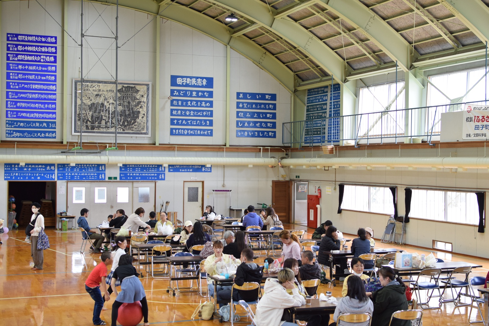
  <figcaption>
    <T>
      School gym!
      学校の体育館！
      School gym!
    </T>
  </figcaption>
</figure>

<T>
  
    Besides the bread, there were photo booths and areas for relaxing while eating bread. It was amazing seeing so many people coming all this way for bread!
  
  
    パン以外にも、フォトブースや食べながらくつろげるスペースもありました。こんなに多くの人がパンのためにわざわざ来てくれたのを見て感動しました！
  
  
    There was more stuff at the bread festival. There was a photo booth, and a place to sit and relax.
  
</T>

<figure>
  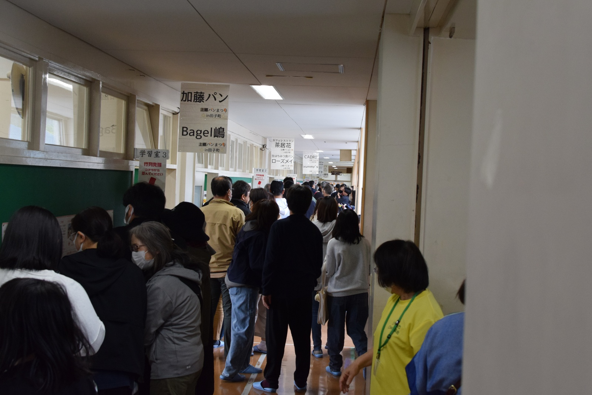
  <figcaption>
    <T>
      It's packed!
      すごい混雑！
      Many people!
    </T>
  </figcaption>
</figure>

<T>
  
    Lots of people came from all over to try the bread! I was happy that most of the shops completely sold out. I can't wait for the next one!
  
  
    遠くからもたくさんの人がパンを求めてやって来ました！ほとんどのお店が完売したことがとてもうれしかったです。次回が楽しみです！
  
  
    A lot of people came. Many shops sold out. I was happy.
  
</T>

### <T>Extra Imagesおまけの写真More Pictures!</T>

<T>
  Here are my leftover pictures of the event!
  イベントの残りの写真です！
  More pictures!
</T>

<Gallery>
  <figure>
    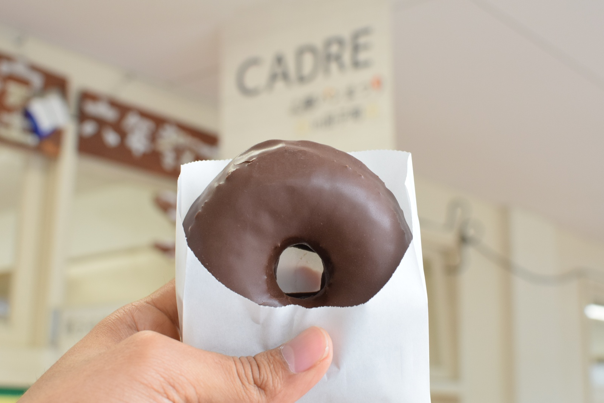
    <figcaption><T>Donut!ドーナツ！Donut!</T></figcaption>
  </figure>
  <figure>
    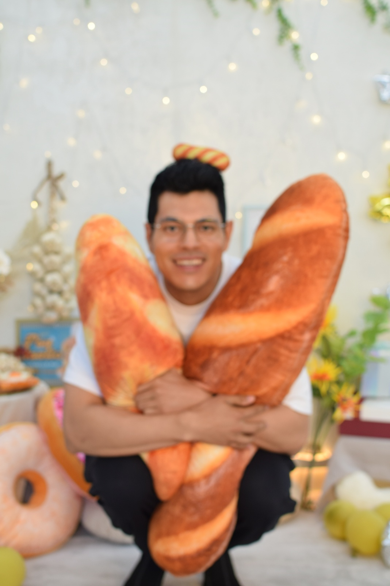
    <figcaption><T>Blurry. Whoops.ブレてる。しまった。Blurry!</T></figcaption>
  </figure>
  <figure>
    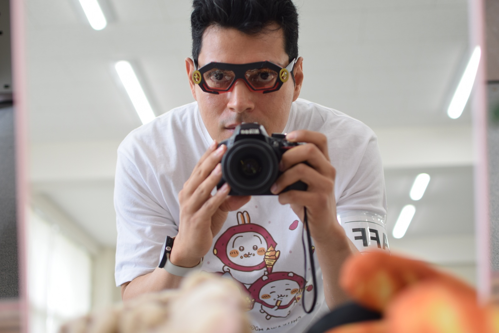
    <figcaption><T>Selfie!自撮り！Selfie!</T></figcaption>
  </figure>
  <figure>
    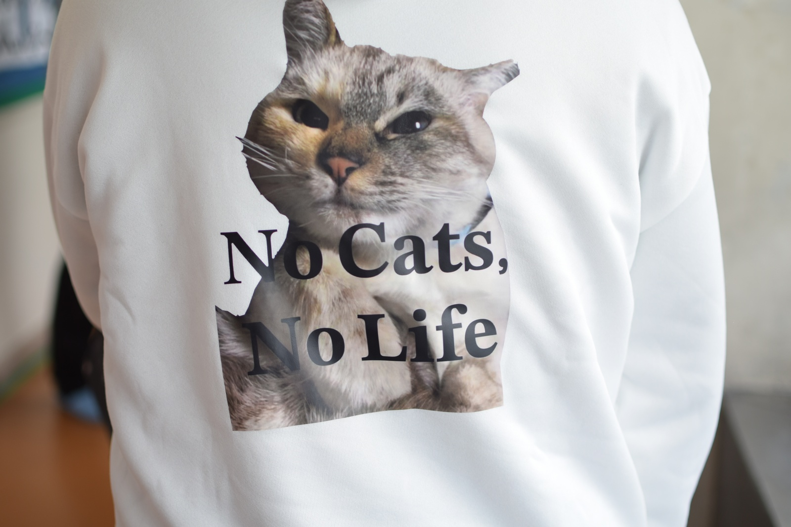
    <figcaption><T>Nice shirt!いいシャツ！Nice shirt!</T></figcaption>
  </figure>
  <figure>
    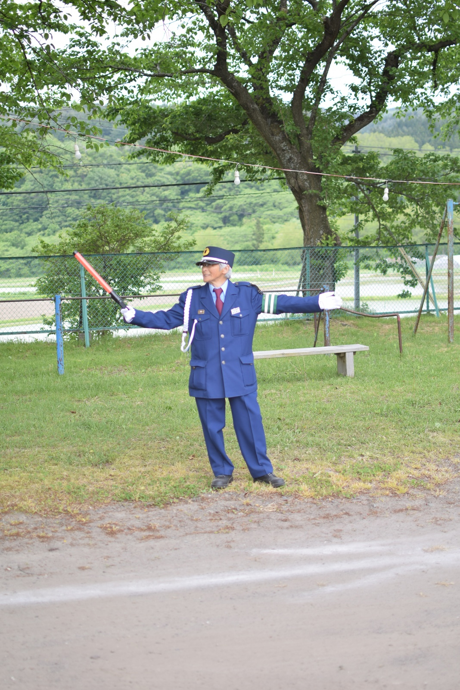
    <figcaption><T>CoolかっこいいCool</T></figcaption>
  </figure>
  <figure>
    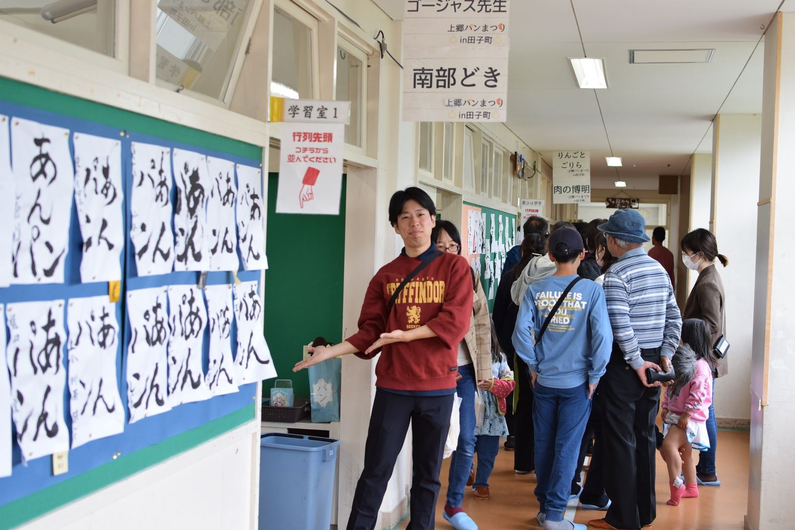
    <figcaption><T>Kuriki san!栗木さん！Kuriki san!</T></figcaption>
  </figure>
  <figure>
    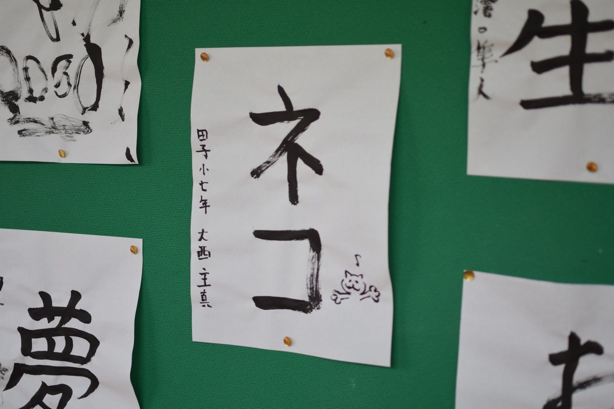
    <figcaption><T>Good taste!センスがいい！Cat!</T></figcaption>
  </figure>
  <figure>
    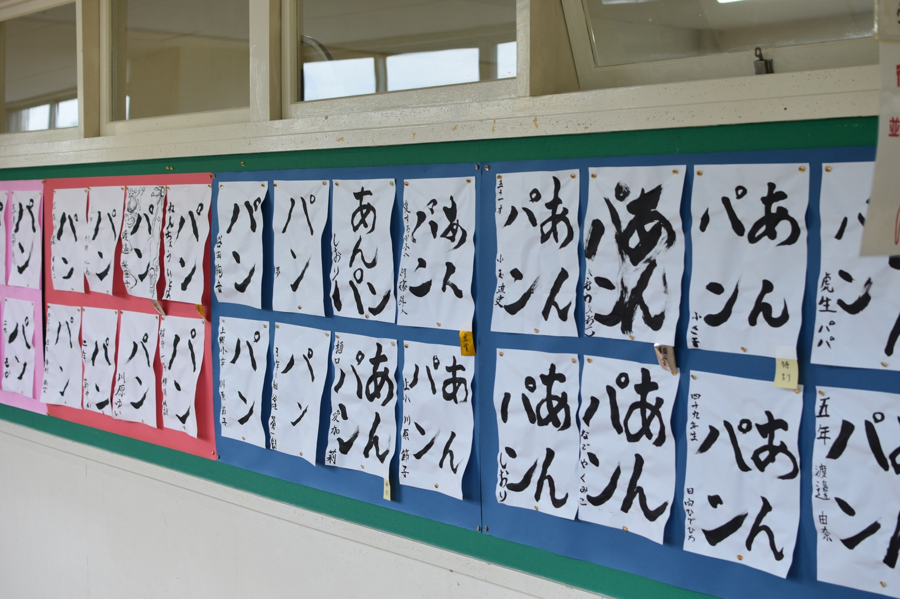
    <figcaption><T>It says bread!パンと書いてある！BREAD!</T></figcaption>
  </figure>
</Gallery>
