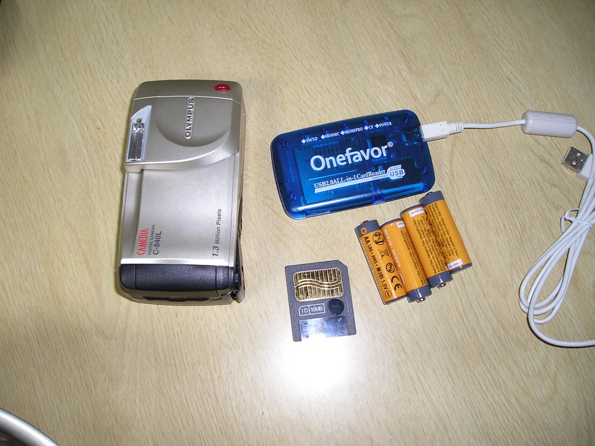
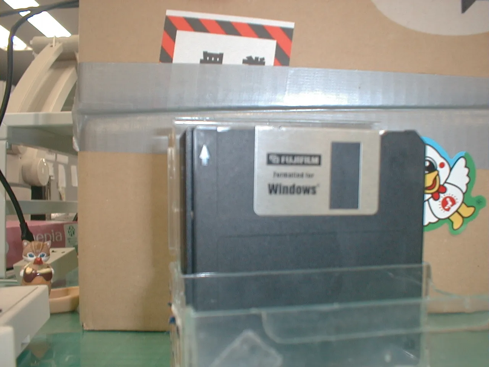
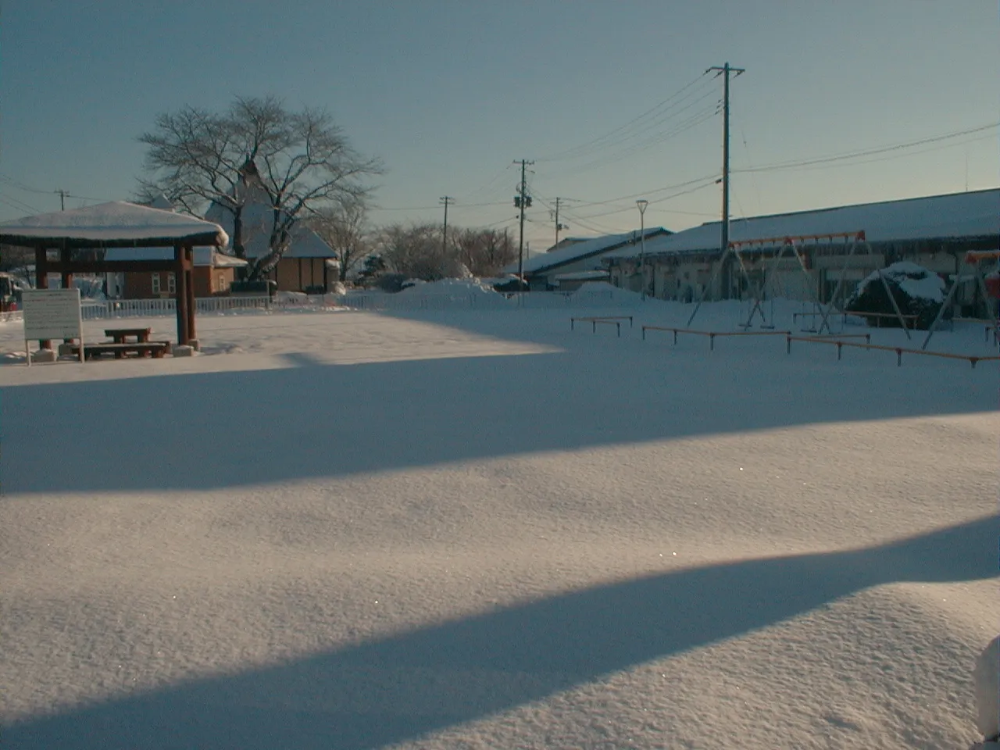

import T from "../../components/i18n/T.astro";
import Quiz from "../../components/content/Quiz.astro";
import Gallery from "../../components/content/Gallery.astro";

## <T>Olympus Camedia C-840Lオリンパス Camedia C-840LOlympus Camedia C-840L</T>

<T>
  
    This is the Olympus Camedia C-840L. It came out in the late 90s in Japan.
    Back then, it was a luxury item, and cutting edge technology. Can you guess
    how much it cost on release?
  
  
    これはオリンパスのCamedia
    C-840Lです。90年代後半に日本で発売されました。当時は高級品で、最先端技術の塊でした。発売当時の価格を当てられますか？
  
  
    This is the Olympus Camedia C-840L. It is from Japan. It was made in the
    1990s. It was expensive. How much was it? Can you guess?
  
</T>

<Quiz
  id="camera-cost"
  correctAnswerIndex={3}
  question={{
    en: "How much did this camera cost when it was released?",
    ja: "このカメラは発売当時いくらでしたか？",
    en_simple: "How much was it?",
  }}
  options={[
    { en: "¥5,000 ($50)", ja: "5,000円" },
    { en: "¥30,000 ($300)", ja: "30,000円" },
    { en: "¥50,000 ($500)", ja: "50,000円" },
    { en: "¥84,800 ($800)", ja: "84,800円" },
  ]}
/>

<T>
  
    Were you surprised? I was too. Even in person, it doesn’t feel particularly
    well made. It's plastic and reminds me of a cheap disposable film camera.
    However, considering inflation, this cost as much as a new iPhone costs
    today.
  
  
    驚きましたか？私もです。実物を見ても、特に作りが良いとは感じません。プラスチック製で、安っぽい使い捨てフィルムカメラを思い出させます。しかし、インフレを考慮すると、これは現在の新品のiPhoneと同じくらいの価格でした。
  
  
    I was surprised! The camera is plastic. It feels like a toy. It does not
    feel strong. But it was very expensive. Like an iPhone.
  
</T>

<figure>
  
  <figcaption>
    <T>
      Off store in Niigata
      新潟のリサイクルショップ
      A store in Niigata
    </T>
  </figcaption>
</figure>

<T>
  
    These days you can find them for less than 1000 yen at second-hand stores,
    or around 1500 yen on online flea market apps in Japan. Personally, I got
    mine for 500(3$) yen at Hobby Off in Niigata, and in perfect condiiton!
  
  
    最近では、中古ショップで1,000円以下、日本のフリマアプリでは約1,500円程度で見つけられます。個人的には新潟のホビーオフで500円（約3ドル）で購入し、完璧な状態でした！
  
  
    Now, it is cheap. It’s usually 1,000 yen or less. I bought mine for 500 yen
    ($3) at a store in Niigata.
  
</T>

<figure>
  
  <figcaption>
    <T>
      extra expenses
      追加の出費
      Extra costs
    </T>
  </figcaption>
</figure>

<T>
  
    Don't let that initial price fool you though. I also needed to buy 4 AA
    batteries and a special memory card called "SmartMedia" to use it.
    SmartMedia cards are very thin and they don't make them anymore, so they can
    be expensive! That's not to mention the special memory card reader. In the
    end, I spent about 5000($35 usd) yen total to be able to use it.
  
  
    でも、その最初の価格に騙されないでください。使うためには単三電池4本と、「スマートメディア」と呼ばれる特別なメモリーカードも買う必要がありました。スマートメディアは非常に薄く、もう製造されていないため、高価になることがあります！特別なカードリーダーも必要です。結局、使えるようにするために合計で約5000円（35ドル）かかりました。
  
  
    The camera was cheap, but I needed other things. I bought 4 batteries, a
    memory card, and a memory card reader. It cost 5000 yen ($35).
  
</T>

<figure>
  
  <figcaption>
    <T>
      Camera selfie
      カメラでの自撮り
      Selfie
    </T>
  </figcaption>
</figure>

<T>
  
    Having said that, it's a great piece of electronics history. And if I had
    bought it back when it was released, I would have paid over 1000 dollars
    more! Also, the pictures are pretty cool looking. If you’re curious, I
    highly recommend you try out one of these old digital cameras. I often see
    cheap bundle deals on Mercari! And of course physical used goods stores are
    good too I reccomend Hobby Off.
  
  
    とはいえ、これは電子機器の歴史における素晴らしい一品です。もし発売当時に買っていたら、1000ドル以上多く払っていたことでしょう！また、写真もかなりかっこいいです。興味があるなら、こういった古いデジタルカメラを試してみることを強くお勧めします。メルカリで安いセット販売をよく見かけます！もちろん、実店舗のリサイクルショップも良いです。ホビーオフがおすすめです。
  
  
    I like this camera. It is a cool piece of history. The pictures are good!
    Please look at the pictures. Do you want to try an old camera? Please go to
    Mercari or Hobby Off.
  
</T>

## <T>Let's try it out!さあ、試してみましょう！Let's try it!</T>

<figure>
  
  <figcaption>
    <T>
      nice view near takko elementary school
      田子小学校近くの素敵な景色
      Nice view near the school
    </T>
  </figcaption>
</figure>

<T>
  
    Compared to using my iPhone, I much prefer using a camera like this for my
    blog posts. Even though the iPhone has many convenient features, somehow
    using this feels less complicated.
  
  
    iPhoneを使うのと比べて、ブログの投稿にはこのようなカメラを使う方がずっと好きです。iPhoneには便利な機能がたくさんありますが、なぜかこれを使う方が複雑さを感じません。
  
  
    I like this camera more than my iPhone. The iPhone is easy. But this old
    camera is fun.
  
</T>

<figure>
  
  <figcaption>
    <T>
      
        These are garlic plants. It is planted in fall, and harvested the next
        year!
      
      これはニンニクです。秋に植えて、翌年に収穫します！
      
        This is garlic. It grows in winter. We harvest it next year.
      
    </T>
  </figcaption>
</figure>

<T>
  
    Since the screen is only there for reviewing pictures you already took, it
    mostly stays off. It feels like I'm using a film camera without the hassle
    of film.
  
  
    画面は撮った写真を確認するためだけにあるので、ほとんど消えたままです。フィルムの手間がないフィルムカメラを使っているような気分です。
  
  
    The screen is off. I don’t use it. It's like a film camera.
  
</T>

<figure>
  
  <figcaption>
    <T>
      View from in front of the big temple
      大きなお寺の前からの眺め
      View from the temple
    </T>
  </figcaption>
</figure>

<T>
  
    I'm not sure if I'll keep using it. I wish it didn’t eat through batteries
    so quickly! Regardless, it was a lot of fun to use and learn about. Maybe I
    will give it to someone that wants it in the future. For now though, I want
    to try using it a bit more.
  
  
    これを使い続けるかどうかはわかりません。電池の消耗がこんなに早くなければいいのに！とにかく、使ってみて学ぶのはとても楽しかったです。将来的には誰か欲しい人にあげるかもしれません。でも今のところは、もう少し使ってみたいと思います。
  
  
    I don’t know if I will use it again. The batteries are expensive. I had fun
    with the camera. I want to use it again.
  
</T>

## <T>Extra pictures!残りの写真Pictures!</T>

<Gallery>
  <figure>
    
    <figcaption>
      <T>
        My desk! It's a bit messy!
        私の机です！ちょっと散らかっています！
        My desk. It is messy.
      </T>
    </figcaption>
  </figure>

<figure>
  
  <figcaption>
    <T>
      Back of the camera
      カメラの背面
      The back of the camera
    </T>
  </figcaption>
</figure>
<figure>
  
  <figcaption>
    <T>
      Takko Elementary School playground
      遊び場
      playground
    </T>
  </figcaption>
</figure>

  <figure>
    
    <figcaption>
      <T>
        Recently renovated playground in Takko town.
        田子町の最近改装された遊び場
        A new playground in Takko.
      </T>
    </figcaption>
  </figure>
</Gallery>
