import T from "../../components/i18n/T.astro";
import Explain from "../../components/content/Explain.astro";
import Gallery from "../../components/content/Gallery.astro";
import Quiz from "../../components/content/Quiz.astro";
import TwoImages from "../../components/content/TwoImages.astro";
import imgPapillonMix1 from "../../assets/images/blog/garlic-festival-dogs/papillon-mix-1.jpg";
import imgPapillonMix2 from "../../assets/images/blog/garlic-festival-dogs/papillon-mix-2.jpg";

<T>
  
    Last weekend I volunteered at Takko's biggest festival of the year, the Ninbe Festival (short for "ninniku to beko," Japanese for "garlic and beef"). This was my third year volunteering there. It's always a great time, and lots of people from all over visit Takko to enjoy delicious food and entertaining attractions.
  
  
    先週末、田子町で一年で一番大きなお祭り「にんべ祭り」（「にんにくとべこ」の略で、「にんにくと牛」という意味です）でボランティアをしました。ここでボランティアをするのは今年で3年目です。いつもとても楽しく、各地からたくさんの人が田子町を訪れて、おいしい食べ物や楽しいアトラクションを楽しみます。
  
  
    Last weekend, I helped at the Beef and Garlic Festival. It's Takko's biggest festival! It was my third time. Many people come for the yummy food and fun shows.
  
</T>

<figure>
  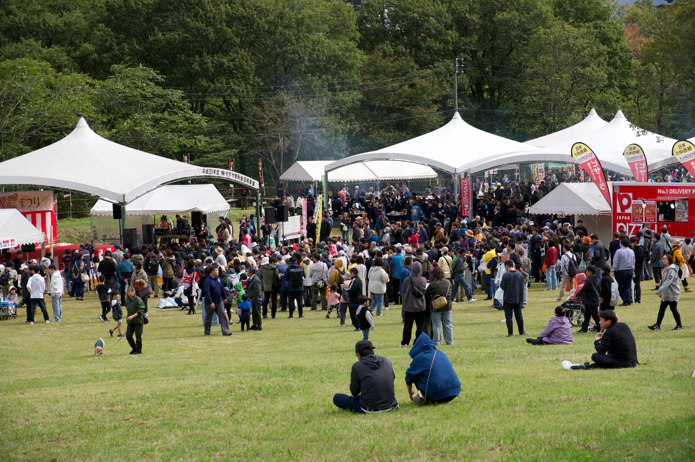
  <figcaption>
    <T>
      The crowd on day one. Can you spot the first dog?
      1日目の人混み。最初の犬を見つけられますか？
      So many people! Can you find the dog?
    </T>
  </figcaption>
</figure>

<T>
  
    There were also lots of dogs. I tried to take pictures of every dog I saw. The variety of breeds was kind of amazing. I had gotten so used to seeing the same Akita dogs, or similar, around town (Takko borders Akita) that I assumed most Japanese people had the same breed.
  
  
    犬もたくさんいました。見かけた犬はすべて写真に撮ろうとしました。犬種の多さにはちょっと驚きました。町では秋田犬やそれに似た犬ばかり見慣れていたので（田子町は秋田県と隣接しています）、日本人はだいたい同じ犬種を飼っているのだと思い込んでいました。
  
  
    There were many dogs too! I took pictures of many dogs. There were so many kinds! In Takko, I usually only see Akita dogs.
  
</T>

## <T>Day 1 Dogs1日目の犬たちDay 1 Dogs</T>

<T>
  
    The first day of the festival was busy. A famous idol group, Ringo Musume (roughly "Apple Girls"), was performing here for the first time, and their fans added to the crowd significantly.

I hadn't initially planned to photograph every dog I saw, but after noticing how willing every owner was, I got excited and made it my goal.
  
  
    祭りの1日目は混雑していました。有名なアイドルグループ「りんご娘」がここで初めてパフォーマンスをして、そのファンのおかげで人出がかなり増えました。

最初は見かけた犬をすべて撮るつもりはありませんでしたが、どの飼い主さんも快く撮らせてくれることに気づいて、うれしくなってそれを目標にしました。
  
  
    Day one was very busy. Ringo Musume came to sing! They are idols.

The dog owners were very nice. I wanted to take pictures of every dog!
  
</T>

### <T>Shiba Mix柴犬ミックスShiba Mix</T>

<figure>
  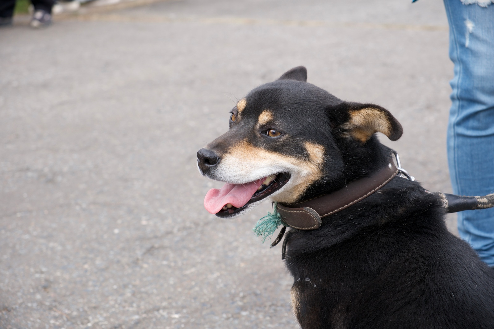
  <figcaption>
    <T>
      A Shiba mix.
      柴犬ミックス
      Shiba mix
    </T>
  </figcaption>
</figure>

<T>
  
    I wasn't sure what breed this dog was at first, and I'm still not sure. My best guess is a Shiba mix of some kind. Anyway, this was the first dog I took pictures of at the event!
  
  
    最初はこの犬の犬種がわからず、今もよくわかりません。たぶん何かの柴犬ミックスだと思います。とにかく、これがイベントで最初に写真を撮った犬です！
  
  
    I think this is a Shiba mix. It was the first dog I saw!
  
</T>

### <T>Hokkaido Dog北海道犬Hokkaido Dog</T>

<figure>
  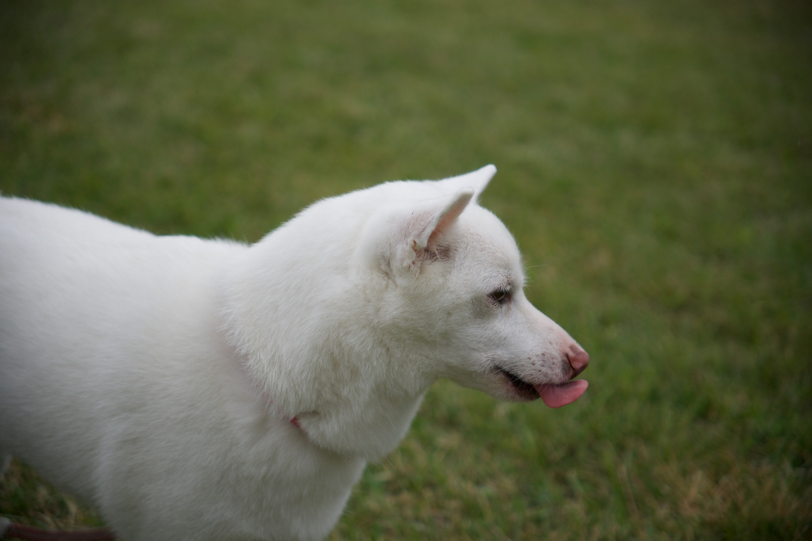
  <figcaption>
    <T>
      A Hokkaido dog.
      北海道犬
      Hokkaido dog
    </T>
  </figcaption>
</figure>

<T>
  
    The next dog was a Hokkaido dog. As you can see, I caught the perfect moment when his tongue was sticking out.
  
  
    次の犬は北海道犬でした。見てのとおり、ちょうど舌が出ている完璧な瞬間を撮ることができました。
  
  
    This is a Hokkaido dog. The picture is silly.
  
</T>

### <T>Long-Haired ChihuahuaロングコートチワワLong-Haired Chihuahua</T>

<figure>
  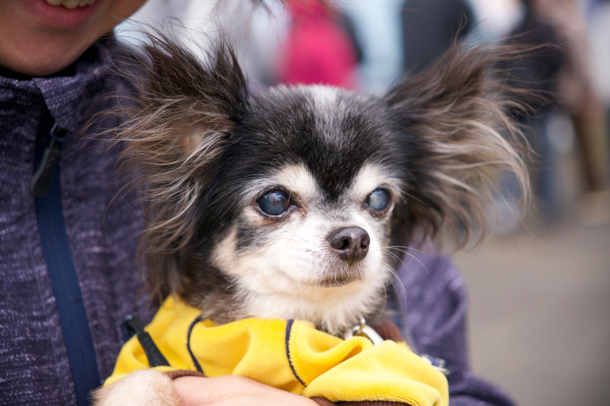
  <figcaption>
    <T>
      A long-haired Chihuahua.
      ロングコートチワワ
      Long-haired Chihuahua
    </T>
  </figcaption>
</figure>

<T>
  
    Small dogs are quite common in Japan, since in many areas, such as Tokyo, there just isn't enough space for big dogs. However, up here there's lots of space, so small dogs are actually a little rarer. I didn't ask the owner, but it seemed like this dog had some sort of eye condition. I wonder if it was blind? That would be sad, but the dog was quite happy regardless, and very <Explain meaning="looks good in photos">photogenic</Explain>! This picture and the one in the [outtakes section](#outtakes) were two of my favorites!
  
  
    日本では小型犬がとても一般的です。東京など多くの地域では、大型犬を飼うのに十分なスペースがないからです。でも、このあたりはスペースがたくさんあるので、小型犬は実は少し珍しいです。飼い主さんには聞きませんでしたが、この犬は目に何か病気があるようでした。もしかして目が見えなかったのでしょうか？それだと悲しいですが、それでもこの犬はとても楽しそうで、写真映えもしました！この写真と[没カット集](#outtakes)にある写真は、私のお気に入りの2枚です！
  
  
    In the countryside, small dogs are a bit rare. This dog was cute. Maybe this dog was blind? This dog was so happy! It's one of my favorite pictures.
  
</T>

### <T>Papillon MixパピヨンミックスPapillon Mix</T>

<TwoImages src1={imgPapillonMix1} alt1="Papillon mix" src2={imgPapillonMix2} alt2="Papillon mix" />

<T>
  
    These two dogs were perhaps twins? They were wearing matching pink outfits and moved around a lot! As you might be able to tell, their owner got them to sit still with a snack.
  
  
    この2匹は、もしかして双子だったのでしょうか？おそろいのピンクの服を着ていて、よく動き回っていました！見てわかるかもしれませんが、飼い主さんがおやつで2匹をじっとさせてくれました。
  
  
    Are they twins? Their clothes are matching! They are looking at a treat.
  
</T>

### <T>Toy Poodle MixトイプードルミックスToy Poodle Mix</T>

<figure>
  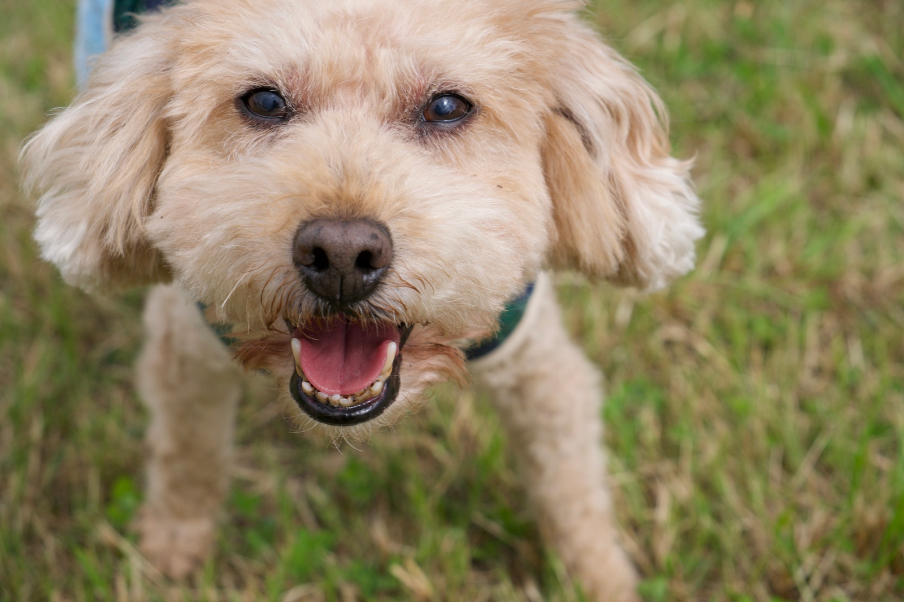
  <figcaption>
    <T>
      A toy poodle mix.
      トイプードルミックス
      Toy poodle mix
    </T>
  </figcaption>
</figure>

<T>
  
    This toy poodle was one of my favorites too, because it reminded me of my old dog, who passed away quite a while ago now. My dog was a standard poodle, which is bigger, but their faces looked similar, and of course the fur too.
  
  
    このトイプードルも私のお気に入りの一匹です。もうずいぶん前に亡くなった、昔飼っていた犬を思い出したからです。私の犬はスタンダードプードルで、もっと大きかったのですが、顔が似ていて、もちろん毛並みも似ていました。
  
  
    This dog looked like my old dog. My dog was a poodle too. That made me happy.
  
</T>

### <T>Saint BernardセントバーナードSaint Bernard</T>

<figure>
  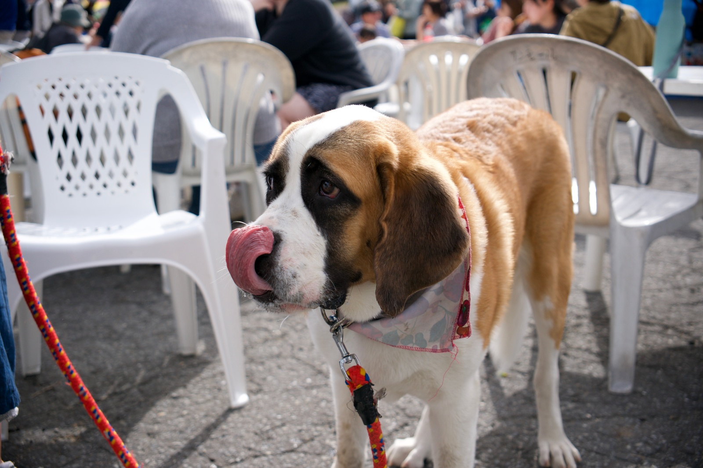
  <figcaption>
    <T>
      A Saint Bernard.
      セントバーナード
      Saint Bernard
    </T>
  </figcaption>
</figure>

<T>
  
    This dog was the first one to really surprise me, as I don't think I'd ever seen one in Japan. Like I said earlier, bigger dogs are rare in Japan in general, and even though there are more up here, they are still mostly Japanese dogs like the Akita or Shiba. This dog got a lot of attention from the people around it, which further convinced me of its "rare dog in Japan" status!
  
  
    この犬は、私が本当に驚いた最初の犬でした。日本で見たことはなかったと思います。前にも言ったように、日本では大型犬は全体的に珍しく、このあたりでは多いとはいえ、ほとんどが秋田犬や柴犬のような日本犬です。この犬は周りの人たちからとても注目を集めていて、「日本では珍しい犬」なのだとさらに確信しました！
  
  
    I was surprised! Big dogs are rare in Japan. Saint Bernard dogs are rare in Japan too. He was popular.
  
</T>

### <T>CorgiコーギーCorgi</T>

<figure>
  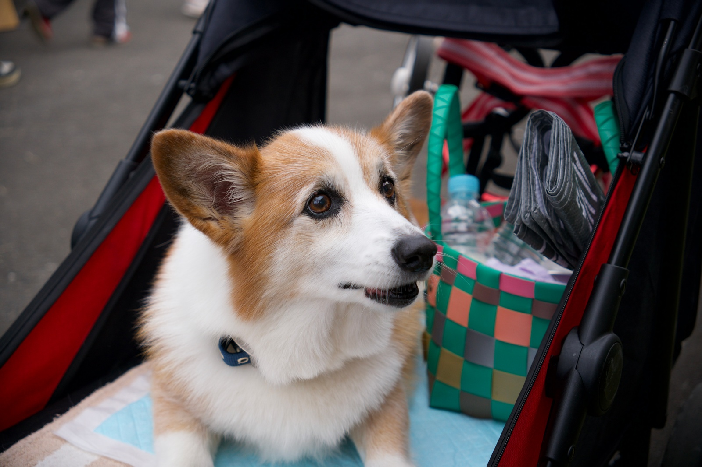
  <figcaption>
    <T>
      A corgi.
      コーギー
      Corgi
    </T>
  </figcaption>
</figure>

<T>
  
    Corgis always make me think of Ein from Cowboy Bebop, a classic anime from Japan. This one was in a stroller. Many Japanese people treat their dogs like babies, I've noticed, and strollers are just the start. Many people in America do so too, but I feel like the <Explain meaning="treating like babies">babification</Explain> of dogs is <Explain meaning="much stronger or bigger">on a whole other level</Explain> here. It's quite interesting!
  
  
    コーギーを見ると、いつも日本の名作アニメ『カウボーイビバップ』のアインを思い出します。このコーギーは犬用のベビーカーに乗っていました。日本では多くの人が犬を赤ちゃんのように扱っていることに気づきましたが、ベビーカーはほんの始まりにすぎません。アメリカでもそういう人は多いですが、ここでの犬の赤ちゃん扱いはまったく別のレベルだと感じます。とても面白いです！
  
  
    Corgis make me think of Ein from Cowboy Bebop. This one was in a stroller! It is like a baby.
  
</T>

### <T>White Spitz Mix白いスピッツミックスWhite Spitz Mix</T>

<figure>
  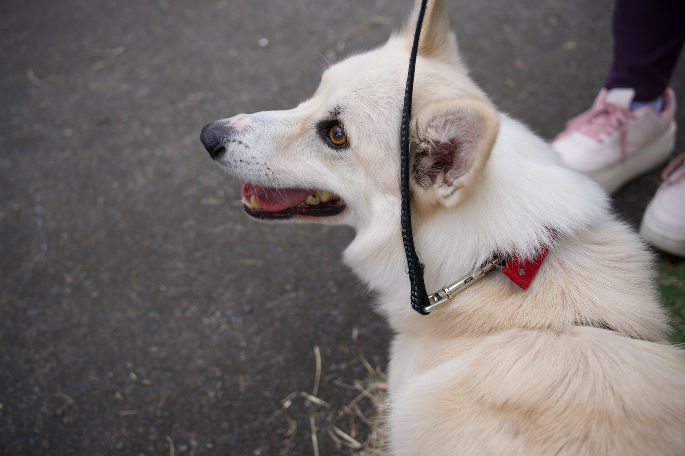
  <figcaption>
    <T>
      A white spitz mix.
      白いスピッツミックス
      White spitz mix
    </T>
  </figcaption>
</figure>

<T>
  
    I wasn't really sure about this dog's breed, but according to a dog breed app I used, it might be a spitz mix. Personally, I thought it looked quite like a fox.
  
  
    この犬の犬種はよくわかりませんでしたが、使った犬種判定アプリによると、スピッツミックスかもしれません。個人的には、キツネにかなり似ていると思いました。
  
  
    I think this is a spitz mix. It looks like a fox, doesn't it?
  
</T>

### <T>Kai Ken甲斐犬Kai Ken</T>

<figure>
  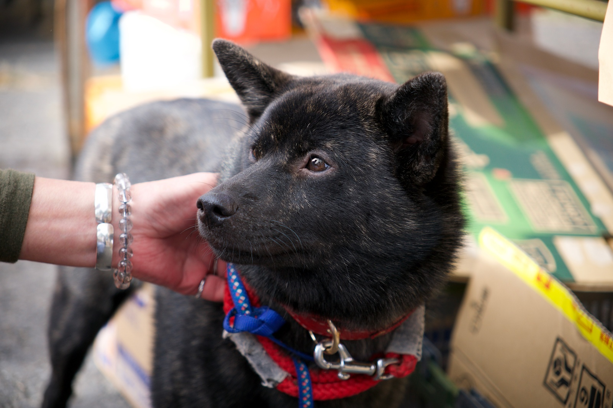
  <figcaption>
    <T>
      A Kai Ken.
      甲斐犬
      Kai Ken
    </T>
  </figcaption>
</figure>

<T>
  
    This doggy belonged to one of the staff at the festival, someone I see quite often in town, as she often runs one of the farmers' markets that I visit regularly. I didn't even know she had a dog! It was quite well behaved and <Explain meaning="walked around">roamed</Explain> freely around the booth she was stationed at. Maybe I'll see this dog again later.
  
  
    このワンちゃんは、祭りのスタッフの一人の犬でした。町でよく会う人で、私がよく行くファーマーズマーケットのひとつをいつも運営しています。犬を飼っているなんて知りませんでした！とてもお行儀がよく、彼女が担当していたブースの周りを自由に歩き回っていました。またいつか、この犬に会えるかもしれません。
  
  
    The owner works at the festival. She is my friend. I didn't know she had a dog!
  
</T>

## <T>Day 2 Dogs2日目の犬たちDay 2 Dogs</T>

<T>
  
    Sunday morning was a bit quieter, but the event was still quite busy. I also had more work to do myself, so I didn't have as much time to find the dogs, but I think I managed to find most of them.
  
  
    日曜日の朝は少し落ち着いていましたが、イベントはやはりかなり混雑していました。私自身もやることが多かったので、犬を探す時間はあまりありませんでしたが、ほとんどの犬は見つけられたと思います。
  
  
    Day two was busy too. I had more work, but I found lots of dogs!
  
</T>

### <T>Golden RetrieverゴールデンレトリバーGolden Retriever</T>

<figure>
  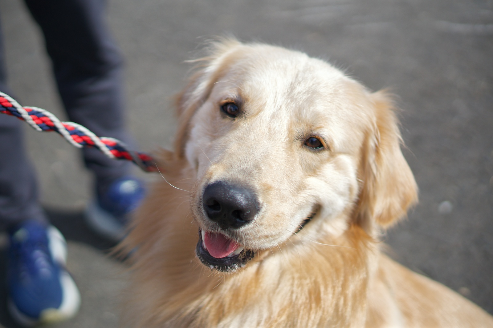
  <figcaption>
    <T>
      A golden retriever.
      ゴールデンレトリバー
      Golden retriever
    </T>
  </figcaption>
</figure>

<T>
  
    This is another dog I didn't really expect to see in Japan, but they seem to be a lot more common than I had originally thought. It's a very common breed in America, and my grandmother even had one. Honestly, they were a bit hard to tell apart from each other physically, but they each had a unique personality. This dog was calmer, and quite photogenic.
  
  
    これも日本で見るとはあまり思っていなかった犬ですが、思っていたよりずっと一般的なようです。アメリカではとても一般的な犬種で、私の祖母も一匹飼っていました。正直、見た目では見分けるのが少し難しかったですが、それぞれ個性がありました。この犬は比較的おとなしくて、写真映えもしました。
  
  
    There are many golden retrievers in America. My grandmother had one too! This one was very calm.
  
</T>

### <T>Jack Russell MixジャックラッセルミックスJack Russell Mix</T>

<figure>
  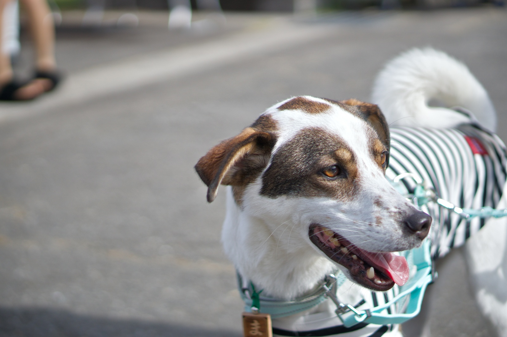
  <figcaption>
    <T>
      A Jack Russell mix. Also a foot, because of my shaky photography.
      ジャックラッセルミックス。それと、私の手ブレのせいで足も写っています。
      Jack Russell mix and a foot!
    </T>
  </figcaption>
</figure>

<T>
  
    This is the only dog whose name I remembered, mostly because half of it is in the picture: まめ (Mame). Actually, I asked each owner for their dog's name, but I managed to forget every single one. Maybe I should have written them down.
  
  
    名前を覚えているのはこの犬だけです。主な理由は、名前の半分が写真に写っているからです：まめ。実は、飼い主さん全員に犬の名前を聞いたのですが、ひとつ残らず忘れてしまいました。書き留めておけばよかったです。
  
  
    This dog's name is まめ. What a cute name.
  
</T>

### <T>Shiba Mix柴犬ミックスShiba Mix</T>

<figure>
  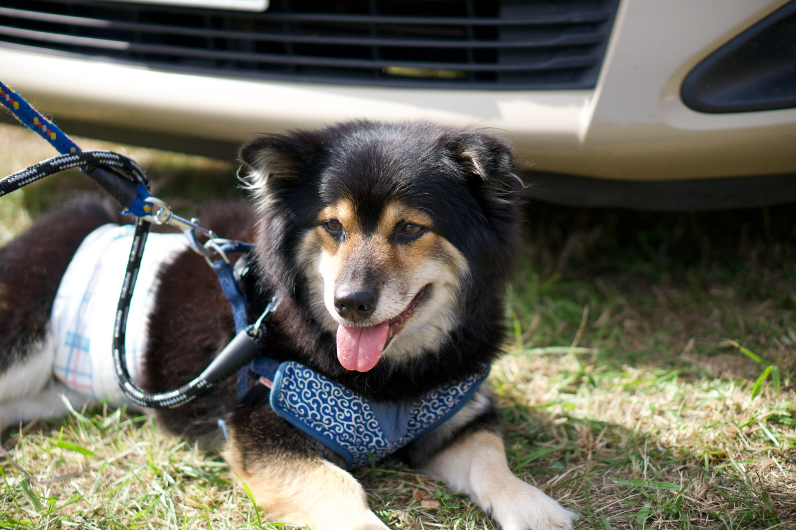
  <figcaption>
    <T>
      A Shiba mix.
      柴犬ミックス
      Shiba mix
    </T>
  </figcaption>
</figure>

<T>
  
    This dog was relaxing and enjoying the performances with their owner. The belt-like item around their body looked like a diaper at first, but I don't think it was. It reminded me of the belts that sumo wrestlers wear.
  
  
    この犬は飼い主さんと一緒にくつろぎながら、ステージを楽しんでいました。体に巻いているベルトのようなものは、最初おむつに見えましたが、違うと思います。お相撲さんが締めているまわしを思い出しました。
  
  
    This dog is looking at the show. Its belt looks like a sumo belt!
  
</T>

### <T>Toy PoodleトイプードルToy Poodle</T>

<figure>
  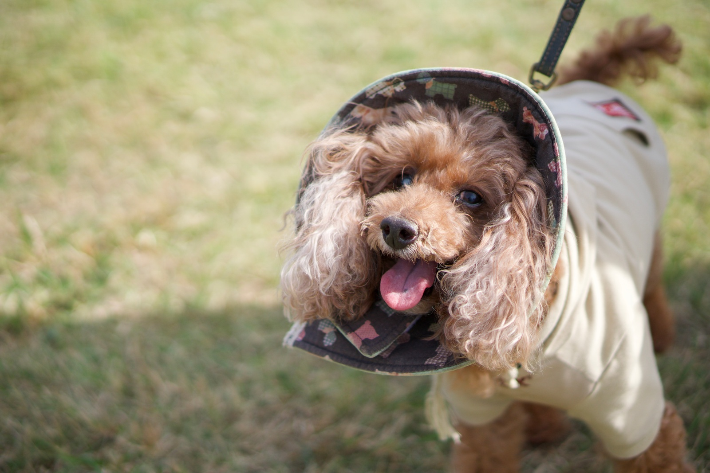
  <figcaption>
    <T>
      A toy poodle.
      トイプードル
      Toy poodle
    </T>
  </figcaption>
</figure>

<T>
  
    Another poodle! In my opinion, this one looked more like a classic toy poodle, and it was quite stylish. They were cute even with the brace! (There's a picture without the brace in the [outtakes section](#outtakes).)
  
  
    またプードルです！個人的には、こちらのほうが典型的なトイプードルらしく見えて、とてもおしゃれでした。サポーターをつけていてもかわいかったです！（サポーターをつけていない写真は[没カット集](#outtakes)にあります。）
  
  
    Another poodle! It was very stylish and cute.
  
</T>

### <T>Golden Retriever #2ゴールデンレトリバー その2Golden Retriever #2</T>

<figure>
  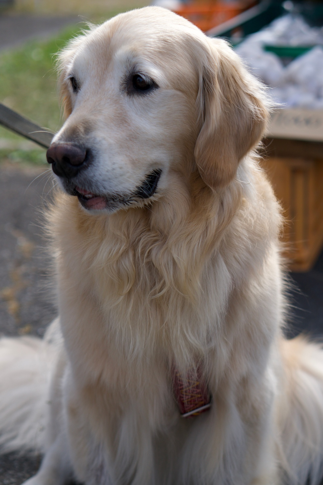
  <figcaption>
    <T>
      A golden retriever.
      ゴールデンレトリバー
      Golden retriever
    </T>
  </figcaption>
</figure>

<T>
  
    Golden retriever number two was similar to the first, but even calmer. Maybe he was older, or just had a more relaxed personality.
  
  
    2匹目のゴールデンレトリバーは1匹目と似ていましたが、さらにおとなしかったです。年をとっていたのか、それとも単にのんびりした性格だったのかもしれません。
  
  
    Golden retriever number two! He was even more calm.
  
</T>

### <T>PomeranianポメラニアンPomeranian</T>

<figure>
  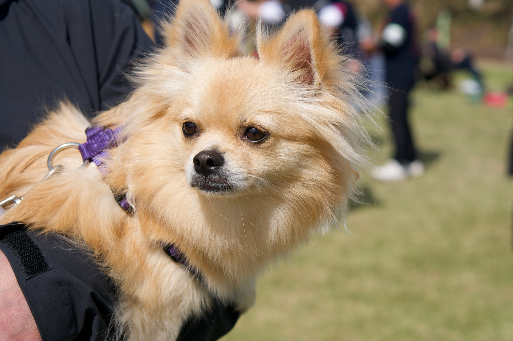
  <figcaption>
    <T>
      A Pomeranian.
      ポメラニアン
      Pomeranian
    </T>
  </figcaption>
</figure>

<T>
  
    A Pomeranian in the rare <Explain meaning="not fluffy">non-puffball</Explain> form. I think this small breed is also quite popular in Japan. I wonder what it was looking at.
  
  
    珍しい、もふもふではない姿のポメラニアンです。この小型犬も日本でかなり人気があると思います。何を見ていたのでしょうね。
  
  
    This Pomeranian has short fur! What is it looking at?
  
</T>

### <T>Labrador MixラブラドールミックスLabrador Mix</T>

<figure>
  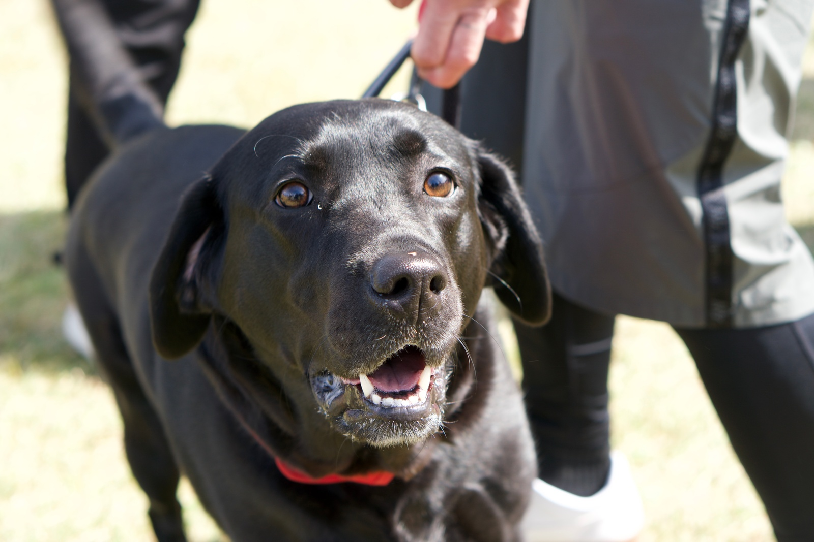
  <figcaption>
    <T>
      A Labrador mix.
      ラブラドールミックス
      Labrador mix
    </T>
  </figcaption>
</figure>

<T>
  
    This lively Labrador was super excited to be here. The app marked it as a mix, but I wonder what it's mixed with?
  
  
    この元気なラブラドールは、ここに来られて大はしゃぎでした。アプリではミックスと判定されましたが、何とのミックスなのでしょうか？
  
  
    This dog was so excited! I think it's a Labrador mix. It's so black.
  
</T>

### <T>Cavalier King Charles Spanielキャバリア・キング・チャールズ・スパニエルCavalier King Charles Spaniel</T>

<figure>
  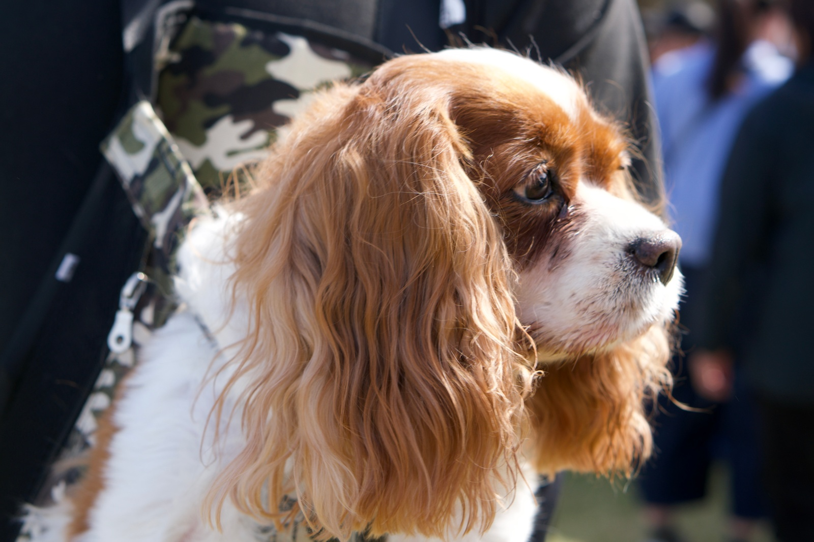
  <figcaption>
    <T>
      A Cavalier King Charles Spaniel.
      キャバリア・キング・チャールズ・スパニエル
      Cavalier King Charles Spaniel
    </T>
  </figcaption>
</figure>

<T>
  
    This dog reminded me of someone I know with curly hair. <Explain meaning="by the way">Incidentally</Explain>, it happened to be her favorite of the dogs I photographed!
  
  
    この犬を見て、巻き毛の知り合いを思い出しました。ちなみに、私が撮った犬の中で、彼女のお気に入りはこの犬でした！
  
  
    This dog has curly hair. It looks like my friend. My friend has curly hair too.
  
</T>

### <T>Chihuahua MixチワワミックスChihuahua Mix</T>

<figure>
  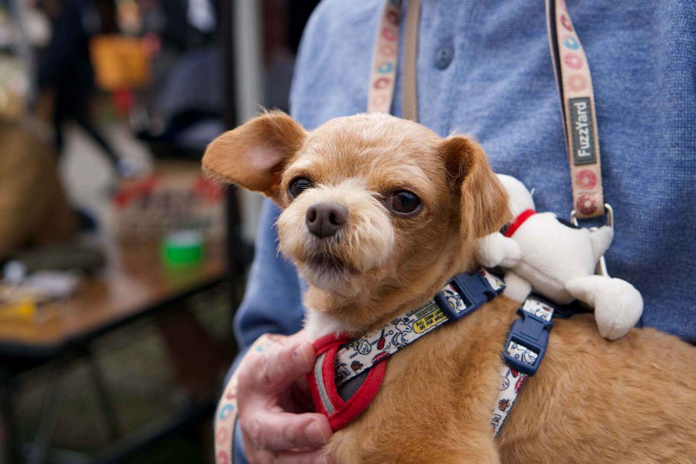
  <figcaption>
    <T>
      A Chihuahua mix.
      チワワミックス
      Chihuahua mix
    </T>
  </figcaption>
</figure>

<T>
  
    This dog looks like he's about to bark at me, because he is. <Explain meaning="just like Chihuahuas usually act">In classic Chihuahua fashion</Explain>, he was barking at anyone who got too close. However, that didn't stop me from taking a close-up shot.
  
  
    この犬は今にも私に吠えそうに見えますが、実際に吠えています。いかにもチワワらしく、近づきすぎた人には誰にでも吠えていました。でも、それでも私は近くから写真を撮りました。
  
  
    This dog is barking at me! But I still took a picture.
  
</T>

### <T>Shiba Inu柴犬Shiba Inu</T>

<figure>
  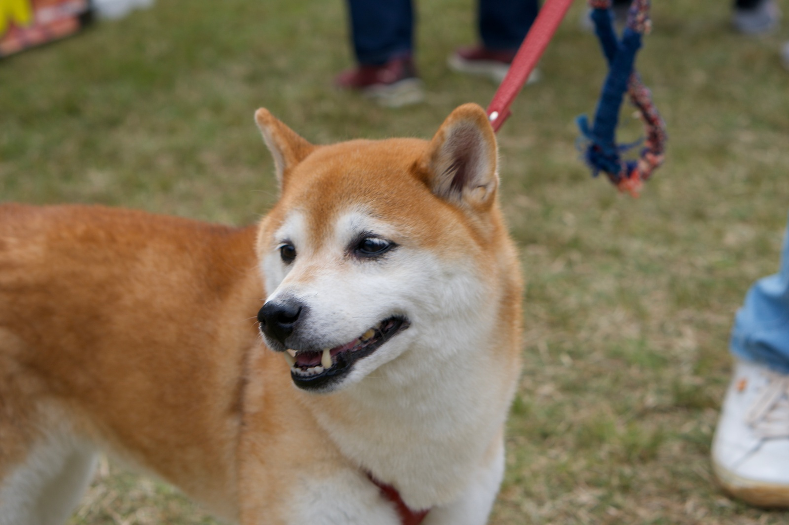
  <figcaption>
    <T>
      A Shiba Inu.
      柴犬
      Shiba Inu
    </T>
  </figcaption>
</figure>

<T>
  
    This was the only Shiba Inu I saw at the event, which was a bit of a surprise. I still <Explain meaning="always think of">can't help but think of</Explain> the <Explain meaning="a famous internet joke picture of a Shiba Inu">doge meme</Explain> when I see them.
  
  
    イベントで見た柴犬はこの一匹だけで、ちょっと意外でした。柴犬を見ると、今でもあの「Doge」のミームを思い出さずにはいられません。
  
  
    This was the only Shiba Inu I saw. I was surprised! Isn't this kind of dog common in Japan?
  
</T>

### <T>Golden Retriever #3ゴールデンレトリバー その3Golden Retriever #3</T>

<figure>
  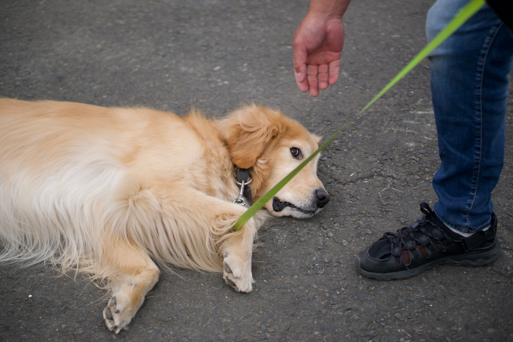
  <figcaption>
    <T>
      A golden retriever.
      ゴールデンレトリバー
      Golden retriever
    </T>
  </figcaption>
</figure>

<T>
  
    This poor doggy was on his way home. As you can see, he did not want to leave! His owner was pulling, <Explain meaning="offering treats">bribing</Explain>, and <Explain meaning="begging">pleading</Explain>, but in the end he had to be carried away.
  
  
    このかわいそうなワンちゃんは、帰るところでした。見てのとおり、帰りたくなかったのです！飼い主さんは引っ張ったり、おやつで釣ったり、お願いしたりしていましたが、結局抱っこされて連れて行かれました。
  
  
    This dog did not want to go home! The owner had to carry him.
  
</T>

### <T>GoldendoodleゴールデンドゥードルGoldendoodle</T>

<figure>
  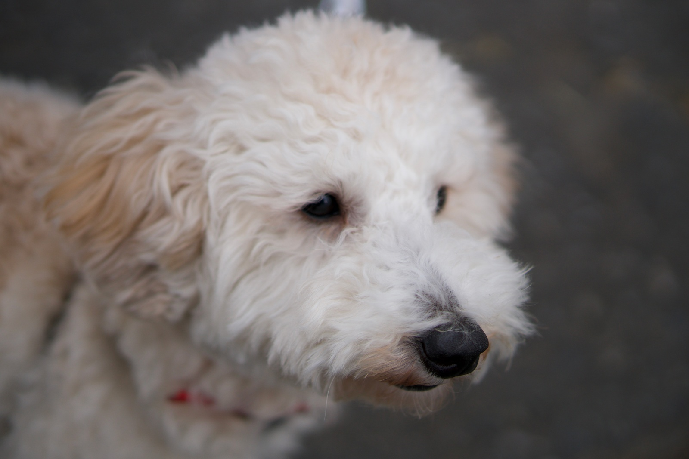
  <figcaption>
    <T>
      A goldendoodle.
      ゴールデンドゥードル
      Goldendoodle
    </T>
  </figcaption>
</figure>

<T>
  
    Apparently a goldendoodle is a cross between a golden retriever and a poodle. Maybe this dog is too white to be one, but it's my best guess. Anyway, this doggy also reminded me of my poodle.
  
  
    ゴールデンドゥードルは、ゴールデンレトリバーとプードルのミックスだそうです。この犬はそれにしては白すぎるかもしれませんが、これが私の一番の予想です。とにかく、このワンちゃんも私のプードルを思い出させてくれました。
  
  
    I think this is a goldendoodle. It's a golden retriever and poodle mixed together.
  
</T>

### <T>Pomeranian #2ポメラニアン その2Pomeranian #2</T>

<figure>
  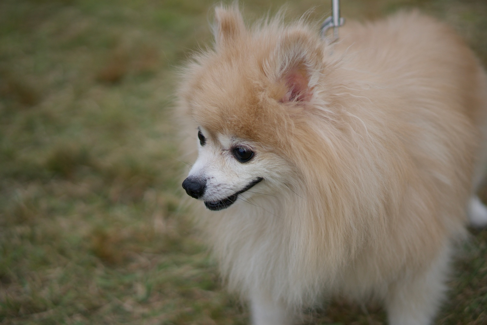
  <figcaption>
    <T>
      A Pomeranian.
      ポメラニアン
      Pomeranian
    </T>
  </figcaption>
</figure>

<T>
  
    The second Pomeranian I saw. In my opinion, this one had more of a fox-like face. It was distracted by something; I wonder what it was.
  
  
    2匹目に見たポメラニアンです。個人的には、こちらのほうがキツネっぽい顔をしていると思います。何かに気をとられていましたが、何だったのでしょうね。
  
  
    Another Pomeranian! This one's face looks like a fox, doesn't it?
  
</T>

### <T>Pit BullピットブルPit Bull</T>

<figure>
  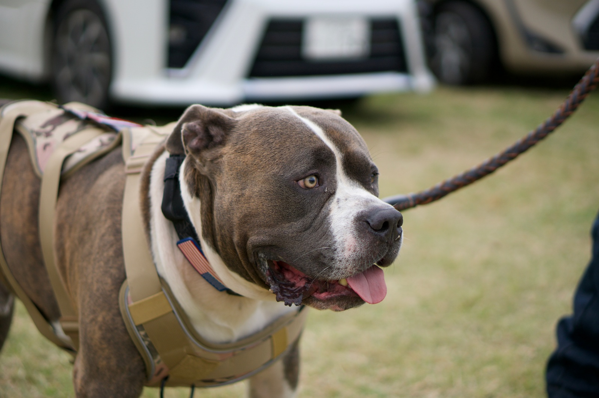
  <figcaption>
    <T>
      A pit bull.
      ピットブル
      Pit bull
    </T>
  </figcaption>
</figure>

<T>
  
    The final dog of the event: a pit bull. This is the last dog I ever expected to see in Japan. I think they are fairly common back in the US, but I wouldn't be surprised if this was the only one in Aomori! <Explain meaning="looking at his clothes">Judging by his outfit</Explain>, you'd think he belonged to a soldier from one of the US bases, but his owner was Japanese. The owner also happened to come second in the garlic-spitting competition!
  
  
    イベント最後の犬は、ピットブルでした。日本で見るとは一番思っていなかった犬です。アメリカではわりと一般的だと思いますが、青森県にいるピットブルがこの一匹だけだったとしても驚きません！服装を見ると、アメリカ軍基地の兵士の犬かと思いますが、飼い主さんは日本人でした。しかもその飼い主さんは、にんにく飛ばし大会で2位になりました！
  
  
    The last dog was a pit bull! I was very surprised to see one in Aomori. The owner got second place in the garlic spitting contest!
  
</T>

<Quiz
  id="garlic-festival-pit-bull"
  question={{
    en: "Have you ever seen a pit bull in Japan?",
    ja: "日本でピットブルを見たことがありますか？",
    en_simple: "Have you seen a pit bull in Japan?",
  }}
  options={[
    { en: "Yes", ja: "はい" },
    { en: "No", ja: "いいえ" },
    { en: "Maybe", ja: "たぶん" },
  ]}
/>

<T>
  
    That ends my exhibition of dogs from the Ninbe Festival. I don't think I managed to photograph every single dog, but I sure tried my hardest.

My main goal, though, was to work on my photography skills. Taking pictures of dogs moving around all over the place was <Explain meaning="very difficult">quite the challenge</Explain>, and I don't think I got my settings right, especially on day 2! It was a great learning experience though, both for photography and for the dog breeds you can find at a festival in the Japanese countryside.
  
  
    これで、にんべ祭りの犬の紹介はおしまいです。すべての犬を撮れたとは思いませんが、精一杯がんばりました。

でも、一番の目的は写真の腕を上げることでした。あちこち動き回る犬を撮るのはかなり大変で、特に2日目は設定がうまくいかなかったと思います！それでも、写真についても、日本の田舎のお祭りで見られる犬種についても、とても勉強になりました。
  
  
    That's all the dogs! I wanted to get better at taking pictures. It was hard, but it was fun!
  
</T>

## <T>Outtakes没カット集More Pictures</T>

<Gallery>
  <figure>
    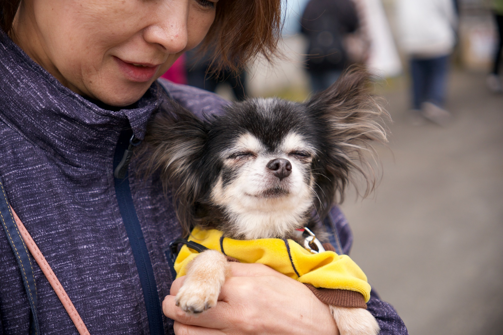
    <figcaption>
      <T>
        Long-haired Chihuahua
        ロングコートチワワ
        Long-haired Chihuahua
      </T>
    </figcaption>
  </figure>
  <figure>
    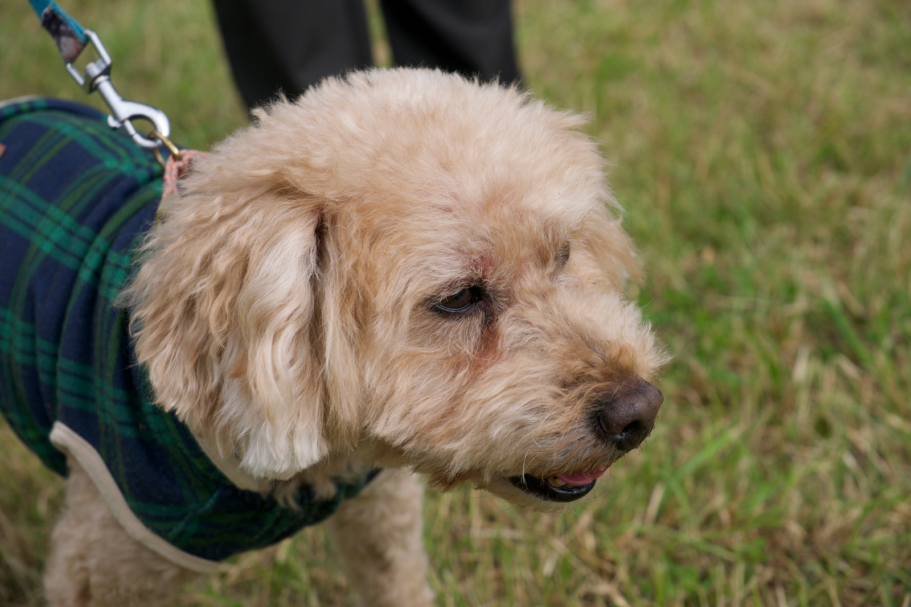
    <figcaption>
      <T>
        Toy poodle mix
        トイプードルミックス
        Toy poodle mix
      </T>
    </figcaption>
  </figure>
  <figure>
    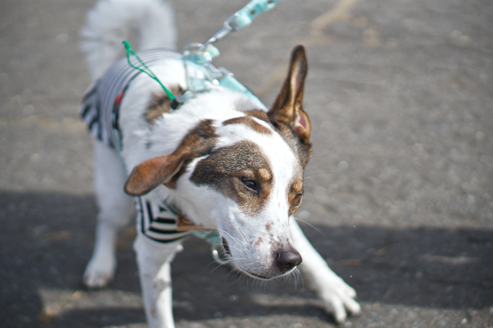
    <figcaption>
      <T>
        Jack Russell mix
        ジャックラッセルミックス
        Jack Russell mix
      </T>
    </figcaption>
  </figure>
  <figure>
    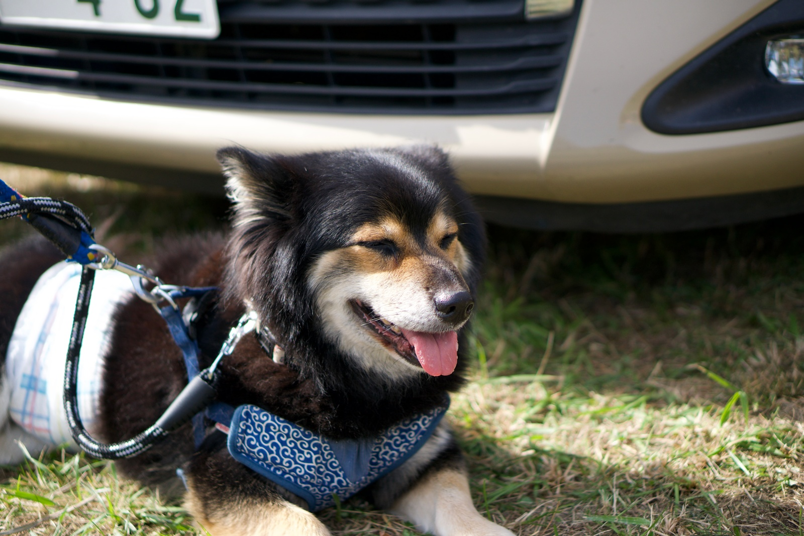
    <figcaption>
      <T>
        Shiba mix
        柴犬ミックス
        Shiba mix
      </T>
    </figcaption>
  </figure>
  <figure>
    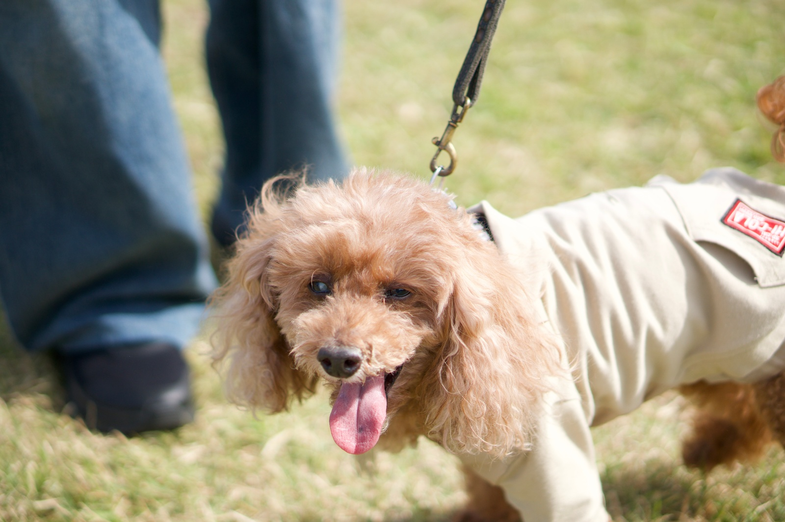
    <figcaption>
      <T>
        Toy poodle
        トイプードル
        Toy poodle
      </T>
    </figcaption>
  </figure>
  <figure>
    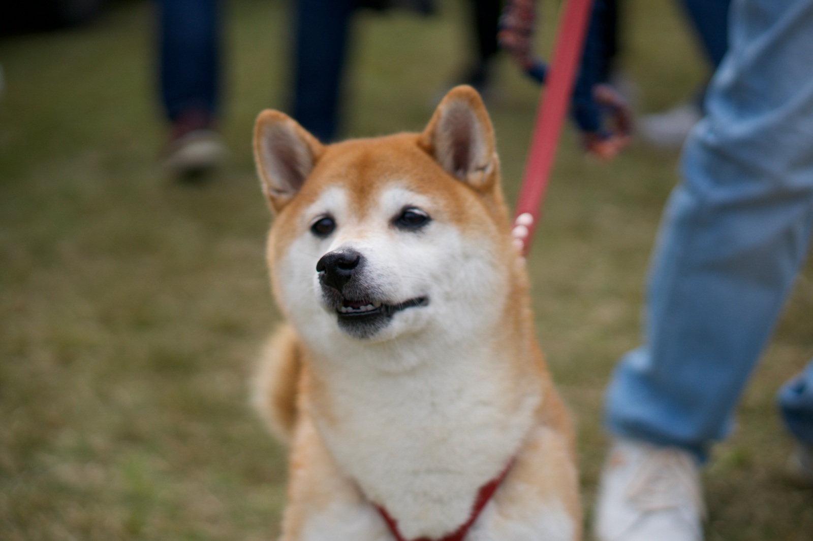
    <figcaption>
      <T>
        Shiba Inu
        柴犬
        Shiba Inu
      </T>
    </figcaption>
  </figure>
  <figure>
    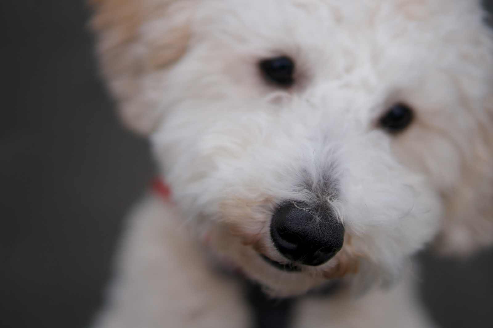
    <figcaption>
      <T>
        Goldendoodle
        ゴールデンドゥードル
        Goldendoodle
      </T>
    </figcaption>
  </figure>
  <figure>
    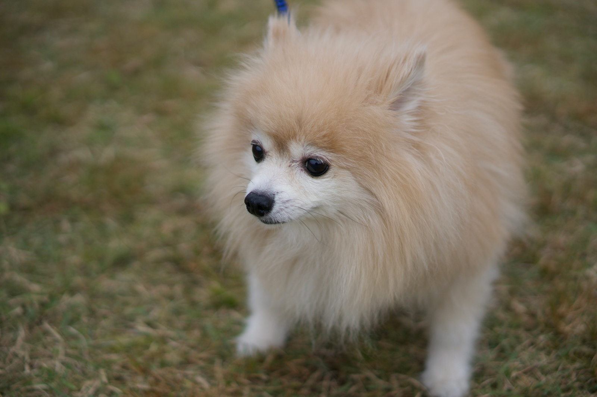
    <figcaption>
      <T>
        Pomeranian
        ポメラニアン
        Pomeranian
      </T>
    </figcaption>
  </figure>
</Gallery>
