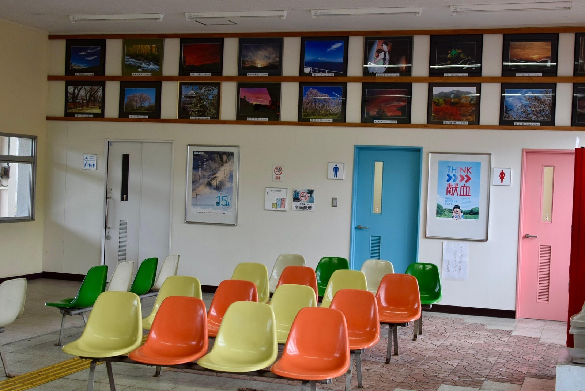
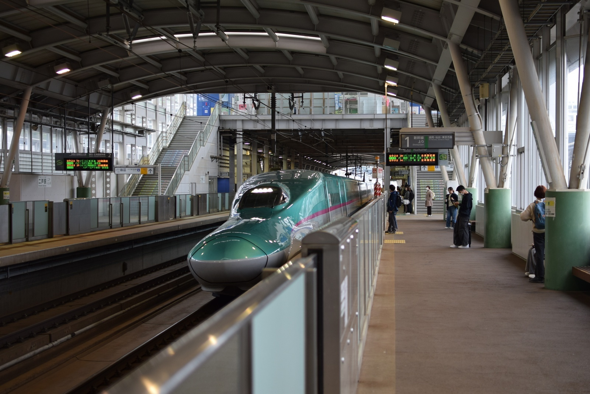
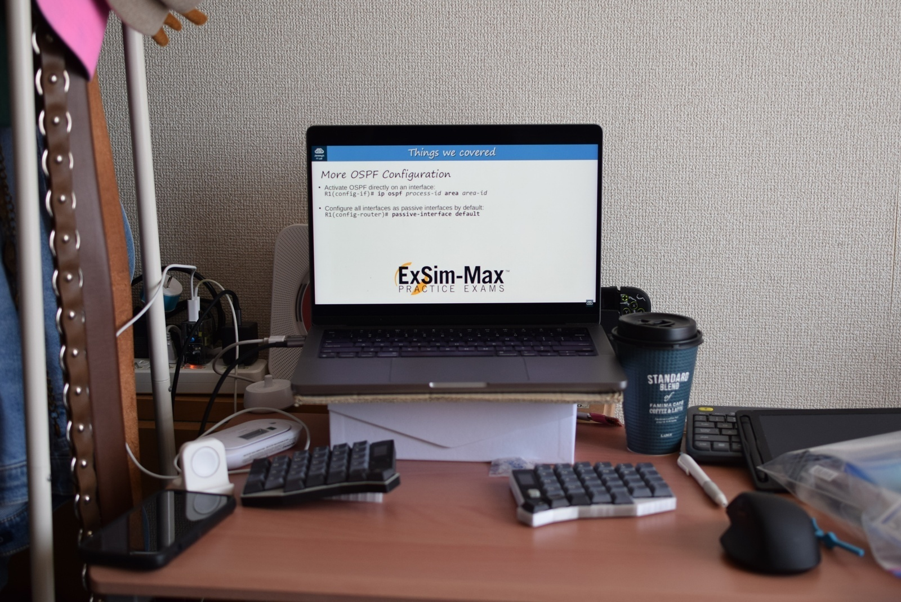
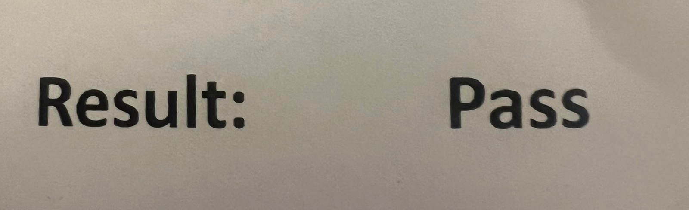
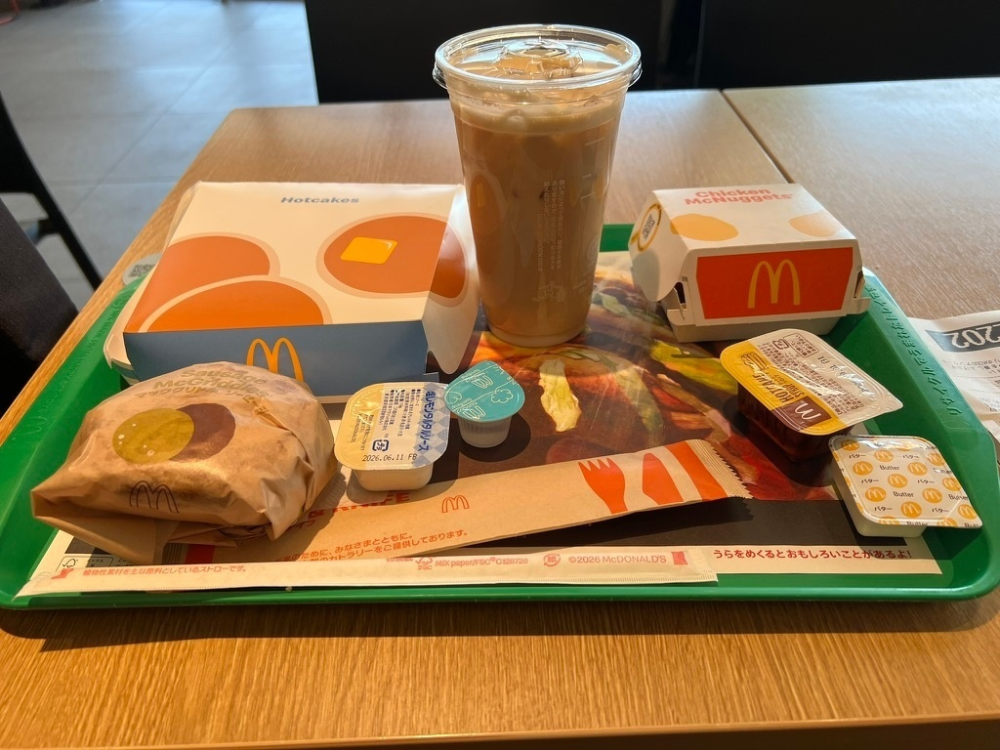
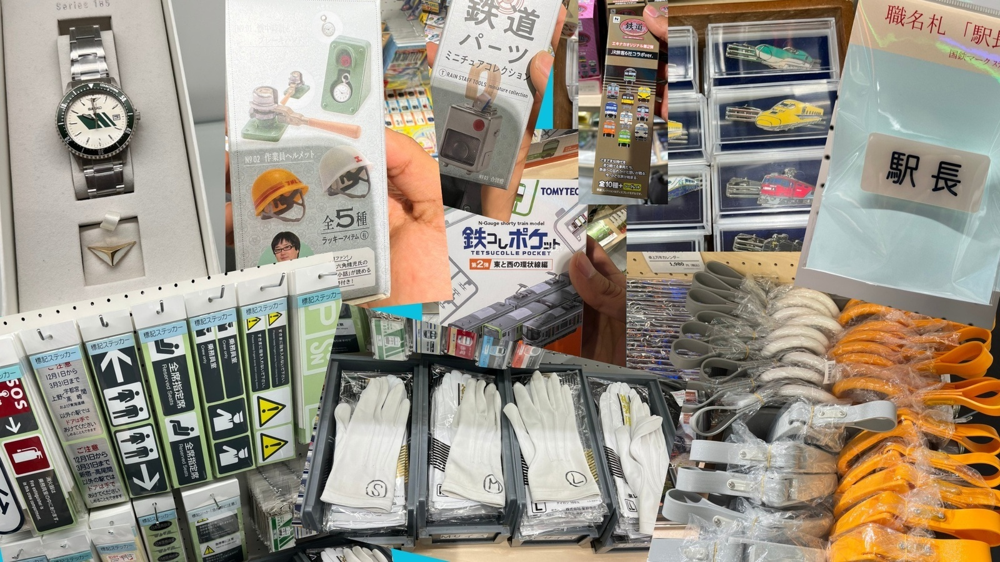
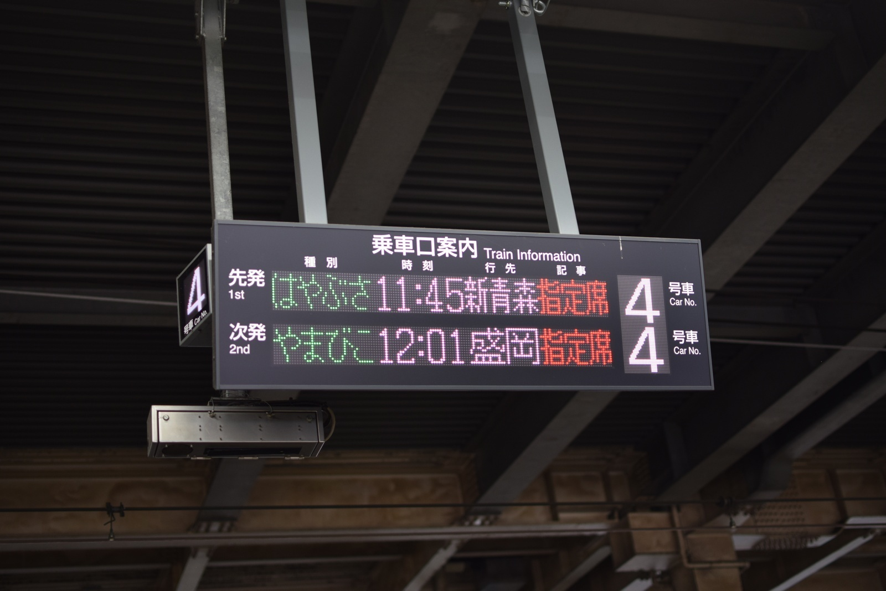
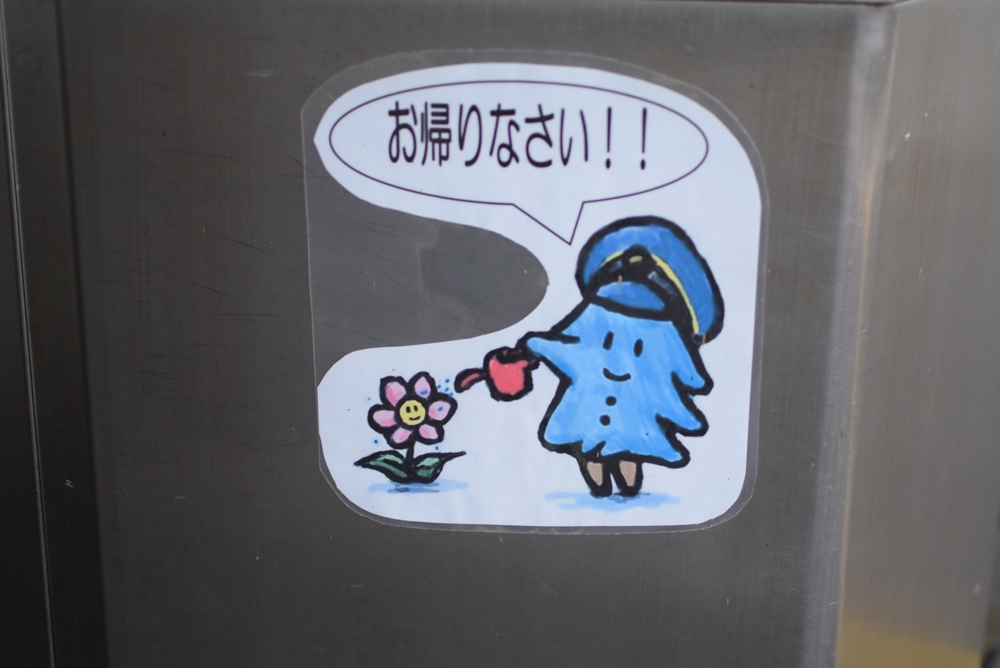

import T from "~/components/i18n/T.astro";
import Quiz from "~/components/content/Quiz.astro";
import Explain from "~/components/content/Explain.astro";

<T>
  
    Around the first week of May in Japan is known as Golden Week. It's a string
    of holidays that make up a week-long vacation period for students and some
    employees in Japan. Personally, I see it as a second spring after the first
    one at the end of March. It's a nice break after the students settle into
    their new classrooms. I usually go on a trip with my girlfriend during Golden
    Week.
  
  
    日本では5月の最初の週頃を「ゴールデンウィーク」と呼びます。学生や一部の社会人にとって、一週間の休暇期間となる連休です。個人的には、3月末の最初の春に続く「第二の春」として捉えています。生徒たちが新しいクラスに慣れてきた頃のちょうどいい休みです。ゴールデンウィークはいつもガールフレンドと旅行に行っています。
  
  
    Do you know about Golden Week? It's a Japanese holiday. Many people can go
    on vacation. I usually go on a trip with my girlfriend.
  
</T>

<figure>
  
  <figcaption>
    <T>
      Sannohe Station. It's very colorful.
      三戸駅の中
      Colorful station!
    </T>
  </figcaption>
</figure>

<figure>
  
  <figcaption>
    <T>
      Shinkansen at Ninohe station. So cool.
      二戸駅の新幹線。かっこいい！
      My favorite train!
    </T>
  </figcaption>
</figure>

<T>
  
    However, this year instead of visiting a new prefecture or even Disneyland,
    I went down to Kanto to take a test! More specifically, the <a href="https://en.wikipedia.org/wiki/CCNA">CCNA</a>, which
    stands for{" "}
    <Explain meaning="a well-known IT certification for computer networking">Cisco Certified Network Associate</Explain>
    . Basically, it's something to make my resume look a little nicer when I
    transition to an IT job, as I can't be an English teacher forever,
    unfortunately!
  
  
    でも今年は、新しい都道府県を訪れたりディズニーランドに行ったりする代わりに、試験を受けるために関東へ行ってきました！具体的には、CCNA（シスコ認定ネットワークアソシエイト）という資格試験です。ITの仕事に転職する際に履歴書を少し良く見せるためのもので、英語の先生をずっと続けるわけにはいきませんからね！
  
  
    This time, I did not go on a trip. I went to Kanto to take a test! It's
    called the CCNA.
  
</T>

### <T>What is the CCNA?CCNAとは？What is the CCNA?</T>

<T>
  
    The CCNA is an IT certification related to networking — basically the
    machines and wires that connect computers to each other, whether that's your
    printer at home or devices on opposite sides of the world. It's{" "}
    <Explain meaning="for people just starting out">entry level</Explain>, but{" "}
    <Explain meaning="famously">notoriously</Explain> difficult,
    requiring months of dedicated study even if you already have some IT
    background. Not only that, but it's expensive! Especially with the current
    exchange rate, I ended up paying over 50,000 yen just to attempt it!
  
  
    CCNAはネットワークに関するIT資格で、基本的には家のプリンターから世界の反対側にある機器まで、コンピューター同士をつなぐ機械や配線に関わるものです。エントリーレベルの資格ですが、悪名高いほど難しく、すでにIT知識がある人でも数ヶ月の集中学習が必要です。しかも高い！特に今の為替レートを考えると、受験するだけで50,000円以上かかってしまいました！
  
  
    The CCNA is about computers and the internet. It's hard, and it's
    expensive! I paid 50,000 yen.
  
</T>

### <T>Not So Golden Weekゴールデンとは言えない週Not So Golden Week</T>

<T>
  
    I think this was my most stressful Golden Week ever! I saved all my practice
    tests for this week. They were quite difficult. Actually, I didn't pass a
    single one! But with every test, I was able to review and find my weaknesses.
    I would spend the day after a practice test reviewing, then it was onto the
    next one. I was honestly a bit worried, but I knew from reading online that
    the practice tests I was using were{" "}
    notoriously way harder than the real thing
    . Even so, I went into the test feeling quite nervous.
  
  
    今年のゴールデンウィークは、人生で一番ストレスのかかる週だったと思います！模擬試験はすべてこの週のためにとっておきました。かなり難しかったです。なんと、一つも合格点に達しなかったんです！でも、毎回の模擬試験で復習して自分の弱点を見つけることができました。模擬試験の翌日は復習に充て、それが終わったら次の模擬試験、という繰り返しです。正直少し不安でしたが、ネットで調べて、私が使っていた模擬試験は本番より格段に難しいことで有名だと知っていました。それでも試験に臨む時はかなり緊張しました。
  
  
    This Golden Week was not so fun. I studied every day. I thought I was going
    to fail. I was worried.
  
</T>

<figure>
  
  <figcaption>
    <T>
      My girlfriend set up my study desk in her tiny apartment!
      ガールフレンドが狭いアパートに勉強スペースを作ってくれた！
      Study time!
    </T>
  </figcaption>
</figure>

### <T>Taking the Testいよいよ試験Taking the Test</T>

<figure>
  
  <figcaption>
    <T>
      I think Wendy's is hard to say in Japanese.
      ウェンディーズって日本語で言いにくいよね。
      Wendy's!
    </T>
  </figcaption>
</figure>

<T>
  
    On test day, I went to the location a bit early so I could confirm where it
    was. I decided to get some Wendy's, or as it's known in Japan, "First
    Kitchen." Fun fact, it was originally known as "Fakkin," but the name was
    changed due to its similarity to a certain English word.
  
  
    試験当日、場所を確認するために少し早めに会場へ向かいました。ウェンディーズ、日本では「ファーストキッチン」として知られているお店で食事することにしました。豆知識ですが、もともと「ファッキン」という略称で知られていましたが、ある英語の言葉に似すぎているとして名前が変更されたそうです。
  
  
    Before the test, I went to Wendy's. It's called "First Kitchen" in Japan.
  
</T>

<T>
  
    After enjoying my "morning burger," I proceeded to the test center. There
    were a few other people there too, doing various tests it seemed. The staff
    were kind, and after some processing, I was sitting in front of a computer
    ready to go.
  
  
    「朝のバーガー」を楽しんだ後、試験センターへ向かいました。そこには他にも何人かいて、様々な試験を受けているようでした。スタッフは親切で、手続きを済ませると、コンピューターの前に座っていよいよ始まりという状況になりました。
  
  
    I ate a burger. Then I went to take the test.
  
</T>

### <T>How Did It Go?結果はどうだった？How Did It Go?</T>

<T>
  
    The first half of the test was very easy, even more than I expected.
    However, the second half was actually harder, and I{" "}
    <Explain meaning="only just managed to finish in time">barely finished</Explain>{" "}
    with 3 minutes left!
  
  
    試験の前半は、予想以上にとても簡単でした。しかし後半は実際に難しく、残り3分でギリギリ終わりました！
  
  
    The test was so hard! I almost ran out of time!
  
</T>

<T>
  
    I didn't have to wait long at all for my results. After stepping out of the
    test room, the kind staff handed me some papers with an "otsukaresama
    deshita." I quickly{" "}
    <Explain meaning="turned pages quickly to find something">flipped through</Explain>{" "}
    them. I was first greeted with one of the worst pictures ever taken of me,
    then at the bottom, the result — I passed!
  
  
    結果はほとんど待つことなくわかりました。試験室を出ると、親切なスタッフが「お疲れ様でした」と言いながら書類を渡してくれました。急いでめくってみると、まず今まで撮られた中で最悪と言えるほどひどい写真が目に飛び込んできて、そしてページの下に結果が——合格でした！
  
  
    I almost ran out of time!
  
</T>

<figure>
  
  <figcaption>
    <T>
      Perhaps my worst picture.
      証明写真…
      Bad picture!
    </T>
  </figcaption>
</figure>

<figure>
  
  <figcaption>
    <T>
      YAY 🎉
      合格！
      YAY 🎉
    </T>
  </figcaption>
</figure>

<T>
  
    I breathed a huge{" "}
    <Explain meaning="a big exhale showing you are no longer worried">sigh of relief</Explain>
    . My months of studying had finally{" "}
    <Explain meaning="produced a good result after a lot of effort">paid off</Explain>
    , and I could finally put away the flashcards and simulations.
  
  
    思いっきり安堵のため息をつきました。数ヶ月間の勉強がついに実を結び、フラッシュカードとシミュレーションをようやく片付けることができました。
  
  
    The test was hard, but I passed! I was happy. I can take a break now!
  
</T>

<Quiz
  id="golden-week-ccna-score"
  correctAnswerIndex={2}
  question={{
    en: "Can you guess my score?",
    ja: "私のスコアを当ててみて！",
    en_simple: "Guess my score!",
  }}
  options={[
    { en: "70%", ja: "70%" },
    { en: "80%", ja: "80%" },
    { en: "90%", ja: "90%" },
    { en: "100%", ja: "100%" },
  ]}
/>

### <T>What's Next?次の目標は？What's Next?</T>

<T>
  
    My next goal is to finish one more certification known as the SAA-C03. I
    think it's going to be easier, but I'm looking forward to another study
    challenge!
  
  
    次の目標は、SAA-C03という資格を取ることです。こちらの方が簡単だと思いますが、また新たな学習の挑戦が楽しみです！
  
  
    My girlfriend made me food. We had a taco party. Next I will study for a
    test called SAA-C03.
  
</T>

<T>
  
    I only had one day left in Kanto before going home. We celebrated my passing
    with some homemade tacos my girlfriend made, and I packed my bags. The next
    day I enjoyed McDonald's breakfast one last time, and headed back home.
  
  
    帰宅前に関東で過ごせる日はあと一日だけでした。ガールフレンドが手作りタコスを作ってくれて合格を祝い、荷物をまとめました。翌日は最後にもう一度マクドナルドの朝ごはんを楽しんで、帰路につきました。
  
  
    My girlfriend made me food. We had a taco party. It was delicious. The next
    day, I ate McDonald's for breakfast.
  
</T>

<figure>
  
  <figcaption>
    <T>
      I love McDonald's breakfast. It's nostalgic!
      マクドナルドの朝ごはんが大好き。懐かしい！
      Do you like McDonald's?
    </T>
  </figcaption>
</figure>

<T>
  
    I got to Omiya Station a bit early before my train, so I stopped by my
    favorite gift shop. I saw loads of amazing items this time!
  
  
    電車の時間より少し早く大宮駅に着いたので、お気に入りのお土産屋さんに立ち寄りました。今回はすごいアイテムをたくさん見つけました！
  
  
    It was time to go home, but first, I went to my favorite store in Omiya
    station.
  
</T>

<figure>
  
  <figcaption>
    <T>
      If you like trains too, look up Omiya train museum!
      電車好きなら大宮の鉄道博物館もチェックして！
      I like trains.
    </T>
  </figcaption>
</figure>

<figure>
  
  <figcaption>
    <T>
      Back to Aomori.
      青森へ帰ろう。
      Let's go home!
    </T>
  </figcaption>
</figure>

<T>
  
    Even though my Golden Week was spent studying, I'm glad I was able to do so
    with my girlfriend. I'm also glad I was able to pass my test! I feel like
    I've become a little bit smarter. I hope I can pass the next one too!
  
  
    ゴールデンウィークを勉強に費やしましたが、ガールフレンドと一緒に過ごすことができてよかったです。そして試験に合格できて本当によかった！少し賢くなった気がします。次の試験も合格できるといいなと思います！
  
  
    Golden Week was hard! But, it was nice to be with my girlfriend. I am happy
    that I passed the test too! I want to challenge myself again!
  
</T>

<figure>
  
  <figcaption>
    <T>
      Welcome back!
      三戸駅のステッカー
      Welcome back!
    </T>
  </figcaption>
</figure>
