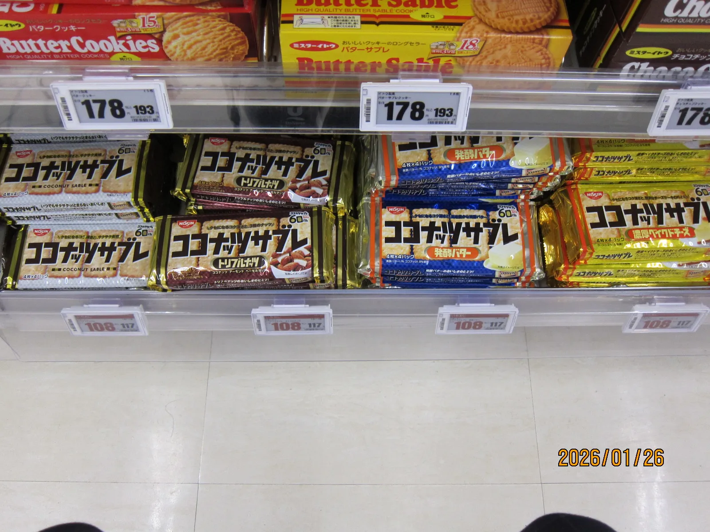
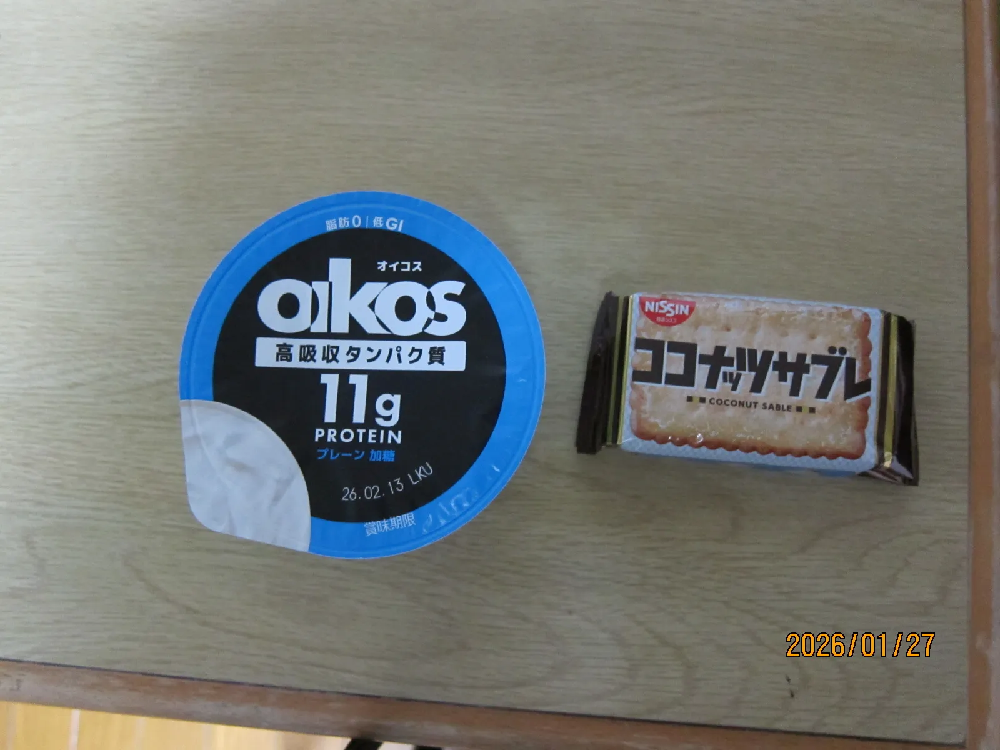
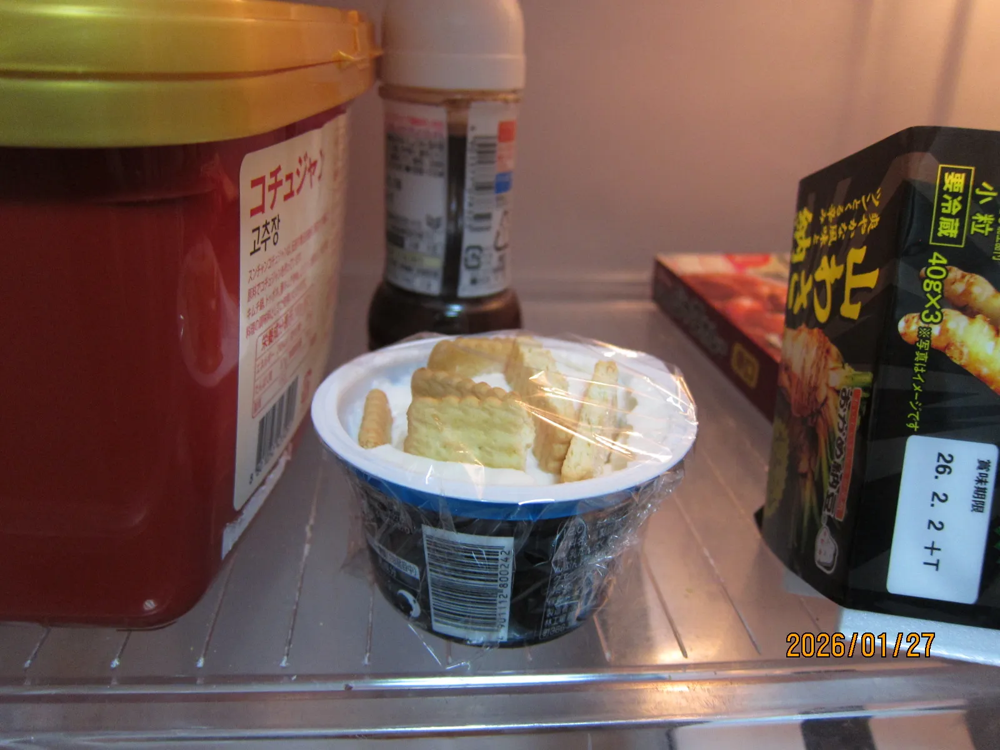
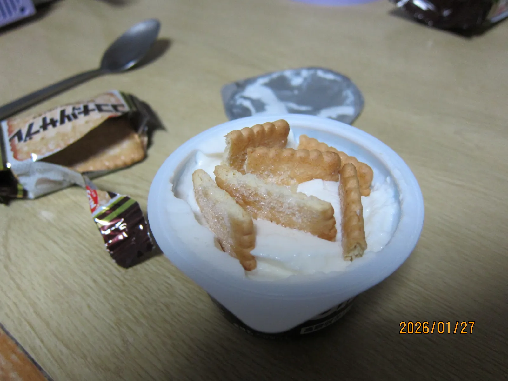
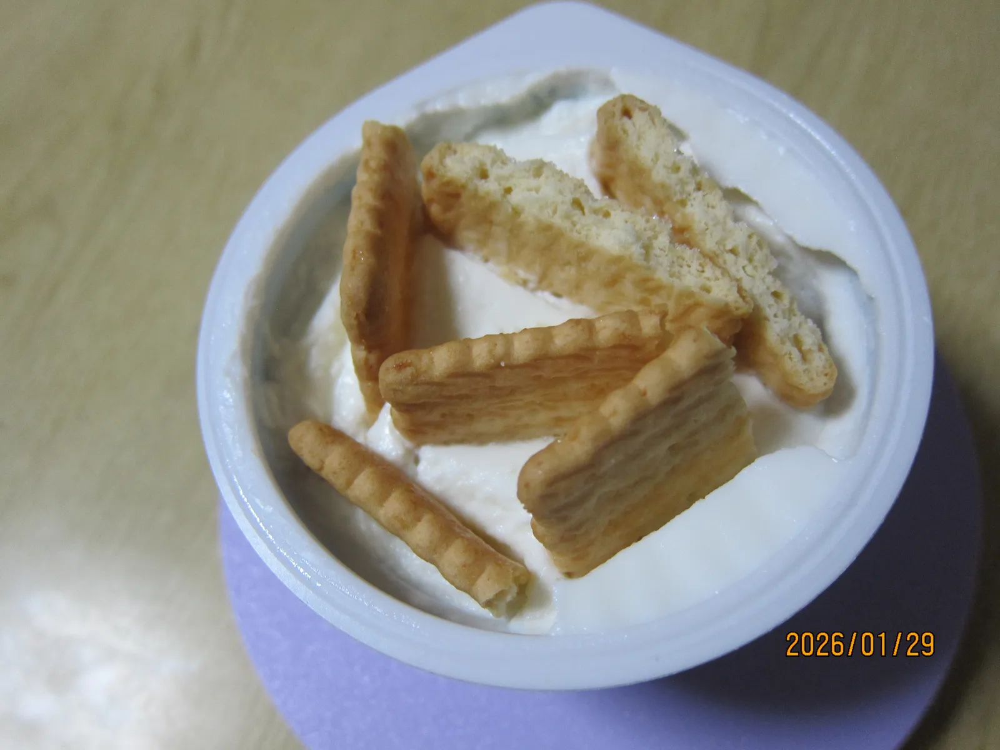
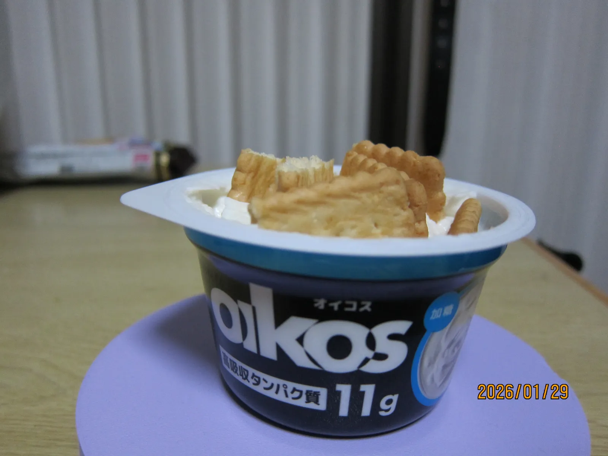

import T from "../../components/T.astro";
import TwoImages from "../../components/TwoImages.astro";
import Explain from "../../components/Explain.astro";
import Gallery from "../../components/Gallery.astro";
import imgAmerican1 from "../../assets/images/blog/japan-diet-cheesecake/sweet-version1.png";
import imgAmerican2 from "../../assets/images/blog/japan-diet-cheesecake/sweet-version2.png";

<T>
  Today I want to tell you about a low-calorie cheesecake <Explain meaning="a clever tip or technique">hack</Explain> that apparently originated in Japan. I’m not sure how popular it actually was in Japan, but it spread to the West and became a <Explain meaning="shared very quickly on the internet">viral trend</Explain> recently.
  今日は、日本発祥と言われている低カロリーなチーズケーキの裏技を紹介します。日本で実際にどれくらい人気だったのかは分かりませんが、海外に広まって最近ネットで流行っていました。
  Today, I will show you a "hack." A hack is a smart way to make something. This is a low-calorie cheesecake. It started in Japan and became famous on the internet.
</T>

### <T>Ingredients材料2 Things</T>

<T>
  This recipe requires only two ingredients: Greek yogurt and Nissin Coconut Sable cookies. However, you do need to leave it in the fridge overnight, so it takes some time. I was surprised by how easy it was. The hardest part is going to the store to buy the ingredients, especially if you live in the countryside without a car (like me). Luckily, I had a dentist appointment in the town next door, so I took the chance to <Explain meaning="stop by quickly">drop by</Explain> the grocery store while I was there.
  材料はギリシャヨーグルトと日清ココナッツサブレの2つだけ。でも、一晩冷蔵庫に入れておく必要があるので、少し時間はかかります。作り方は驚くほど簡単でした。一番大変だったのは材料を買いに行くこと。私は田舎に住んでいて車を持っていないので。運よく隣町で歯医者の予約があったので、そのついでにスーパーに寄ることができました。
  You only need two things: yogurt and cookies. You must put them in the fridge for one night. It is very easy. Buying the cookies was hard for me because I do not have a car. I had a chance, so I got it!
</T>

<figure>
  
  <figcaption>
    <T>
      They even have cheesecake flavor. Wow.
      チーズケーキ味まであるんですね。すごい。
      Cheesecake flavor! Wow!
    </T>
  </figcaption>
</figure>

<figure>
  
  <figcaption>
    <T>
      The two main ingredients
      2つの主な材料
      Ingredients
    </T>
  </figcaption>
</figure>

### <T>The Mistake大失敗No!</T>

<T>
  Actually, the first time I tried to make this, I <Explain meaning="did not do something">skipped</Explain> putting it in the fridge. This was a big mistake, because it changed the taste completely. You need to let it sit in the fridge because the dry crackers <Explain meaning="soak up">absorb</Explain> the liquid from the Greek yogurt. This makes the yogurt more <Explain meaning="firm or hard">solid</Explain> and the crackers softer. The resulting texture is very similar to that of cheesecake.
  実は、初めて作った時は冷蔵庫に入れずに食べてしまいました。これは大失敗でした。味が全然違います。乾燥したサブレがヨーグルトの水分を吸う必要があるので、冷蔵庫で寝かせないといけません。そうすることで、ヨーグルトは固くなり、サブレは柔らかくなります。食感が本物のチーズケーキに近くなるんです。
  The first time, I did not use the fridge. That was a mistake. In the fridge, the cookies take in water from the yogurt. Then, the yogurt becomes hard and the cookies become soft. It feels like real cheesecake.
</T>

### <T>American Styleアメリカ流のアレンジAmerica too!</T>

<T>
  This trend is currently very popular in America and, as expected, they have added various interesting <Explain meaning="changes or variations">twists</Explain>. The main one is using Biscoff cookies instead of the Japanese Coconut Sable. Many people also cover it in sweets, like syrup and candy. It kind of <Explain meaning="makes the effort useless">defeats the point</Explain> of “diet” cheesecake though, or does it?
  このトレンドは今アメリカでも大人気で、予想通り色々なアレンジが加えられています。一番の違いは、日本のココナッツサブレの代わりに「ロータス ビスコフ」を使うこと。シロップやお菓子をたくさんトッピングする人もいます。それだと「ダイエット」の意味がない気もしますが……どうなんでしょうね？
  Many people in America like this too. They use different cookies. Some people add syrup or candy.
</T>

<TwoImages src1={imgAmerican1} alt1="American Style 1" src2={imgAmerican2} alt2="American Style 2" />

  <T>
    American Style with Biscoff and toppings
    アメリカ風（ビスコフとトッピング使用）
    American style.
  </T>

### <T>How to make it作り方Make it</T>

<T>
  For the original version, all you do is put some crackers into your yogurt, then put it in the fridge overnight. That's all.
  オリジナル版の作り方は、ヨーグルトにサブレを入れて一晩冷蔵庫に置くだけ。それだけです。
  Put cookies in the yogurt. Put it in the fridge for one night. That is all!
</T>

<figure>
  
  <figcaption>
    <T>
      Don't forget the plastic wrap!
      ラップを忘れないで！
      Plastic too!
    </T>
  </figcaption>
</figure>

## <T>Results結果Finish!</T>

<T>
  It was pretty good. I think I give it a 6/10. American-style cheesecake is hard to find where I live in Japan, so it was a nice reminder of what it’s like. However, I don’t think I would <Explain meaning="mistake one thing for another">confuse it for</Explain> the real thing. That being said, it's much lower in calories compared to the real thing, so it's easier to eat more often. I would definitely make it again and <Explain meaning="try new things to see what happens">experiment</Explain> with different cookie and yogurt flavors.
  かなり美味しかったです。10点満点中6点かな。私の住んでいるところではアメリカンスタイルのチーズケーキがなかなか手に入らないので、懐かしい気分になれました。もちろん本物と間違えるほどではありませんが、本物よりずっと低カロリーなので、頻繁に食べやすいのがいいですね。また違う味のサブレやヨーグルトで試してみたいです。
  It was good. I give it 6/10. Real cheesecake is hard to find here. This is not real cheesecake, but it is healthy. I want to try it again with different cookies.
</T>

<Gallery>
  <figure>
    
    <figcaption>
      <T>
        Showcase
        ショーケース
        Showcase
      </T>
    </figcaption>
  </figure>

  <figure>
    
    <figcaption>
      <T>
        First result
        結果その1
        First result
      </T>
    </figcaption>
  </figure>

  <figure>
    
    <figcaption>
      <T>
        Second result
        結果その2
        Second result
      </T>
    </figcaption>
  </figure>
</Gallery>