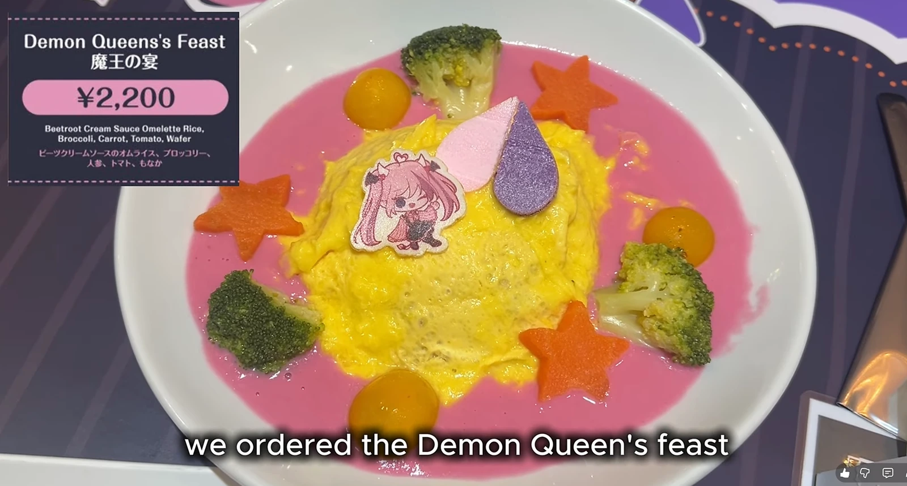
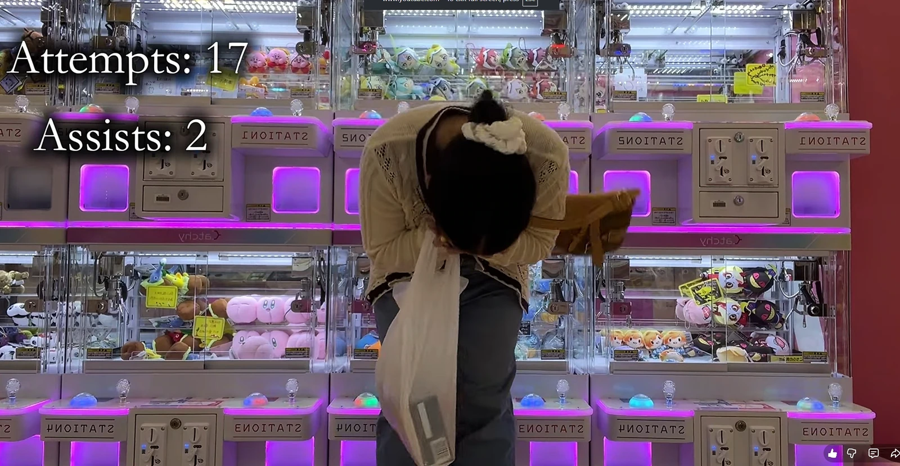
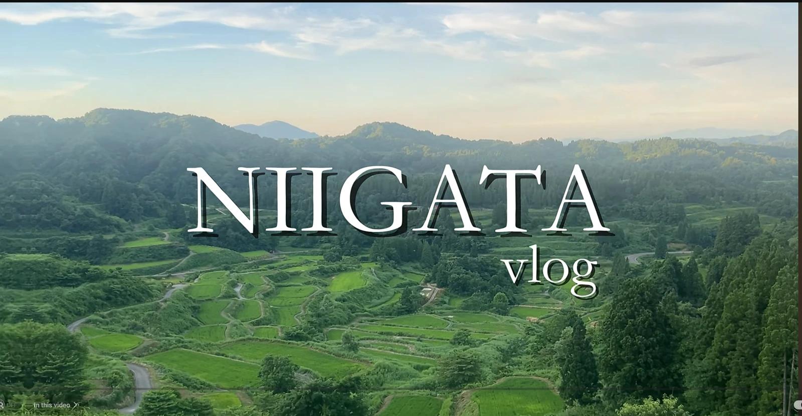
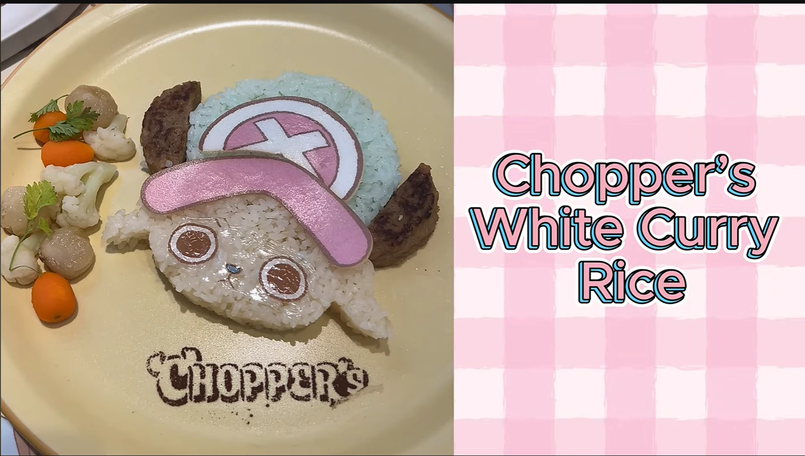
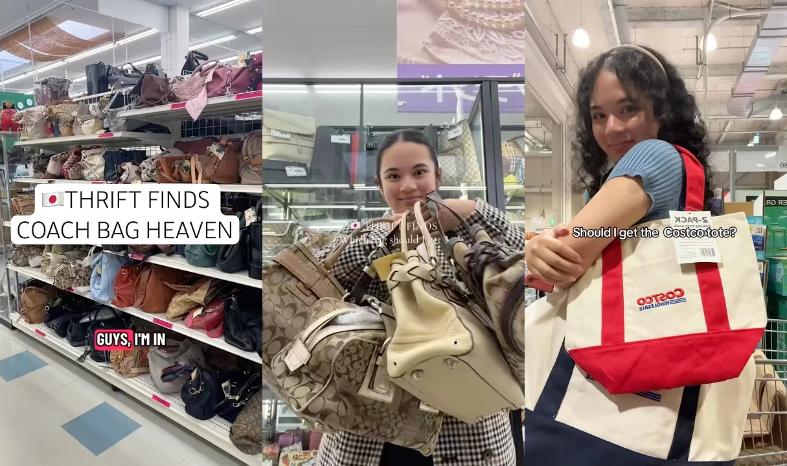

import T from "~/components/i18n/T.astro";
import YouTubePreview from "~/components/content/YouTubePreview.astro";
import Explain from "~/components/content/Explain.astro";
import Quiz from "~/components/content/Quiz.astro";

<T>
  
    Hello! Today I would like to tell you about my favorite YouTuber. I{" "}
    <Explain meaning="discovered">found out about her</Explain>{" "}
    a long time ago, when she first started making videos. Her
    name is [An](https://www.youtube.com/@yourstruly-an/videos). An lives in
    <Explain meaning="😂">JapAn</Explain>, and she makes videos about the interesting things she does. She makes
    both short videos and long videos. Her content includes places to visit in
    Japan, anime cafes, anime pop-up events, and daily life in Japan.
  
  
    こんにちは！今日は私の好きなYouTuberについて紹介したいと思います。彼女の動画を
    見つけたのは、チャンネルを始めたばかりのころでした。名前は
    [An](https://www.youtube.com/@yourstruly-an/videos)さん。Anさんは日本に住んでいて、
    日々の中で面白かったことを動画にしています。ショート動画も長編動画も作っていて、
    日本で行ける場所、アニメカフェ、アニメのポップアップイベント、そして日本での暮らしを
    紹介しています。
  
  
    Today I will talk about my favorite YouTuber. Her name is
    [An](https://www.youtube.com/@yourstruly-an/videos). I found her channel a
    long time ago. She lives in Japan. She makes short and long videos about
    travel, anime cafes, pop-up events, and her life in Japan.
  
</T>

### <T>So many great videos!すごい動画がたくさん！Great Videos!</T>

<T>
  
    An has been making videos for over a year now, and you can tell her skills
    as a video creator have improved a lot since she started. One reason I like
    An's channel is the amount of hard work she puts into her videos. Her videos
    are well-made, and she{" "}
    <Explain meaning="carefully notices small things">pays attention to detail</Explain>.
  
  
    Anさんは動画投稿を始めてから1年以上たっていて、最初のころと比べると編集スキルが
    かなり上がったのが分かります。私がこのチャンネルを好きな理由の一つは、動画づくりに
    かけている努力です。どの動画も丁寧に作られていて、細かいところまでしっかり
    こだわっています。
  
  
    An has made videos for more than one year. She is getting better. I like her
    channel because she works hard. Her videos are good. She makes them well.
  
</T>

<figure>
  
  <figcaption>
    <T>
      
        An added the prices of the food the way it was displayed at this cafe!
        [Watch video](https://www.youtube.com/watch?v=wlSsogcXCj0&t=5s)
      
      
        このカフェで、Anさんは料理の値段を実際の表示と同じように入れていました！
        [動画を見る](https://www.youtube.com/watch?v=wlSsogcXCj0&t=5s)
      
      
        She added the price! It's nice.
        [watch](https://www.youtube.com/watch?v=wlSsogcXCj0&t=5s)
      
    </T>
  </figcaption>
</figure>

<Quiz
  id="my-favorite-youtuber-quiz-1"
  question={{
    en: "Do you know the character from the image above?",
    ja: "上の画像のキャラクターを知っていますか？",
    en_simple: "Do you know this character?👆",
  }}
  options={[
    { en: "Yes, I know", ja: "はい、知っています", en_simple: "Yes" },
    { en: "No, I don't know", ja: "いいえ、知りません", en_simple: "No" },
  ]}
/>

<T>
  
    Another reason I like An's content is that she is passionate about what she
    shows in her videos. She likes to travel, she likes anime (especially
    shojo-themed anime), and she's good at Japanese crane games! Many of her
    videos have a very{" "}
    <Explain meaning="a certain feeling or mood">personal vibe</Explain>, as if
    you are{" "}
    <Explain meaning="joining">going along with her</Explain>{" "}
    on an adventure.
  
  
    もう一つ好きな理由は、Anさんが動画で紹介することに本気でワクワクしているところ
    です。旅行も好きだし、アニメ（特に少女系）も好きで、クレーンゲームもとても上手！
    動画全体にパーソナルな空気感があって、一緒に冒険している気分になります。
  
  
    I also like her videos because she loves what she does. She likes traveling
    and anime. She is also good at crane games. It's like you are traveling
    together.
  
</T>

<figure>
  
  <figcaption>
    <T>
      
        An was having a hard time in this crane game video!
        [Watch video](https://www.youtube.com/watch?v=6pH9sNqmbNg)
      
      
        このクレーンゲームの動画では、Anさんちょっと苦戦していました！
        [動画を見る](https://www.youtube.com/watch?v=6pH9sNqmbNg)
      
      
        This crane game was hard for An.
        [watch](https://www.youtube.com/watch?v=6pH9sNqmbNg)
      
    </T>
  </figcaption>
</figure>

### <T>Let's Check Out Her Videos!動画を見てみよう！Look at this!</T>

<T>
  
    An makes videos about places you can visit in Japan, and fun things you can
    do there. In one video, An went to Niigata. She enjoyed delicious food and
    visited different places. I think it's great that she visits the countryside
    often. The countryside is often{" "}
    <Explain meaning="not noticed or not given enough attention">overlooked</Explain>{" "}
    when people plan trips to Japan,
    but rural Japan is amazing!
  
  
    Anさんは、日本で行ける場所やそこでできる楽しいことを動画で紹介しています。
    ある動画では新潟を訪れて、おいしいものを食べたり、いろいろな場所を回ったりして
    いました。特に私がいいなと思うのは、地方にもよく行っていることです。日本旅行を
    計画するときは都市部に集中しがちですが、地方の日本は本当に魅力があります。
  
  
    An shows places to visit in Japan and fun things to do. In one video, she
    went to Niigata. She ate good food and visited many places. She goes to the
    countryside too. I like that. Many travelers do not go there, but it is very
    nice.
  
</T>

<figure>
  
  <figcaption>
    <T>
      
        Beautiful view in Niigata! This place is beautiful.
        [Watch video](https://www.youtube.com/watch?v=JAJmmQtrDBY&t=1s)
      
      
        新潟の風景が本当にきれい！とても素敵な場所です。
        [動画を見る](https://www.youtube.com/watch?v=JAJmmQtrDBY&t=1s)
      
      
        Niigata is very beautiful. This place is beautiful.
        [watch](https://www.youtube.com/watch?v=JAJmmQtrDBY&t=1s)
      
    </T>
  </figcaption>
</figure>

<T>
  
    An's anime cafe videos are always entertaining! In her newest video, An went
    to the One Piece Chopper Cafe in Tokyo. Everything was Chopper-themed, so
    cute! Sometimes I wish I lived in the city so I could go to anime cafes more
    often.
  
  
    Anさんのアニメカフェ動画はいつも面白いです。最新の動画では東京の
    「ワンピース チョッパーカフェ」に行っていて、店内もメニューもチョッパーづくしで
    とてもかわいかったです。私ももっと都会に住んで、アニメカフェにたくさん行けたら
    いいのにと思います。
  
  
    Her anime cafe videos are fun. In her new video, she went to the One Piece
    Chopper Cafe in Tokyo. Everything was Chopper. It was very cute. I want to
    live in a city and go to anime cafes too.
  
</T>

<figure>
  
  <figcaption>
    <T>
      
        This is one of the dishes An showed in the video. So cute!
        [Watch video](https://www.youtube.com/watch?v=ByIQfmKyjUs)
      
      
        これはAnさんが動画で紹介していた料理の一つです。とてもかわいい！
        [動画を見る](https://www.youtube.com/watch?v=ByIQfmKyjUs)
      
      
        This is one dish An showed. Very cute!
        [watch](https://www.youtube.com/watch?v=ByIQfmKyjUs)
      
    </T>
  </figcaption>
</figure>

<T>
  
    In these short videos, you can learn tips about shopping in Japan.
    Personally, I prefer looking for electronics at{" "}
    <Explain meaning="stores that sell used items">second-hand stores</Explain>, but it
    seems there are{" "}
    <Explain meaning="great finds that are hard to notice at first">treasures</Explain>{" "}
    in the bag section too!
  
  
    ショート動画では、日本のリユースショップでの買い物のコツも学べます。私は
    中古ショップだと電子機器を見るのが好きですが、バッグ売り場にも掘り出し物が
    あるみたいです！
  
  
    She also makes short videos with shopping tips. She shows second-hand stores
    in Japan. I like looking for electronics there. You can also find nice bags.
  
</T>

<figure>
  
  <figcaption>
    <T>
      
        These are short-form videos where An shows her shopping adventures.
        [Watch video](https://www.youtube.com/shorts/laFEoIx5_is)
      
      
        Anさんが買い物冒険を紹介するショート動画のスクリーンショットです。
        [動画を見る](https://www.youtube.com/shorts/laFEoIx5_is)
      
      
        Short videos of An's shopping adventures.
        [watch](https://www.youtube.com/shorts/laFEoIx5_is)
      
    </T>
  </figcaption>
</figure>

<T>
  
    I know An's channel will continue to grow and improve. Even though her
    channel is still small, she has already created lots of amazing work in the
    world. If you{" "}
    <Explain meaning="take a look at something">check out</Explain> her channel,
    you might find a topic that interests
    you too. Or you can check out this video about one of my favorite prefectures,
    Niigata! I'm looking forward to the next video!
  
  
    Anさんのチャンネルは、これからももっと成長していくと思います。まだ小さな
    チャンネルですが、すでに素晴らしい動画をたくさん作っています。見てみると、きっと
    自分の興味に合うテーマが見つかるはずです。私の好きな新潟を紹介している動画も
    あるので、ぜひチェックしてみてください。次の動画も楽しみです！
  
  
    I think her channel will grow more. Her channel is still small, but her
    videos are great. If you watch her channel, you can find a topic you like.
    This video is about Niigata. I love Niigata! I am excited for her next
    video!
  
</T>

<YouTubePreview
  videoId="JAJmmQtrDBY"
  title="Niigata vlog"
/>
