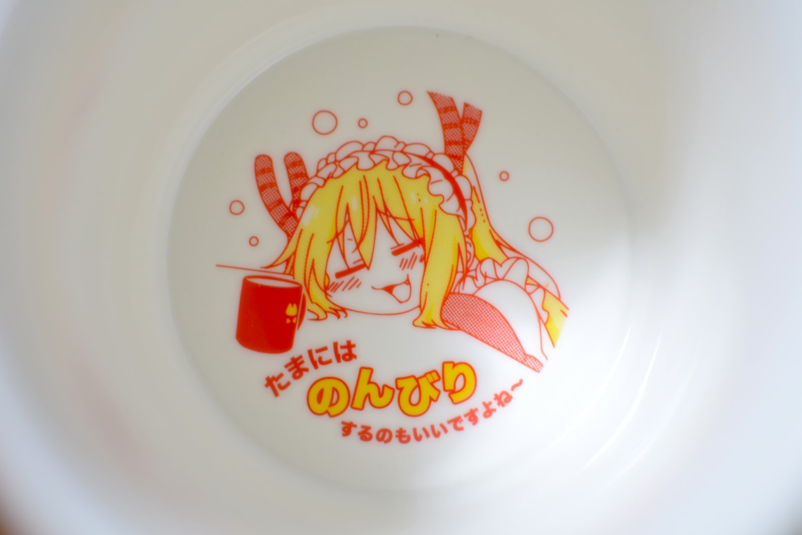
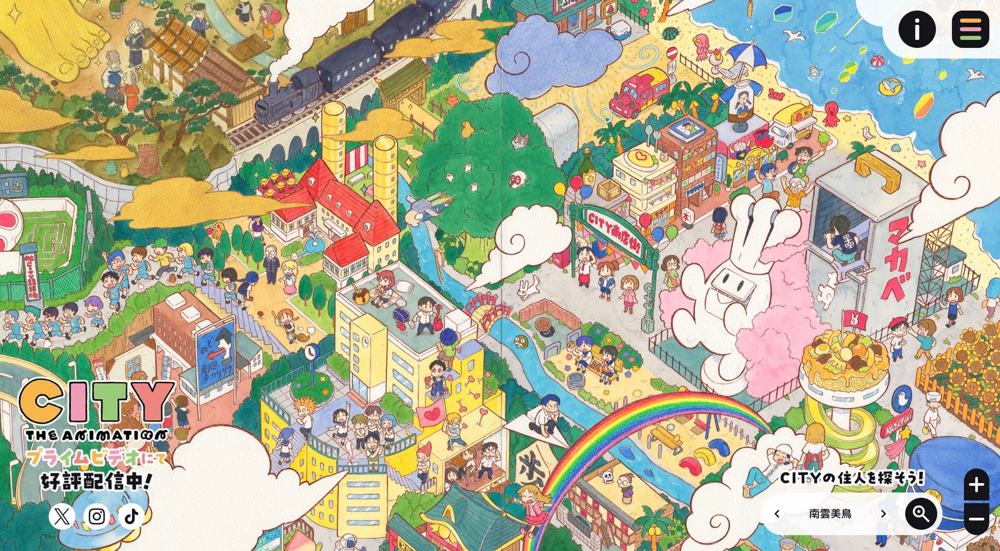
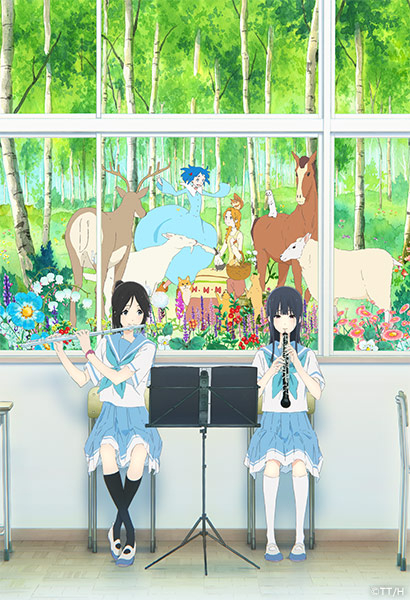
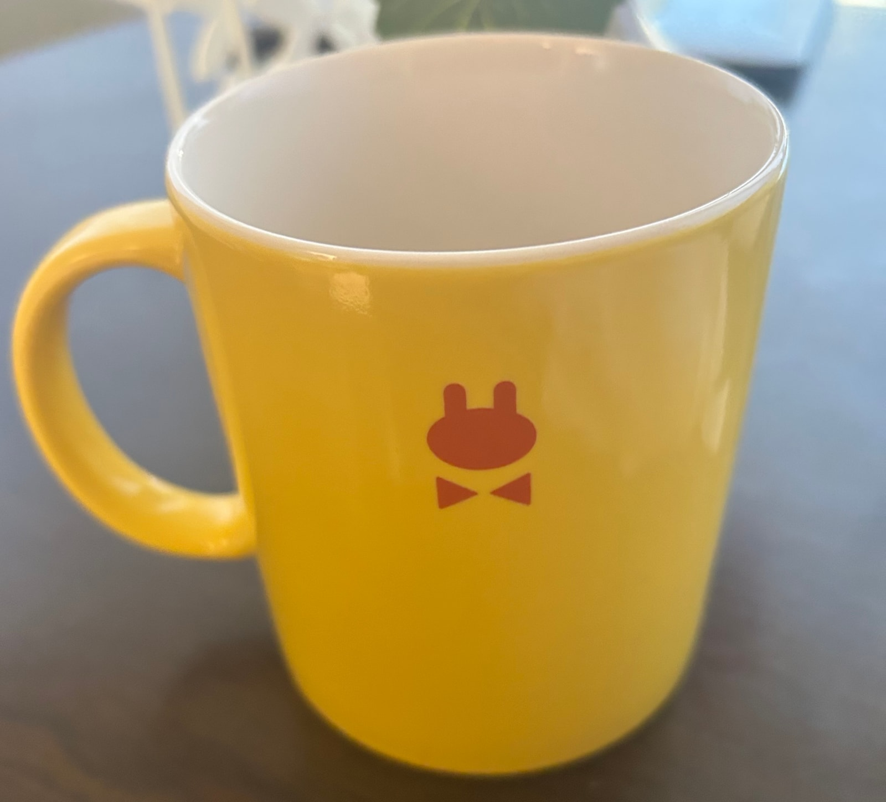
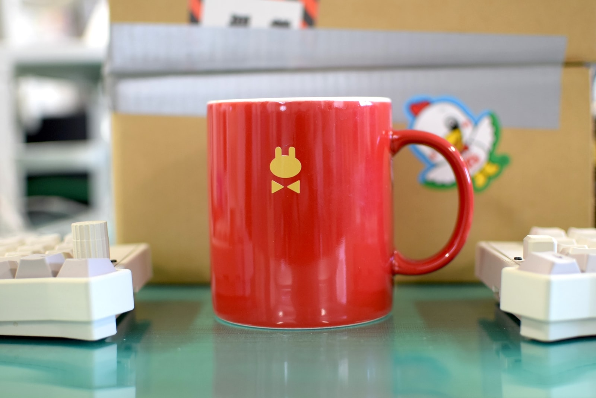

import T from "~/components/i18n/T.astro";
import Loader from "~/components/ui/Loader.astro";
import redCupSpin from "../../assets/images/blog/my-new-cup/red-cup-spin.webp";
import Explain from "~/components/content/Explain.astro";

<T>
  
    Hello, today I want to show off my new cup. It's merchandise from my
    favorite animation studio, [Kyoto Animation](https://www.kyotoanimation.co.jp),
    for their show called "Miss Kobayashi's Dragon Maid". I think the studio is
    <Explain meaning="very">quite</Explain> well known, so maybe you've heard of it.
  
  
    こんにちは。今日は新しいカップを紹介したいと思います。これは私の好きな
    アニメーションスタジオ、[京都アニメーション](https://www.kyotoanimation.co.jp)の作品
    『小林さんちのメイドラゴン』のグッズです。とても有名なスタジオなので、
    聞いたことがあるかもしれません。
  
  
    Hello! This is my new cup. It is from Kyoto Animation. The anime is called
    "Miss Kobayashi's Dragon Maid." The studio is famous. Maybe you know it!
  
</T>

<figure>
  
  <figcaption>
    <T>
      It says "Taking it easy once in a while is nice, isn't it?"
      「たまにはのんびりするのもいいですよね」と書いてあります。
      It's good to relax sometimes!
    </T>
  </figcaption>
</figure>

### <T>Kyoto Animation Studio京都アニメーションKyoto Animation</T>

<figure>
  
  <figcaption>
    <T>
      
        This is from the website for their newest work,
        [City](https://city-the-animation.com/). Even the website is beautiful!
      
      
        これは最新作の[City](https://city-the-animation.com/)の公式サイトです。
        サイトまで本当にきれいです！
      
      
        This is the website for the new anime,
        [City](https://city-the-animation.com/). The website is beautiful too!
      
    </T>
  </figcaption>
</figure>

<T>
  
    This animation studio makes beautiful animations and art for their shows
    and movies. They are known for the high quality and attention to detail in
    their works. My favorite work of theirs is a <Explain meaning="a side story from the main series">spin-off</Explain> movie called
    ["Liz and the Blue Bird"](https://liz-bluebird.com/). The watercolor art
    style is amazing!
  
  
    このスタジオは、作品や映画で美しいアニメーションとアートを作っています。
    クオリティの高さと細部へのこだわりで知られています。私が特に好きなのは、
    スピンオフ映画の["リズと青い鳥"](https://liz-bluebird.com/)です。水彩っぽい画風が
    本当にすばらしいです！
  
  
    This studio makes beautiful anime and movies. Their art is very good. My
    favorite is ["Liz and the Blue Bird"](https://liz-bluebird.com/). The art
    is beautiful!
  
</T>

<figure>
  
  <figcaption>
    <T>
      "Movie poster for Liz and the Blue Bird"
      「リズと青い鳥の映画ポスター」
      "Liz and the Blue Bird poster!"
    </T>
  </figcaption>
</figure>

### <T>Dragon MaidドラゴンメイドDragon Maid</T>

<figure>
  

    

      <Loader size={52} stepMs={700} />
    

  

  <figcaption>
    <T>
      My loading animation was inspired by the transitions used in the show!
      私のローディングアニメーションは、この作品の場面転換に影響を受けています！
      I made this. Its like the show!
    </T>
  </figcaption>
</figure>

<T>
  
    "Miss Kobayashi's Dragon Maid" is a show made by this studio. You might
    think it's a bit strange, especially if you've never seen a Japanese anime
    before. However, once you get past the <Explain meaning="a story that is kind of silly">somewhat ridiculous premise,</Explain> the daily life elements are 
    <Explain meaning="more realistic than expected">surprisingly grounded</Explain>. You might even compare it to
    an American sitcom. However, the standout for any Kyoto Animation show is
    always the quality of the art. Even frames that are on the screen for just
    a few seconds are drawn with care and amazing detail.
  
  
    「小林さんちのメイドラゴン」はこのスタジオの作品です。日本のアニメをあまり見たことがない
    人には、少し変わった作品に見えるかもしれません。でもその少し変わった設定を受け入れると、
    日常パートは意外と地に足がついています。アメリカのシットコムに近いと感じるかもしれません。
    ただ、京都アニメーション作品で一番目立つのはやはり作画の質です。数秒しか映らないカットでも、
    丁寧で細かく描かれています。
  
  
    "Miss Kobayashi's Dragon Maid" is an anime by this studio. The story is interesting. 
    But, the characters live a normal life. It is like an
    American TV show. The art is always great. They draw every picture very
    carefully.
  
</T>

<figure>
  
  <figcaption>
    <T>
      It's spinning! I can't draw well, but I can still make animation!
      回ってる！絵はあまり上手く描けませんが、アニメーションも作れます！
      It's spinning!
    </T>
  </figcaption>
</figure>

<T>
  
    These cups are used by the two main characters in the show. They aren't magic cups or anything like that,
     they're just cups, even in the show. However, this is my favorite kind of merchandise because it is a subtle
    reference to the show. The yellow version was released some time ago, and I
    bought it during my first visit to Japan in 2017, directly from the
    studio's gift shop in Kyoto. I didn't bring it with me when I moved to
    Japan, so I had my mother send me pictures from back home.
  
  
    これらのカップは、作品のメインキャラクター2人が使っています。魔法のカップというわけでは
    なく、作中でもただのカップです。でもこういうさりげないグッズが私はいちばん好きです。
    黄色バージョンはだいぶ前に発売されていて、2017年に初めて日本へ来たとき、京都のスタジオ
    ショップで買いました。日本に引っ越すときは持ってこなかったので、実家にあるものを母に写真で
    送ってもらいました。
  
  
    The cups are in the show. The cups are just cups, but it reminds me of the
    show. I bought the yellow cup in 2017. I went to the real store! I left it
    in America. My mother took pictures of it for me.
  
</T>

<figure>
  
  <figcaption>
    <T>
      Picture of the yellow cup taken by my mom in America.
      アメリカで母が撮った黄色いカップの写真
      My mom took the picture!
    </T>
  </figcaption>
</figure>

<T>
  
    I'm glad I was able to complete the set, even if it's <Explain meaning="in different parts of the earth">spread across the
    world</Explain>. I also like that it's something that is useful. I'll be using it at
    my office from now on. I hope I don't drop it!
  
  
    世界に分かれていても、セットをそろえられてうれしいです。しかも実際に使えるところも
    気に入っています。これからは職場で使うつもりです。落とさないように気をつけないと！
  
  
    I have the set now! I am very happy. The cup is also very useful. I will
    use it at my office. I hope I don't drop it!
  
</T>

<figure>
  
  <figcaption>
    <T>
      My cup at work.
      職場で使っているカップです。
      Cup at work.
    </T>
  </figcaption>
</figure>
