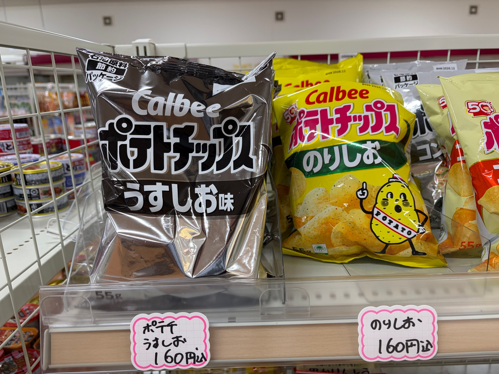
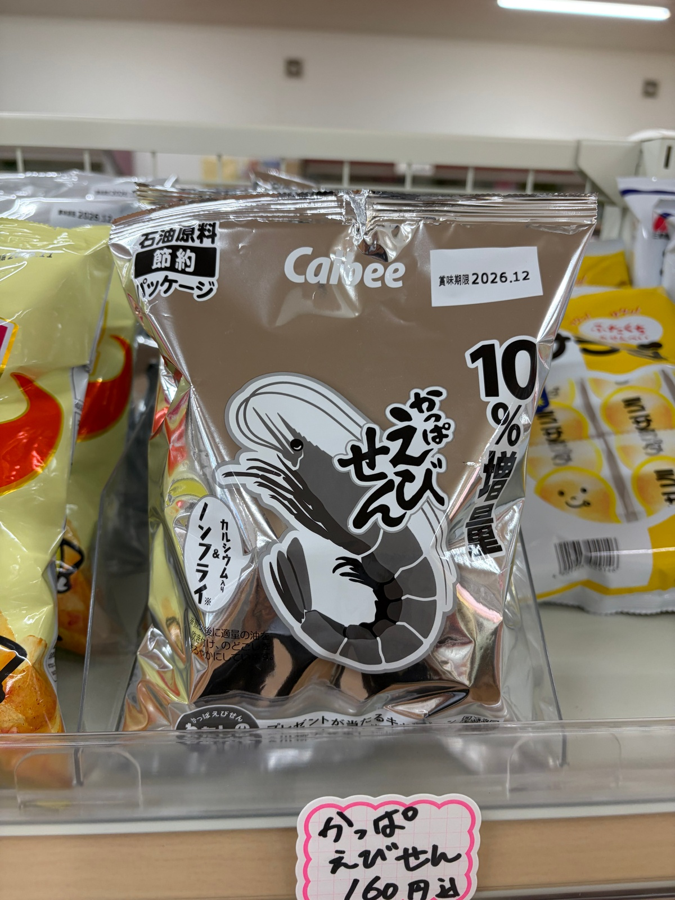
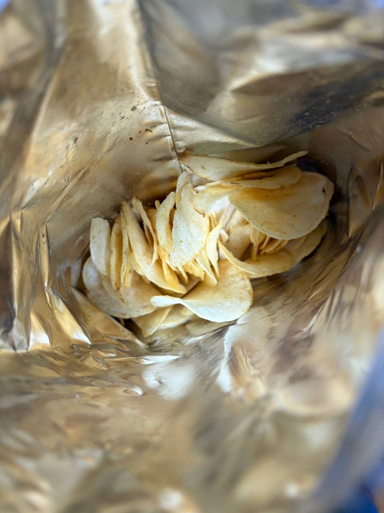
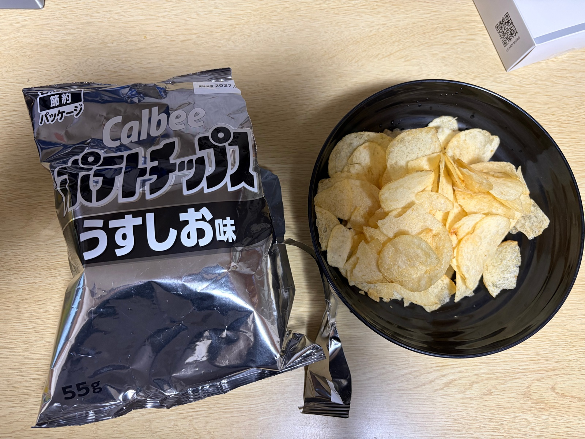

import T from "../../components/i18n/T.astro";
import Explain from "../../components/content/Explain.astro";
import Quiz from "../../components/content/Quiz.astro";

<T>
  Have you seen this kind of bag in Japan before? I first noticed it at my local grocery store. I thought it was a new brand trying to <Explain meaning="get noticed">stand out from the others</Explain>.
  日本でこういう袋を見たことがありますか。私は近所のスーパーで初めて気づきました。他と差をつけようとしている新しいブランドだと思いました。
  Have you seen this bag in Japan? I saw it at my grocery store. I thought it was a new brand.
</T>

<figure>
  
  <figcaption>
    <T>
      Have you seen Calbee? It’s very popular!
      カルビーを見たことがありますか。とても人気です！
      Calbee is popular!
    </T>
  </figcaption>
</figure>

<T>
  However, I noticed it wasn’t just one brand; in fact, various brands of snacks have similar packaging right next to normally colored packaging.
  しかし、それが一つのブランドだけではないことに気づきました。実際、いろいろなお菓子のブランドが、普通の色の袋のすぐ隣で、似たような包装を使っています。
  But it was not only one brand. Many snack brands have this bag now. They sit next to the colorful bags.
</T>

<figure>
  
  <figcaption>
    <T>
      Shrimp flavor.
      えび味です。
      Shrimp.
    </T>
  </figcaption>
</figure>

<T>
  I bought some out of curiosity, thinking maybe there was a new collaboration or flavor, only to find they were exactly the same as the normal colored bags.
  新しいコラボか新しい味かもしれないと思って、興味本位でいくつか買ってみました。ところが、中身は普通の色の袋とまったく同じでした。
  I bought some. I thought it was a new flavor. But it was the same snack inside.
</T>

<figure>
  
  <figcaption>
    <T>
      I didn’t eat any yet! Why so few?
      まだ一枚も食べていません！どうしてこんなに少ないの？
      Big bag, few chips :(
    </T>
  </figcaption>
</figure>

<T>
  I was a little disappointed! However, it was at that point that I finally decided to read the label at the top right. It says something like "Crude Oil plain packaging," which, if I understand correctly, means that it's packaging being used to save on costs related to the situation in the Middle East.
  少しがっかりしました！でも、そのときになってようやく右上のラベルを読んでみる気になりました。「石油原料節約パッケージ」というようなことが書いてあり、私の理解が正しければ、中東の情勢に関わるコストを抑えるために使われている包装だという意味です。
  I was a little sad! Then I read the small label at the top right. It says "crude oil plain packaging." I think it means the company is saving money. Oil costs more now because of the Middle East.
</T>

<figure>
  
  <figcaption>
    <T>
      Yummy chips.
      おいしいチップス。
      Yummy chips.
    </T>
  </figcaption>
</figure>

<T>
  It was interesting to see the effects of the crisis in ways beyond higher prices. I hope companies can keep coming up with ways like this to <Explain meaning="cut costs">trim costs</Explain> that don’t affect the price and product as much. I wonder, are other countries taking measures like this too?
  値上がり以外の形でも危機の影響が見られるのは興味深かったです。企業がこうやって、価格や商品にあまり影響しない形でコストを削る方法をこれからも考えてくれたらいいなと思います。他の国でもこういう対策をしているのでしょうか。
  The oil problem changes more than prices. I hope companies keep saving money this way. Then the price and the snack stay the same. Do other countries do this too?
</T>

<Quiz
  id="shrimp-chips"
  question={{
    en: "Have you tried shrimp flavored chips?",
    ja: "えび味のチップスを食べたことがありますか。",
    en_simple: "Have you tried shrimp chips?",
  }}
  options={[
    { en: "Yes, they were good!", ja: "はい、おいしかったです！" },
    { en: "Yes, but they were not good!", ja: "はい、でもおいしくなかったです！" },
    { en: "No, but I want to try.", ja: "いいえ、でも食べてみたいです。" },
    { en: "No.", ja: "いいえ。" },
  ]}
/>
