import T from "../../components/i18n/T.astro";
import Explain from "../../components/content/Explain.astro";
import Quiz from "../../components/content/Quiz.astro";
import TwoImages from "../../components/content/TwoImages.astro";
import imgPrepTable from "../../assets/images/blog/pasta-time/prep-table-view.JPG";
import imgPrepRoom from "../../assets/images/blog/pasta-time/prep-room-view.JPG";
import imgExtra3 from "../../assets/images/blog/pasta-time/extra3.JPG";
import imgExtra4 from "../../assets/images/blog/pasta-time/extra4.JPG";

<T>
  
    Hello! Today I'd like to tell you about my international cooking class in Takko, "Pasta Time." It's the 3rd cooking class I've held in town. The goal is to introduce new foods and cooking methods from outside of Japan, and to enjoy some yummy food!
  
  
    こんにちは！今日は、田子で開催している国際料理教室「パスタタイム」についてお話ししたいと思います。町で開くのはこれで3回目です。日本国外の料理や調理法を紹介して、みんなでおいしいものを楽しむのが目的です！
  
  
    Hello. Today I will talk about my cooking class. It's called "Pasta Time". It's the third one. I want to show my town yummy food from overseas!
  
</T>

<figure>
  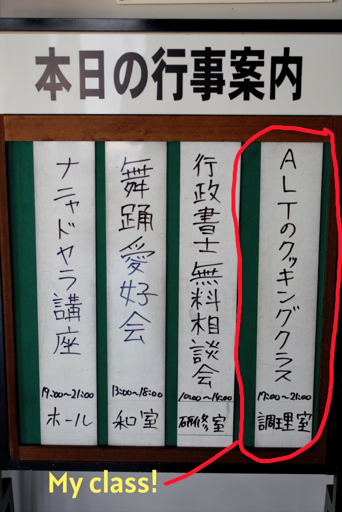
  <figcaption>
    <T>
      I hold the classes in the community center. There's a big kitchen that anyone can borrow!
      公民館で開催しています。誰でも借りられる大きなキッチンがあるんです！
      I use a big kitchen at the community center!
    </T>
  </figcaption>
</figure>

<T>
  
    This time we made traditional Italian pasta, with a not-so-traditional meat sauce, and a caprese salad. It's a meal I ate often as a kid, minus the handmade pasta! This was only my second time making pasta from scratch, so it was a learning experience for me too.
  
  
    今回は、伝統的なイタリアのパスタに、あまり伝統的ではないミートソース、そしてカプレーゼサラダを作りました。子どもの頃によく食べていた料理ですが、手作りパスタは別として！パスタをゼロから作るのはこれで2回目だったので、私自身にとっても学びの多い体験でした。
  
  
    We made pasta from Italy, meat sauce, and "caprese" salad. When I was a kid, I ate it a lot. But I'm not good at cooking it!
  
</T>

## <T>Let's Cook!料理しよう！Let's Cook!</T>

<figure>
  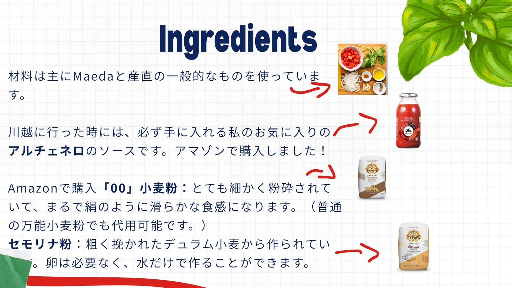
  <figcaption>
    <T>
      The non-fresh ingredients! I ordered most of these from Amazon.
      生鮮食品以外の材料です！ほとんどはAmazonで注文しました。
      All the ingredients! I bought most from Amazon.
    </T>
  </figcaption>
</figure>

<T>
  
    The class was centered around making traditional Italian pasta from scratch. We also made a simple meat sauce and caprese salad to go with it. I tried to follow traditional Italian methods for the pasta, while keeping it simple and accessible enough that the class attendees could easily make it at home themselves later.
  
  
    今回の教室のメインは、ゼロから手作りする伝統的なイタリアンパスタです。一緒に簡単なミートソースとカプレーゼサラダも作りました。パスタはできるだけ伝統的なイタリアの作り方に沿いながら、参加者が後で自宅でも作れるようにシンプルで親しみやすい内容にしました。
  
  
    The pasta was the main focus. We made it Italian style!
  
</T>

<figure>
  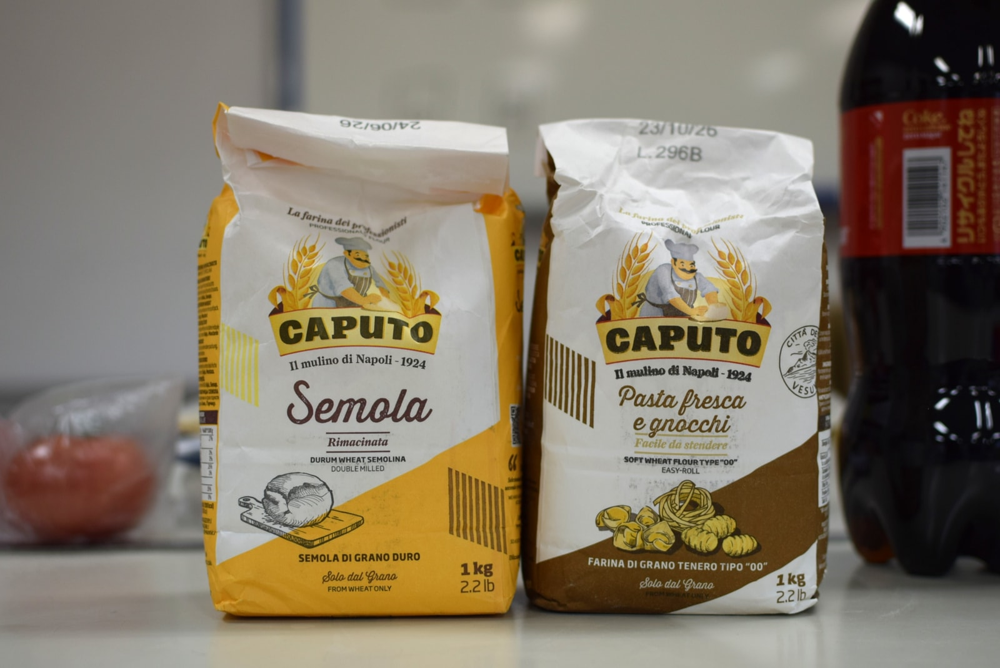
  <figcaption>
    <T>
      I ordered these from Amazon.
      Amazonで注文しました。
      Two kinds of flour!
    </T>
  </figcaption>
</figure>

<T>
  
    For the pasta, I decided to make two kinds. There is a version that requires an egg, and there's one that you can make with warm water. These also require two different types of flour. First is "00" flour, or double O flour, which is like ordinary flour, but finer. This is for the egg version. Next is semolina flour. It's coarser, and all you need is warm water!
  
  
    パスタは2種類作ることにしました。卵を使うバージョンと、お湯だけで作れるバージョンです。それぞれ異なる小麦粉を使います。まずは「00（ドッピオゼロ）粉」。普通の薄力粉に似ていますが、より細かく挽かれています。卵バージョンに使います。次はセモリナ粉。粗挽きで、お湯だけで生地が作れます！
  
  
    We made 2 kinds of pasta. One has an egg. The other has only water.
  
</T>

<figure>
  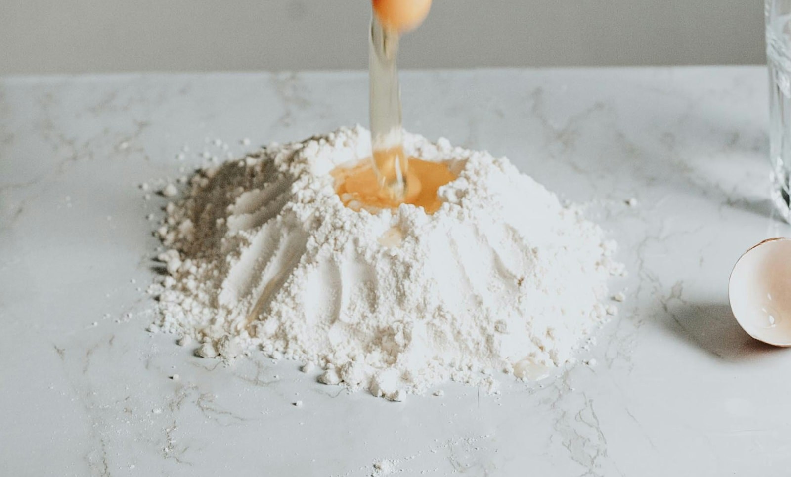
</figure>

<T>
  
    The traditional method to mix the dough is quite interesting. You make a sort of volcano with the dry ingredients and put the wet ingredients in the middle. You mix the egg a bit, then you slowly incorporate the flour to start forming the dough. You then knead it for around 8 minutes, and let it rest in a sealed container or in plastic wrap for 20 minutes.
  
  
    生地を混ぜる伝統的な方法がとても面白いんです。乾いた材料で火山のような形を作り、中央に湿った材料を入れます。卵を少しほぐしてから、粉をゆっくりと取り込んで生地をまとめていきます。その後、約8分こねて、密閉容器かラップに包んで20分休ませます。
  
  
    You make a volcano shape. Then you put the eggs in the center. Then you mix it together slowly. You need to put it away for 20 minutes.
  
</T>

## <T>Sauce Time!ソース作り！Sauce Time!</T>

<figure>
  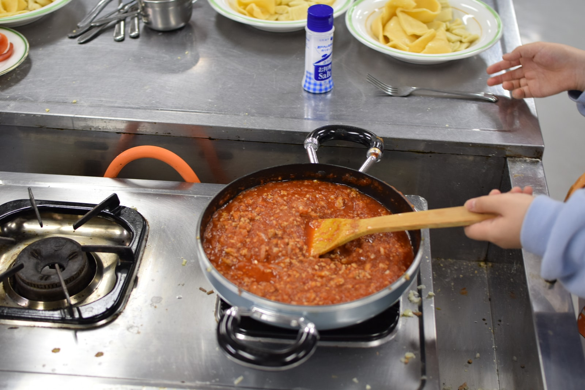
  <figcaption>
    <T>
      The finished sauce!
      完成したソース！
      Finished sauce!
    </T>
  </figcaption>
</figure>

<T>
  
    While the dough is resting, it's a good time to get started on the meat sauce. First, cook the meat until it's brown all over. Then add chopped onions and cook until they are <Explain meaning="see-through and soft from cooking">translucent</Explain>. Finally, add some salt and pepper, and plenty of chopped garlic. Then simply pour in the sauce. Since it's pre-made, we don't need to cook it for too long, but let it simmer for a few minutes so that everything mixes well. For one bottle of sauce, I used 400g of minced meat, one small onion, and 3 cloves of garlic. I also like to add some red pepper for some spice.
  
  
    生地を休ませている間に、ミートソースに取り掛かりましょう。まず、肉を全体的に茶色くなるまで炒めます。次に刻んだ玉ねぎを加え、透き通るまで炒めます。最後に塩こしょうとみじん切りのにんにくをたっぷり加えます。そのままソースを注ぐだけです。市販品なので長く煮る必要はありませんが、全体がなじむように数分間弱火で煮込みます。ソース1本に対して、ひき肉400g、小さめの玉ねぎ1個、にんにく3片を使いました。辛みのために赤唐辛子も入れるのがお気に入りです。
  
  
    Let's make the sauce. First you cook the meat. Make it brown all over. Then add chopped onion. Then salt and pepper. Then chopped garlic. Last, pour the sauce on top of everything. I like to add red pepper too. Spicy is yummy!
  
</T>

### <T>Why This Sauce?なぜこのソース？Why This Sauce?</T>

<T>
  
    I decided to use pre-made sauce because it was faster, and because it's what my mother used during my childhood. I think it's very common in America to use pre-made sauce rather than making it from scratch with tomatoes. However, making the sauce from scratch is cheaper and better once you get the seasonings down, so I recommend you try it!
  
  
    市販のソースを使ったのは、時短になるからというのと、子どもの頃に母が使っていたものだからです。アメリカでは、トマトからソースを手作りするより市販品を使うほうがずっと一般的だと思います。ただ、ゼロから作るほうが安くておいしいので、慣れてきたらぜひ試してみてください！
  
  
    You can make the sauce with just tomatoes too. You should try!
  
</T>

<T>
  
    As for this brand of sauce, it's my favorite pre-made sauce that isn't too hard to find in Japan. I discovered it at an international foods store in Kawagoe, Saitama while I was visiting, and I found out it can be ordered on Amazon!
  
  
    このブランドのソースは、日本でも比較的手に入りやすいお気に入りの市販ソースです。埼玉県川越市の輸入食材店で見つけて、Amazonでも注文できることがわかりました！
  
  
    I saw this sauce in Kawagoe, Saitama. You can buy it on Amazon too!
  
</T>

<figure>
  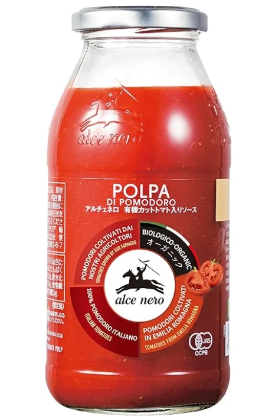
  <figcaption>
    <T>
      I bought this from Amazon, but you can sometimes find it at international stores.
      Amazonで買いましたが、輸入食材店で見かけることもあります。
      You can buy this on Amazon!
    </T>
  </figcaption>
</figure>

## <T>Caprese SaladカプレーゼサラダCaprese Salad</T>

<figure>
  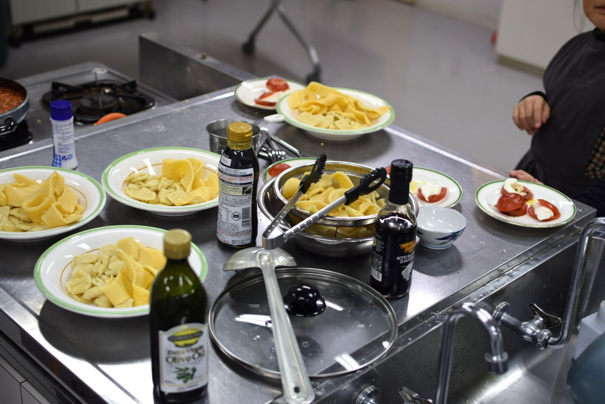
</figure>

<T>
  
    The salad was my favorite part of the class because it's something I had never made before, and it became a new favorite. Making it is quite <Explain meaning="easy and uncomplicated">straightforward</Explain>. You slice tomatoes and the round balls of mozzarella cheese you can buy in a bag at the grocery store. Then you stack them up, add some salt, and pour olive oil and balsamic vinegar on top. You can also top it with some fresh basil, though I wasn't able to find any at the stores in my town. I heard shiso leaves are a good substitute, though!
  
  
    サラダは今回のクラスで一番好きなパートでした。作ったことがなかったのに、すっかりお気に入りになりました。作り方はとてもシンプルです。トマトと、スーパーでパック売りしているモッツァレラチーズを輪切りにします。それを重ねて、塩を加え、オリーブオイルとバルサミコ酢をかけるだけです。生バジルをトッピングしてもいいですが、町のお店では見つけられませんでした。しその葉で代用できると聞きましたよ！
  
  
    The salad was interesting. It's simple and delicious! You can add basil, or shiso too. Use mozzarella cheese.
  
</T>

<T>
  
    Actually, I was initially going to substitute the cheese with tofu. I had seen people online make it this way, and it's a lot cheaper. However, the day of the class I compared them both, and the cheese was just too good! As a result, we made a very tiny portion, but I hope the attendees were able to enjoy the taste.
  
  
    実は最初、チーズの代わりに豆腐を使おうと思っていました。ネットでそういうレシピを見たし、豆腐のほうがずっと安いからです。でも当日、両方を比べてみたら、チーズの勝ちでした！少量しか作れませんでしたが、参加者のみなさんに味わってもらえてよかったです。
  
  
    You can use tofu too. But I think cheese is better.
  
</T>

## <T>Special Ingredients Used使用した特別な材料Special Ingredients</T>

<figure>
  
</figure>

<T>
  
    The sauce and the flour were the only ingredients I really had to order online living in the Japanese countryside. Here are the ones I got! They are a bit pricey, so you might prefer to use all-purpose flour and cheap sauce, but I think it would be good to try the nicer ones at least once!
  
  
    日本の田舎暮らしでオンライン注文が必要だったのは、ソースと小麦粉だけでした。こちらがそれです！少し値段が高めなので、普通の薄力粉や安いソースで代用してもいいと思いますが、一度はいいものを試してみる価値があると思います！
  
  
    I had to order the flour and sauce online. They cost a little money. But you can use normal flour and cheap sauce too!
  
</T>

* **"00" flour (for egg pasta):** [Amazon Link](https://www.amazon.co.jp/dp/B016ZHAFRE?ref=ppx_yo2ov_dt_b_fed_asin_title&th=1)
* **Semolina flour (for water pasta):** [Amazon Link](https://www.amazon.co.jp/dp/B008ZGMP2M?ref=ppx_yo2ov_dt_b_fed_asin_title&th=1)
* **Pre-made Sauce:** [Amazon Link](https://www.amazon.co.jp/dp/B00N8IYCB4?ref=ppx_yo2ov_dt_b_fed_asin_title&th=1)

## <T>The Cooking Class Experience料理教室の様子The Cooking Class</T>

<TwoImages src1={imgPrepTable} src2={imgPrepRoom} />

<T>
  
    I always do a lot of preparation. I pre-portion ingredients and do other setup that would otherwise waste a lot of time during the class.
  
  
    いつもたくさん準備をしています。材料をあらかじめ小分けにしたり、クラス中に時間を取られそうな下準備をしておいたりします。
  
  
    I prepared a lot before the class!
  
</T>

<figure>
  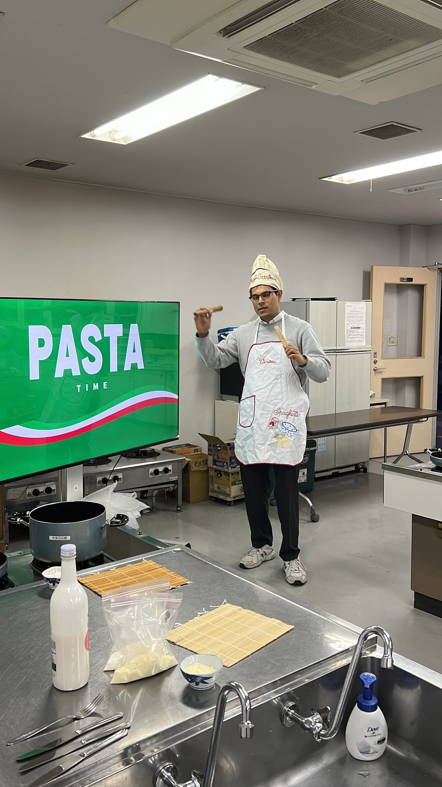
  <figcaption>
    <T>
      My hat and apron were a gift from my girlfriend! She got them in Italy!
      帽子とエプロンは彼女からのプレゼントです！イタリアで買ってきてくれました！
      My girlfriend bought this hat and apron in Italy!
    </T>
  </figcaption>
</figure>

<T>
  
    I did a short introduction and got started on the dough right away. Everything seemed to be going well, besides the fact that there weren't enough eggs. Did you know Japanese egg containers contain 10 eggs instead of 12?
  
  
    簡単な自己紹介をしてから、すぐに生地作りに取り掛かりました。卵が足りないという事態を除いては、順調に進んでいました。日本の卵パックは12個ではなく10個入りだということ、知っていましたか？
  
  
    I started the class. I needed more eggs! Oh no!
  
</T>

<Quiz
  id="pasta-time-eggs"
  question={{
    en: "Did you know Japanese egg containers contain 10 eggs instead of 12?",
    ja: "日本の卵パックは12個ではなく10個入りだと知っていましたか？",
    en_simple: "Japan egg boxes have 10 eggs, not 12. Did you know?",
  }}
  options={[
    { en: "Yes, I knew!", ja: "知っていた！", en_simple: "Yes!" },
    { en: "No, I didn't know!", ja: "知らなかった！", en_simple: "No!" },
  ]}
/>

<T>
  
    Luckily, my friend Luis was there to save the day and brought me more eggs. We proceeded with making the dough, and it was going okay, though it took quite a bit longer than in my testing to finish! We proceeded to flatten the first batch of dough, and I tried to use a bottle because there were no more rolling pins.
  
  
    幸い、友人のルイスが助けに来てくれて、卵を追加で持ってきてくれました。生地作りを続けましたが、練習のときよりもかなり時間がかかってしまいました！最初のバッチを伸ばす段階になると、麺棒が足りなくなったのでボトルを使ってみました。
  
  
    My friend saved me! He got eggs for me. We made the dough. It was hard! I used a bottle.
  
</T>

<figure>
  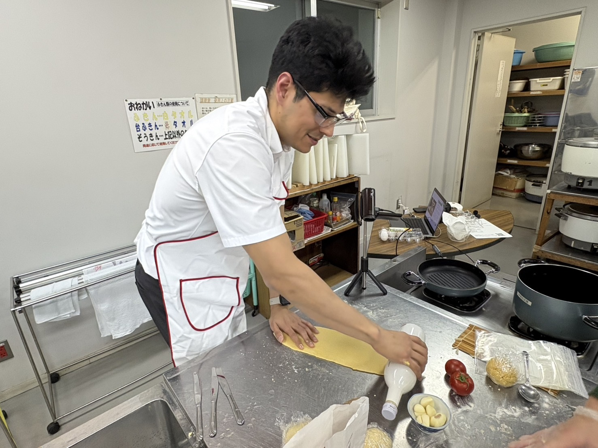
  <figcaption>
    <T>
      I read online you can use a bottle as a rolling pin, but I was too scared I would break it to use it properly.
      ネットでボトルを麺棒代わりにできると読んだのですが、割ってしまいそうで怖くて、ちゃんと押せませんでした。
      I used a bottle! I was scared to push too hard.
    </T>
  </figcaption>
</figure>

### <T>Trouble Begins!トラブル発生！Trouble!</T>

<figure>
  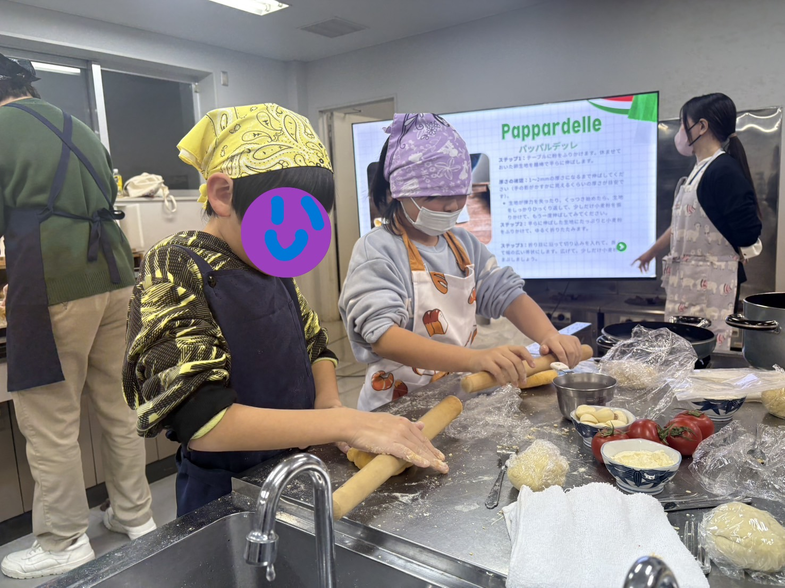
</figure>

<T>
  
    Rolling out the dough is where things got rough. It was taking a very long time, and we just weren't able to get it flat enough. I wonder if there was a problem with the kneading, or if the amount of flour was too much. Anyway, the first noodles ended up being a bit too thick, but time was running out, so we moved on!
  
  
    生地を伸ばすところで苦労しました。時間がかかる上に、なかなか薄く伸びなくて。こね方に問題があったのか、粉の量が多すぎたのか。いずれにせよ、最初のパスタは少し厚くなってしまいましたが、時間がなかったので次に進みました！
  
  
    It was so hard! I think I made a mistake.
  
</T>

<figure>
  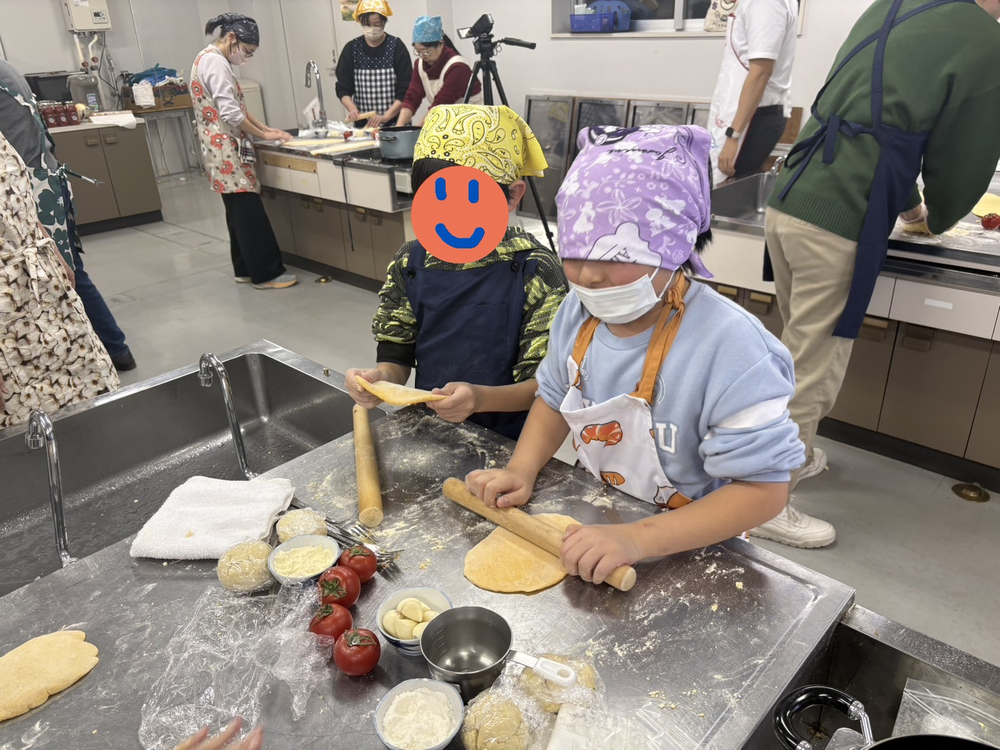
  <figcaption>
    <T>
      I think the kids weren't strong enough! I helped them but it was still so thick!
      子どもたちには力が足りなかったかも！私も手伝いましたが、それでもまだ厚かったです！
      The kids tried hard! But the dough was still too thick.
    </T>
  </figcaption>
</figure>

<T>
  
    The next types of noodles were a bit easier, but I didn't do a good job of explaining how to make them. To be honest, I had only made them once before, and I didn't demonstrate it properly! They were also a bit too thick, though they did look nice.
  
  
    次の種類のパスタは少し作りやすかったですが、説明がうまくできませんでした。正直に言うと、以前に一度しか作ったことがなく、きちんとデモができなかったんです！こちらも少し厚めになってしまいましたが、見た目はよかったです。
  
  
    The other noodles were ok. They look nice.
  
</T>

<figure>
  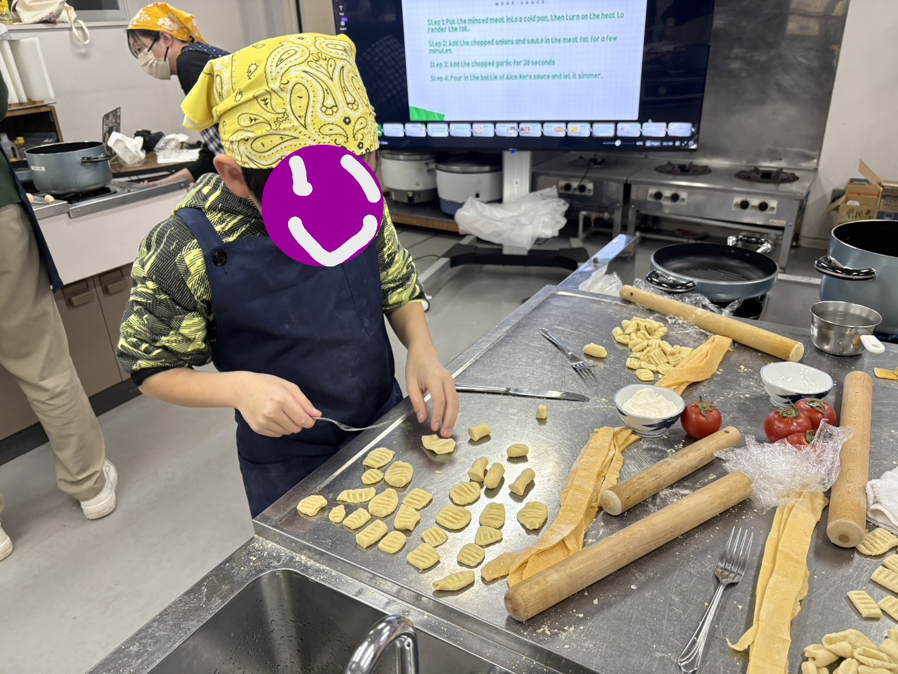
  <figcaption>
    <T>
      He's a pasta making expert!
      パスタ作りの達人だ！
      Wow! He's good at it!
    </T>
  </figcaption>
</figure>

<T>
  
    At this point, I was panicking a bit because it took so long to make the noodles, and we still had to make the sauce and the salad. I'm very grateful for my friend Luis and my coworkers who stepped in to help. Without them, I think the class would have taken 4 hours to finish!
  
  
    この時点でかなり焦っていました。パスタに時間がかかりすぎて、ソースとサラダがまだ残っていたんです。手伝ってくれた友人のルイスと同僚には本当に感謝しています。彼らがいなければ、クラスが終わるのに4時間かかっていたと思います！
  
  
    I was worried! My friends helped me.
  
</T>

<figure>
  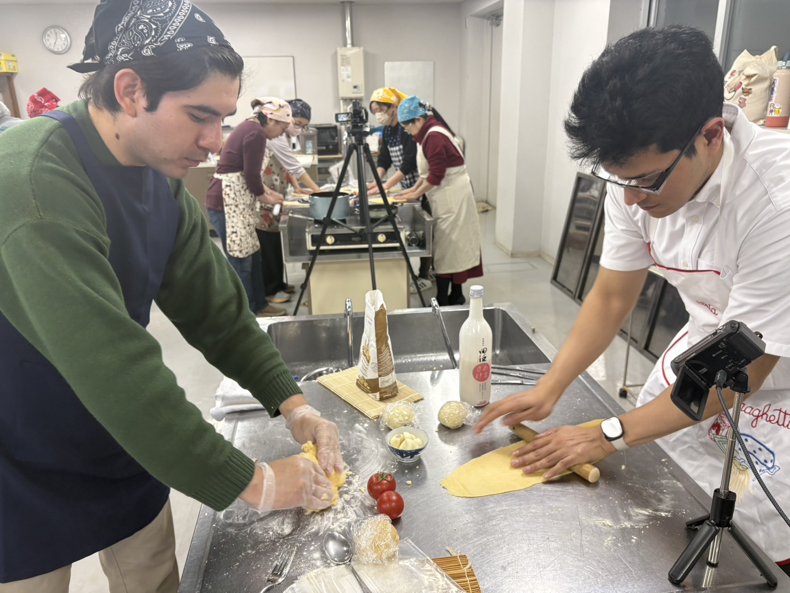
  <figcaption>
    <T>
      I managed to borrow a rolling pin.
      なんとか麺棒を借りられました。
      I borrowed a rolling pin!
    </T>
  </figcaption>
</figure>

<T>
  
    After the pasta troubles, things calmed down a bit, but my attendees were working overtime now! We quickly put together the sauce and the salad. At this point, I was running around like a{" "}
    <Explain meaning="very confused and busy, going in all directions">chicken with its head cut off</Explain>.
  
  
    パスタのトラブルが落ち着いてきましたが、参加者たちはもう残業状態！急いでソースとサラダを仕上げました。この頃の私は、完全にてんやわんやの状態でした。
  
  
    Everyone was working hard! I was confused!
  
</T>

<TwoImages src1={imgExtra3} src2={imgExtra4} />

## <T>Phew! Finished!ふぅ！完成！Finished!</T>

<figure>
  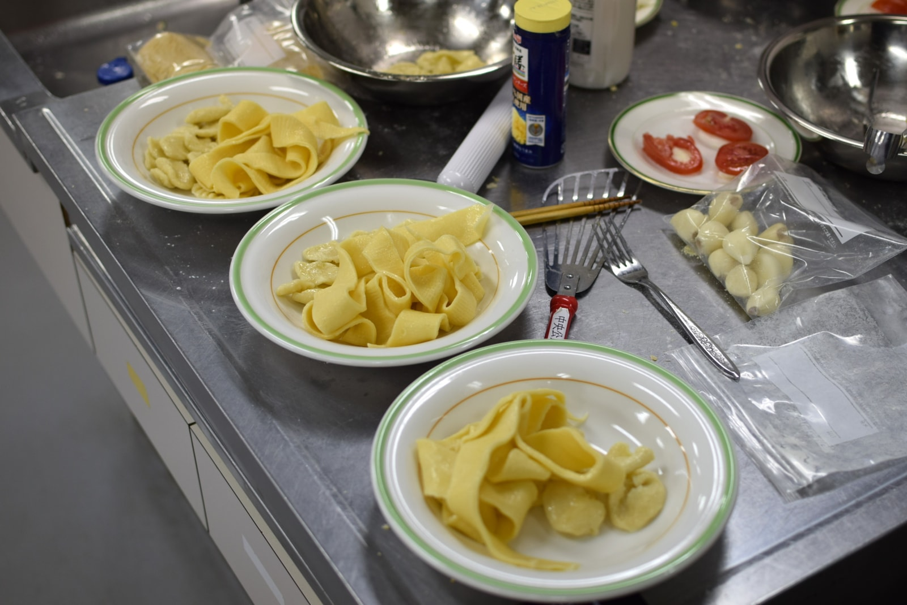
  <figcaption>
    <T>
      So thick!
      厚すぎる！
      So thick!
    </T>
  </figcaption>
</figure>

<figure>
  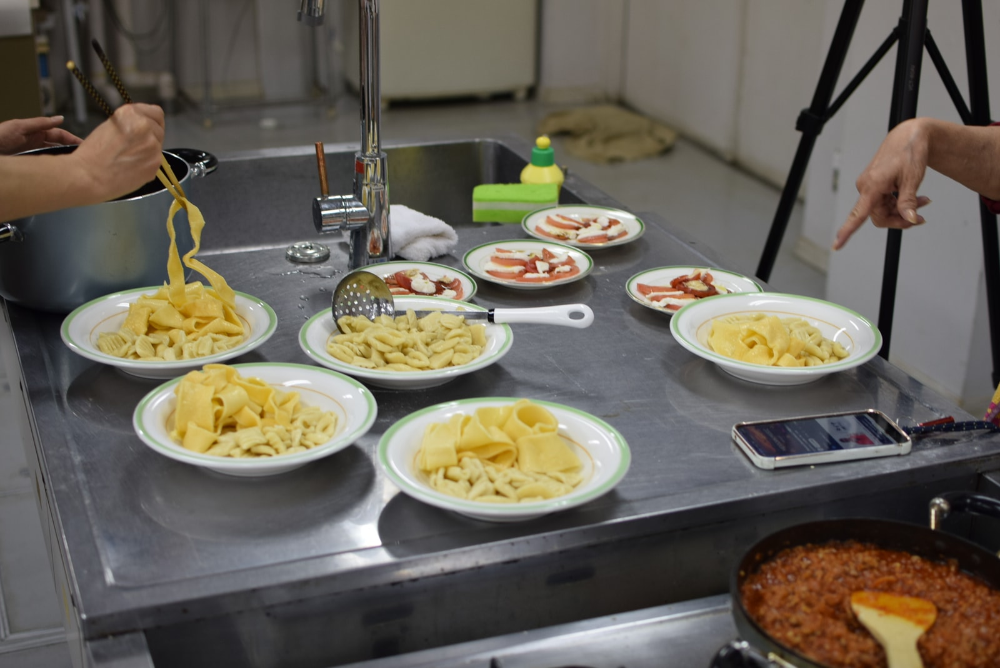
  <figcaption>
    <T>
      It's done! Wow!
      できた！すごい！
      It's done!
    </T>
  </figcaption>
</figure>

<T>
  
    Finally, just 20 minutes after the class was supposed to end, we finished. Everyone finished plating their meals, and we enjoyed the food. The noodles were a bit hard, and I forgot the crucial step of seasoning the meat, so it wasn't the best, to be honest! However, my incredibly kind attendees ate it up and told me they liked it.
  
  
    終了予定時刻を20分オーバーして、ようやく完成しました。全員が盛り付けを終え、みんなで食事を楽しみました。麺が少し硬くなってしまったし、肉の味付けという大事なステップを忘れてしまったので、正直最高の出来ではありませんでした！それでも、とても優しい参加者のみなさんが残さず食べてくれて、「おいしかった」と言ってくれました。
  
  
    We took a long time. The noodles were hard. My students were nice! Thank you!
  
</T>

<T>
  
    I'm very grateful to have been able to hold another cooking class in town, and even though it was a bit of a mess, I hope I will get the opportunity to try again in the future. I want to hold at least one class that ends within the stated time period!
  
  
    また町で料理教室を開くことができて、本当に嬉しかったです。少し混乱してしまいましたが、また機会があればぜひリベンジしたいです。いつか、時間通りに終わるクラスを一度は実現させたいと思っています！
  
  
    It was a little bit crazy! But I want to try again!
  
</T>

---
