import T from "../../components/i18n/T.astro";
import Gallery from "../../components/content/Gallery.astro";
import Explain from "../../components/content/Explain.astro";
import Quiz from "../../components/content/Quiz.astro";

<T>
  
    Recently I went and planted rice with Japanese 5th graders at the
    countryside elementary school where I work. It was an amazing experience
    that I will never forget, and today I would like to share it with you.
  
  
    最近、私は、自分が働いている田舎の小学校で、日本の5年生たちと一緒にお米を植えてきました。それは一生忘れられない素晴らしい経験で、今日はそれを皆さんにお伝えしたいと思います。
  
  
    I planted rice with Japanese 5th graders! I work at their school. It was so
    much fun. I want to tell you about it!
  
</T>

## <T>Not just garlic!ニンニクだけじゃない！Not just garlic!</T>

<T>
  
    I live in Takko-machi, which is a mountain farming town. It's famous for
    garlic, but that isn't the only crop grown here. I've personally seen corn,
    onions, apples, potatoes, pumpkins, and of course, rice. I've heard tobacco
    and mushrooms are also{" "}
    <Explain meaning="popular, widely grown">big</Explain> here.
  
  
    私は田子町という山あいの農業の町に住んでいます。ニンニクで有名ですが、ここで育てられている作物はそれだけではありません。私は実際に、トウモロコシ、玉ねぎ、りんご、じゃがいも、かぼちゃ、そしてもちろんお米を見てきました。タバコやきのこも、この辺りでは盛んだと聞いています。
  
  
    I live in Takko-machi. It is a farming town in the mountains. Takko is
    famous for garlic. But we grow other things too, like rice!
  
</T>

## <T>田植え: Rice Planting田植えPlanting Rice</T>

<figure>
  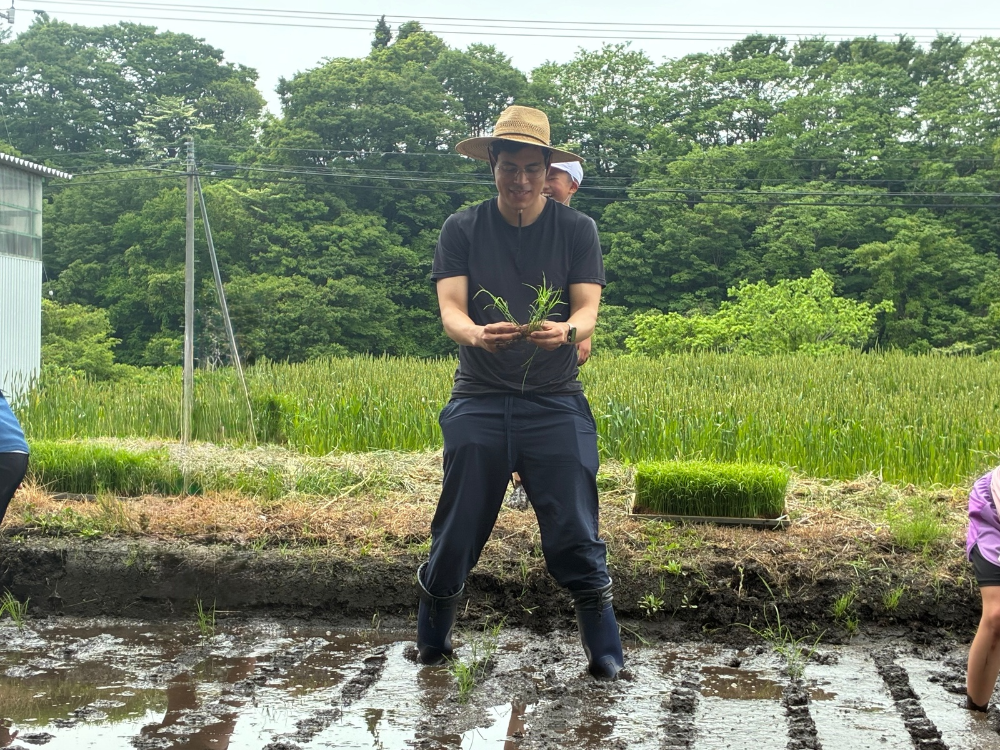
  <figcaption>
    <T>
      Do you like my hat?
      私の帽子、気に入った？
      Do you like my hat?
    </T>
  </figcaption>
</figure>

<T>
  
    Perhaps that's why every year the 5th graders have a rice cultivation
    experience. From seedling to mochi, the students grow their own rice. I've
    been fortunate enough to join them for three parts of this experience: the
    planting, or "taue" (田植え), the harvesting, or "inekari" (稲刈り), and the
    final step of turning it into mochi!
  
  
    おそらくそれが、毎年5年生が稲作体験をする理由なのでしょう。苗からお餅まで、生徒たちは自分のお米を育てます。私は幸運にも、この体験のうち3つの場面に参加させてもらいました。田植え（taue）、稲刈り（inekari）、そして最後にそれをお餅にする工程です！
  
  
    Every year, the 5th graders grow rice. They plant it. Then they harvest it. Finally they make mochi! I can help them three times: planting (taue),
    harvesting (inekari), and making mochi!
  
</T>

<figure>
  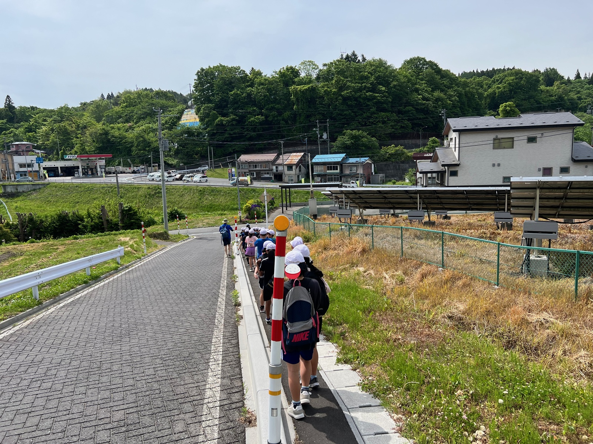
  <figcaption>
    <T>
      Walking to the rice field.
      田んぼへ歩いています。
      Let's go!
    </T>
  </figcaption>
</figure>

<T>
  
    In this post, I want to share my experience planting rice with the students
    in May. We <Explain meaning="left, departed">set off</Explain> in the
    morning directly from the school to the school's own rice field, Takko Tanbo.
  
  
    この記事では、5月に生徒たちと田植えをした体験を紹介したいと思います。私たちは朝、学校から直接、学校専用の田んぼである「田子田んぼ」へ出発しました。
  
  
    In May, we planted the rice. We walked from school to the rice field. It is
    called Takko Tanbo.
  
</T>

<figure>
  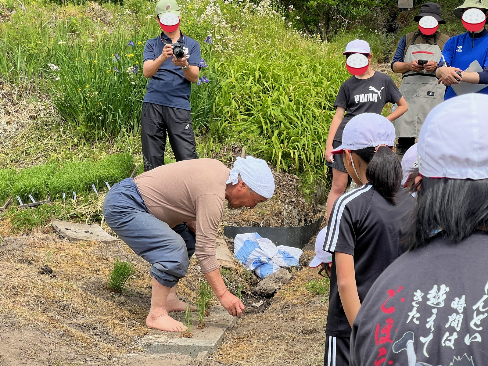
  <figcaption>
    <T>
      Learning how to plant the rice.
      お米の植え方を学んでいます。
      Watch and learn.
    </T>
  </figcaption>
</figure>

<T>
  
    The field is prepared and taken care of by Mr. Uto and his family. They are
    very kind. This is a picture of the rice plants the students grew in class
    up until now. They look great!
  
  
    この田んぼは、宇藤さんとそのご家族が準備し、世話をしてくださっています。皆さんとても親切です。これは、生徒たちがこれまで授業で育ててきた稲の写真です。とても立派ですね！
  
  
    Mr. Uto and his family take care of the field. They are very kind. The
    students grew these rice plants in class. They look great!
  
</T>

<figure>
  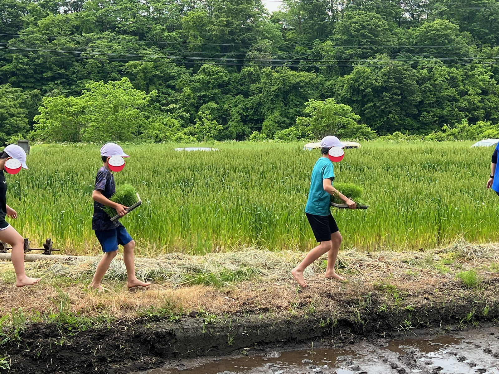
  <figcaption>
    <T>
      Carrying the seedling trays to the field.
      苗のトレーを田んぼへ運んでいます。
      Carrying the trays.
    </T>
  </figcaption>
</figure>

<T>
  
    After the short lecture, the students took the plants to their designated row in the field.
  
  
    短い説明のあと、生徒たちは苗を、田んぼの中の自分の決められた列まで運びました。
  
  
    The students carry the rice plants to the field.
  
</T>

<figure>
  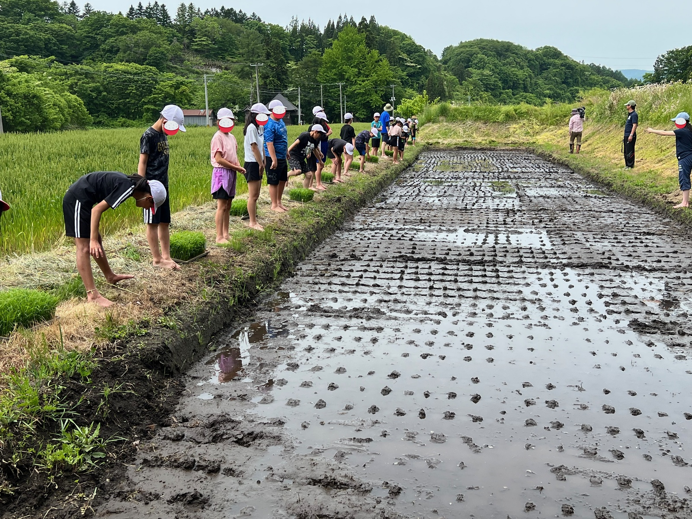
  <figcaption>
    <T>
      the students are hesitant to step in!
      生徒たちは足を踏み入れるのをためらっています！
      it's a little scary!
    </T>
  </figcaption>
</figure>

<T>
  
    The students take off their shoes and prepare to enter
    the muddy rice paddy in their assigned rows. They were hesitant at first,
    but once someone went in, everyone else followed.
  
  
    生徒たちは靴を脱ぎ、割り当てられた列で、泥だらけの田んぼに入る準備をします。最初はためらっていましたが、誰か一人が入ると、他のみんなも続きました。
  
  
    The students took off their shoes. The rice paddy is
    very muddy. They were scared at first. But once one student went in,
    everyone followed!
  
</T>

<figure>
  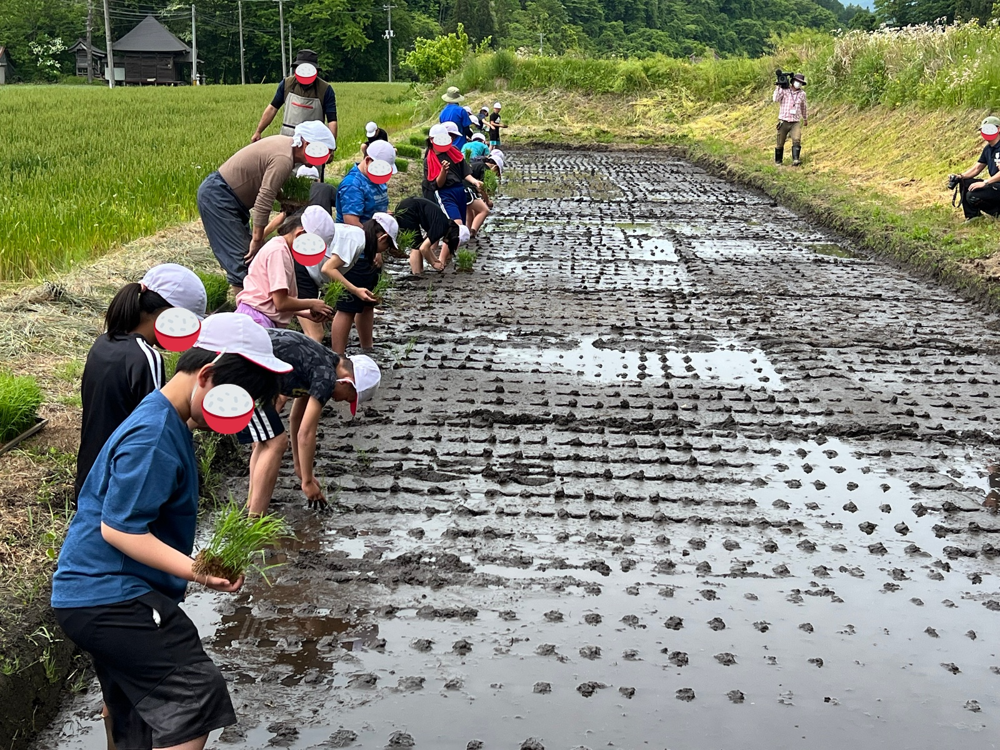
  <figcaption>
    <T>
      Starting to plant in neat rows.
      きれいな列に植え始めています。
      Start planting!
    </T>
  </figcaption>
</figure>

<T>
  
    We then began placing the rice plants into the ground in neat rows. You grab
    a few at a time, then stuff them into the mud with the stems sticking out.
    Walking through the mud is quite hard with my boots on. Maybe I should have
    gone barefoot too.
  
  
    それから私たちは、お米の苗をきれいな列に地面へ植え始めました。数本ずつ手に取り、茎が外に出るように泥の中へ押し込みます。長靴を履いたまま泥の中を歩くのは、なかなか大変です。私も裸足になればよかったかもしれません。
  
  
    We put the rice plants into the mud in straight lines. You push them in, and
    the stems stick out. Walking in the mud was hard in my boots!
  
</T>

<figure>
  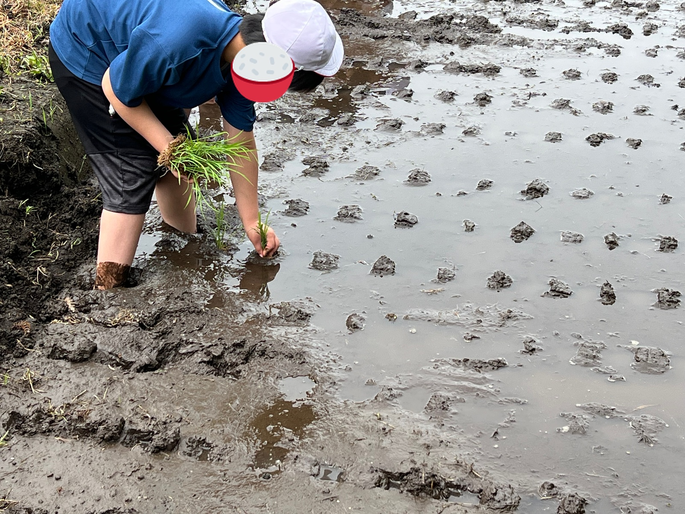
  <figcaption>
    <T>
      Pushing the plants into the mud.
      苗を泥の中へ押し込んでいます。
      Planting
    </T>
  </figcaption>
</figure>

<T>
  
    It was hard work but lots of fun. Luckily, I didn't fall in this time!
    Though I{" "}
    <Explain meaning="the other kids did fall in">can't say the same for the
    other kids</Explain>.
  
  
    大変な作業でしたが、とても楽しかったです。幸運にも、今回は転びませんでした！もっとも、他の子たちについては同じとは言えませんが。
  
  
    It was hard work, but so much fun! This time, I did not fall in the mud! But
    some kids did!
  
</T>

<figure>
  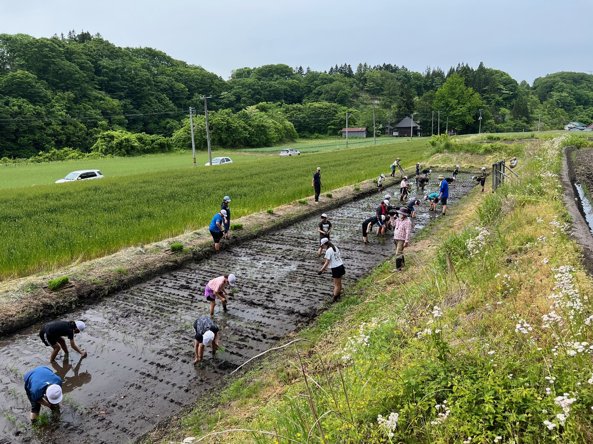
  <figcaption>
    <T>
      All the rows are planted!
      全ての列が植えられました！
      All done!
    </T>
  </figcaption>
</figure>

<T>
  
    It went well. Everyone's rows looked great. Being a farming town, some kids
    already had experience, so they finished quickly and cleaned up the other
    rows. How nice of them!
  
  
    うまくいきました。みんなの列はとてもきれいに見えました。農業の町なので、すでに経験のある子もいて、早く終わらせて他の列まで片付けてくれました。なんて親切なんでしょう！
  
  
    Everyone did a great job! Some kids have planted rice before. They finished
    fast and helped the others. How kind!
  
</T>

<figure>
  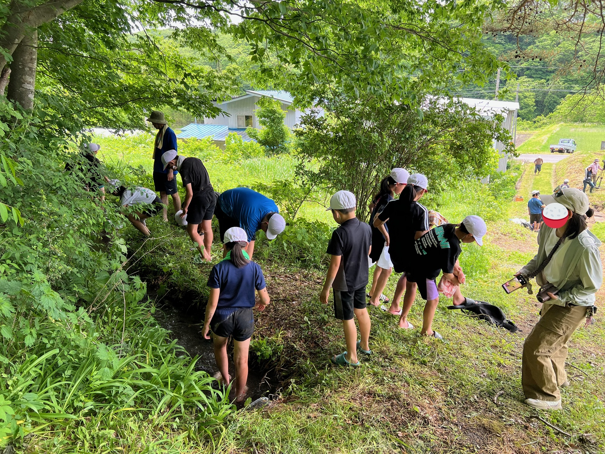
  <figcaption>
    <T>
      Washing off the mud.
      泥を洗い流しています。
      cleaning!
    </T>
  </figcaption>
</figure>

<T>
  
    The kids washed up in the aqueduct higher up, then we headed back to school
    to continue with the school day.
  
  
    子どもたちは、少し上の方にある用水路で体を洗い、それから学校に戻って、一日の授業の続きをしました。
  
  
    The kids washed the mud off in the water. Then we walked back to school.
  
</T>

<figure>
  
  <figcaption>
    <T>
      Walking back to school.
      学校へ歩いて戻っています。
      Going back to school.
    </T>
  </figcaption>
</figure>

<Quiz
  id="rice-planting-duration"
  correctAnswerIndex={0}
  question={{
    en: "Can you guess how long it took to plant the rice?",
    ja: "田植えにどれくらい時間がかかったと思いますか？",
    en_simple: "How long did it take to plant the rice?",
  }}
  options={[
    { en: "1 hour", ja: "1時間" },
    { en: "2 hours", ja: "2時間" },
    { en: "3 hours", ja: "3時間" },
    { en: "30 minutes", ja: "30分" },
  ]}
/>

## <T>What's NextこれからWhat's Next</T>

<T>
  
    We will return in fall for the harvest, and then finally make mochi in
    winter, but for now that's it. The Uto family will watch over the field
    until then.
  
  
    私たちは秋に収穫のために戻り、そして最後に冬にお餅を作りますが、今のところはここまでです。それまでは、宇藤さんご一家が田んぼを見守ってくれます。
  
  
    We will come back in fall to harvest the rice. In winter, we will make
    mochi! The Uto family will take care of the field.
  
</T>

<figure>
  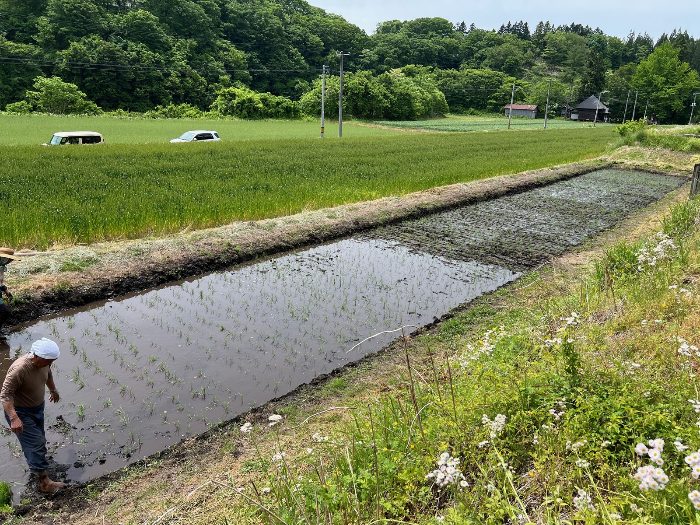
  <figcaption>
    <T>
      The field after planting.
      田植え後の田んぼ。
      Finished.
    </T>
  </figcaption>
</figure>

<T>
  
    I'm so grateful that I can have amazing experiences like this in the
    Japanese countryside. I never thought I would learn how to plant rice. It's
    an amazing part of Japanese culture that I'm glad I can share with everyone.
  
  
    日本の田舎で、このような素晴らしい経験ができることを、私はとてもありがたく思っています。お米の植え方を学ぶことになるとは、思ってもみませんでした。これは日本文化の素晴らしい一部で、それを皆さんと分かち合えることを嬉しく思います。
  
  
    I am so happy I can do things like this in the countryside. I never thought
    I would learn to plant rice! It is a special part of Japanese culture.
  
</T>

<figure>
  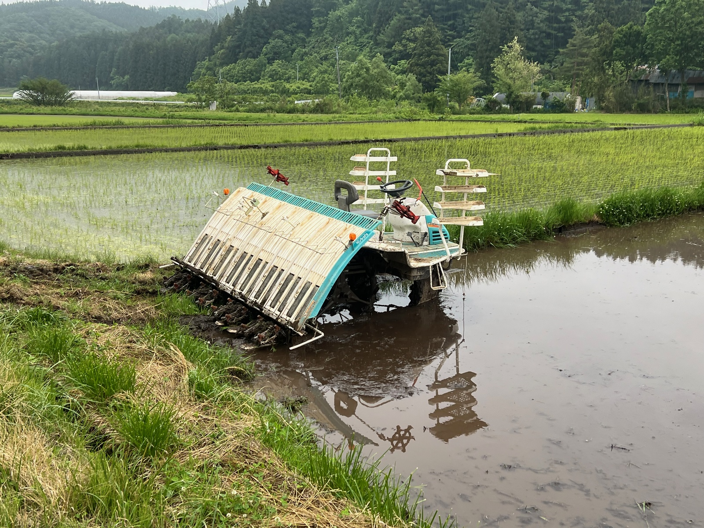
  <figcaption>
    <T>
      A rice-planting machine.
      田植え機。
      A rice machine!
    </T>
  </figcaption>
</figure>

<T>
  
    Actually, it seems most farmers these days use machines like this to plant
    the rice, though many still do it the old-fashioned way. It's hard work!
  
  
    実は、最近ではほとんどの農家さんが、お米を植えるのにこのような機械を使うようです。とはいえ、今でも多くの人が昔ながらの方法でやっています。大変な作業です！
  
  
    Many farmers use machines like this to plant rice. But some still do
    it by hand. It is hard work!
  
</T>

<Gallery>
  <figure>
    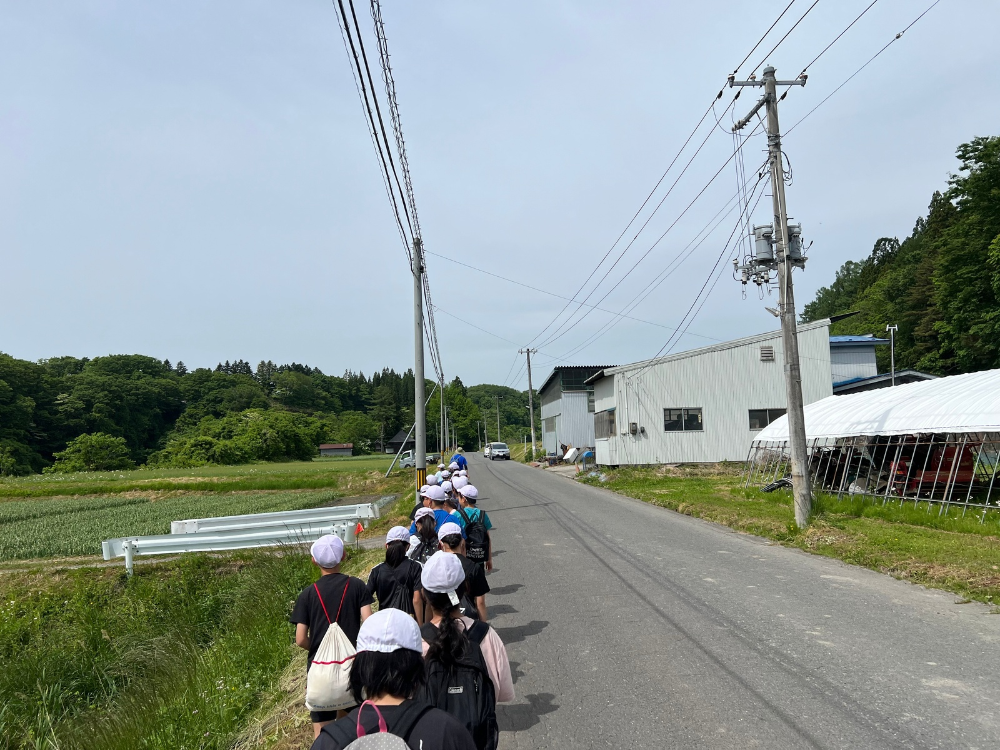
    <figcaption>
      <T>
        Almost there!
        もうすぐです！
        Almost there!
      </T>
    </figcaption>
  </figure>
  <figure>
    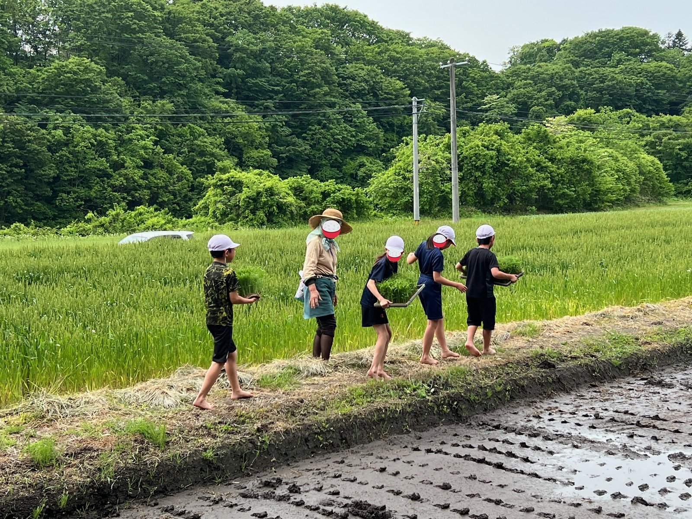
    <figcaption>
      <T>
        Walking with the seedlings.
        苗を持って歩いています。
        Walking with seedlings.
      </T>
    </figcaption>
  </figure>
  <figure>
    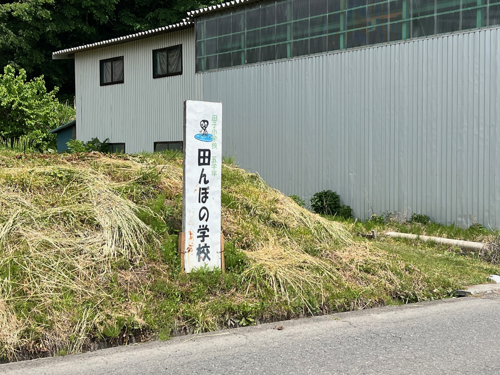
    <figcaption>
      <T>
        Tanbo no Gakkou.
        田んぼの学校。
        Tanbo no Gakkou.
      </T>
    </figcaption>
  </figure>
  <figure>
    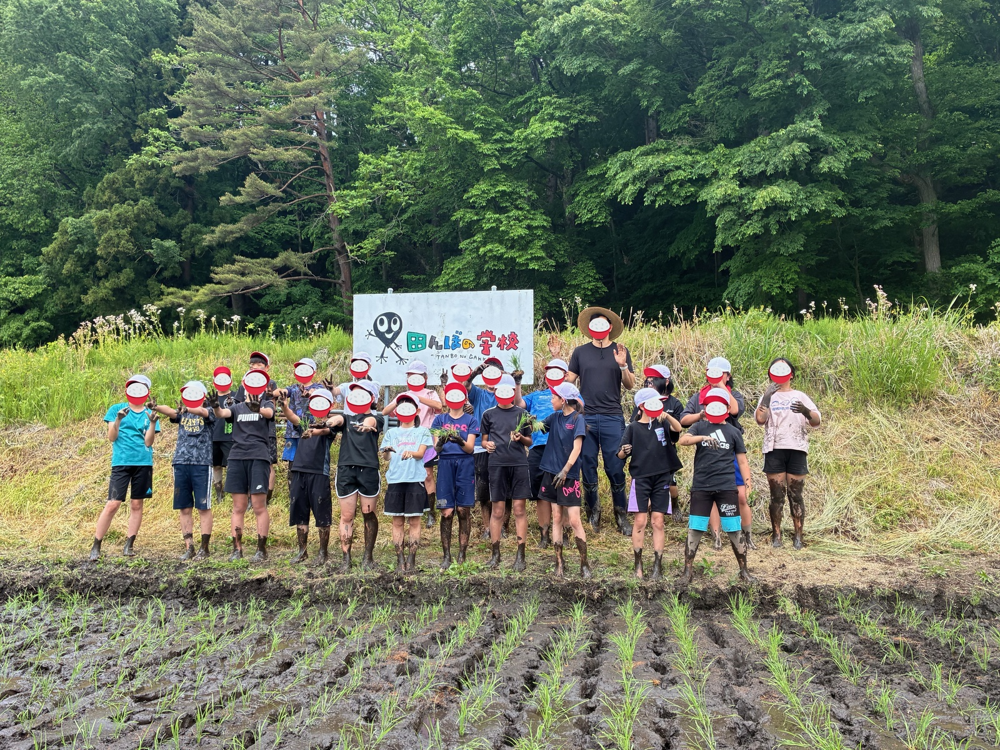
    <figcaption>
      <T>
        Group photo in the paddy.
        田んぼでの集合写真。
        Group photo!
      </T>
    </figcaption>
  </figure>
  <figure>
    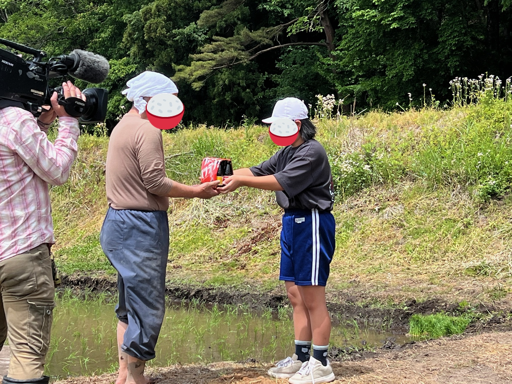
    <figcaption>
      <T>
        Giving a thank-you gift to the farmer.
        農家さんへお礼の贈り物を渡しています。
        A gift for the farmer!
      </T>
    </figcaption>
  </figure>
  <figure>
    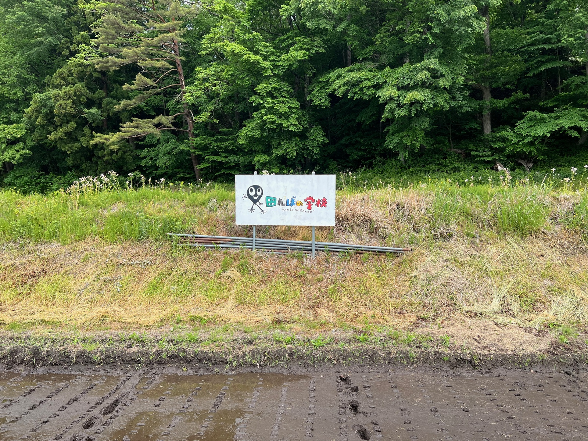
    <figcaption>
      <T>
        What is that character?
        あの字は何だろう？
        What is that character?
      </T>
    </figcaption>
  </figure>
</Gallery>
