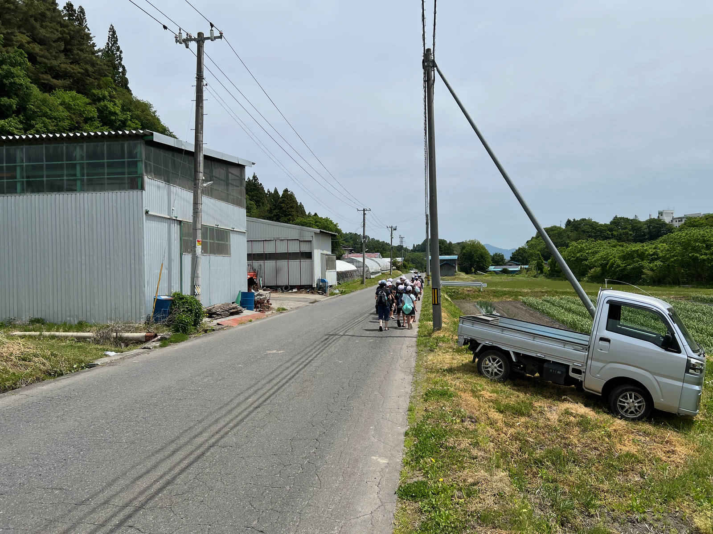

import T from "../../components/i18n/T.astro";
import Gallery from "../../components/content/Gallery.astro";

<T>
  
    Recently I went and planted rice with Japanese 5th graders at the
    countryside elementary school where I work. It was an amazing experience
    that I will never forget, and today I would like to share it with you.
  
  
    I planted rice with Japanese 5th graders! I work at their school. It was so
    much fun. I want to tell you about it!
  
</T>

## <T>Not just garlic!Not just garlic!</T>

<T>
  
    I live in Takko-machi, which is a mountain farming town. It's famous for
    garlic, but that isn't the only crop grown here. I've personally seen corn,
    onions, apples, potatoes, pumpkins, and of course, rice. I've heard tobacco
    and mushrooms are also big here.
  
  
    I live in Takko-machi. It is a farming town in the mountains. Takko is
    famous for garlic. But we grow other things too, like rice!
  
</T>

## <T>田植え: Rice PlantingPlanting Rice</T>

<figure>
  
  <figcaption>
    <T>
      The rice plants the students grew in class.
      The students' rice plants.
    </T>
  </figcaption>
</figure>

<T>
  
    Perhaps that's why every year the 5th graders have a rice cultivation
    experience. From seedling to mochi, the students grow their own rice. I've
    been fortunate enough to join them for three parts of this experience: the
    planting, or "taue" (田植え), the harvesting, or "inekari" (稲刈り), and the
    final step of turning it into mochi!
  
  
    Every year, the 5th graders grow rice. They grow it from a small plant all
    the way to mochi! I get to help them three times: planting (taue),
    harvesting (inekari), and making mochi!
  
</T>

<T>
  
    In this post, I want to share my experience planting rice with the students
    in May. We set off in the morning directly from the school to the school's
    own rice field, Takko Tanbo.
  
  
    In May, we planted the rice. We walked from school to the rice field. It is
    called Takko Tanbo.
  
</T>

<figure>
  
  <figcaption>
    <T>
      Learning how to plant the rice.
      The lesson.
    </T>
  </figcaption>
</figure>

<T>
  
    The field is prepared and taken care of by Mr. Uto and his family. They are
    very kind. This is a picture of the rice plants the students grew in class
    up until now. They look great!
  
  
    Mr. Uto and his family take care of the field. They are very kind. The
    students grew these rice plants in class. They look great!
  
</T>

<figure>
  
  <figcaption>
    <T>
      Walking to the rice field.
      Walking to the field.
    </T>
  </figcaption>
</figure>

<T>
  
    Placeholder text. Add your writing here.
  
  
    Placeholder text. Add your writing here.
  
</T>

<figure>
  
  <figcaption>
    <T>
      Ready to step into the mud!
      Ready to jump in!
    </T>
  </figcaption>
</figure>

<T>
  
    After a short lecture, the students take off their shoes and prepare to enter
    the muddy rice paddy in their assigned rows. They were hesitant at first,
    but once someone went in, everyone else followed.
  
  
    After a short lesson, the students took off their shoes. The rice paddy is
    very muddy! They were scared at first. But once one student went in,
    everyone followed!
  
</T>

<figure>
  
  <figcaption>
    <T>
      Starting to plant in neat rows.
      Start planting!
    </T>
  </figcaption>
</figure>

<T>
  
    We then began placing the rice plants into the ground in neat rows. You grab
    a few at a time, then stuff them into the mud with the stems sticking out.
    Walking through the mud is quite hard with my boots on. Maybe I should have
    gone barefoot too.
  
  
    We put the rice plants into the mud in straight lines. You push them in, and
    the stems stick out. Walking in the mud was hard in my boots!
  
</T>

<figure>
  
  <figcaption>
    <T>
      Pushing the plants into the mud.
      Into the mud!
    </T>
  </figcaption>
</figure>

<T>
  
    It was hard work but lots of fun. Luckily, I didn't fall in this time!
    Though I can't say the same for the other kids.
  
  
    It was hard work, but so much fun! This time, I did not fall in the mud! But
    some kids did!
  
</T>

<figure>
  
  <figcaption>
    <T>
      All the rows are planted!
      All done!
    </T>
  </figcaption>
</figure>

<T>
  
    It went well. Everyone's rows looked great. Being a farming town, some kids
    already had experience, so they finished quickly and cleaned up the other
    rows. How nice of them!
  
  
    Everyone did a great job! Some kids have planted rice before. They finished
    fast and helped the others. How kind!
  
</T>

<figure>
  
  <figcaption>
    <T>
      Washing off the mud.
      Washing up!
    </T>
  </figcaption>
</figure>

<T>
  
    The kids washed up in the aqueduct higher up, then we headed back to school
    to continue with the school day.
  
  
    The kids washed the mud off in the water. Then we walked back to school.
  
</T>

<figure>
  
  <figcaption>
    <T>
      Walking back to school.
      Going back to school.
    </T>
  </figcaption>
</figure>

## <T>What's NextWhat's Next</T>

<T>
  
    We will return in fall for the harvest, and then finally make mochi in
    winter, but for now that's it. The Uto family will watch over the field
    until then.
  
  
    We will come back in fall to harvest the rice. In winter, we will make
    mochi! The Uto family will take care of the field until then.
  
</T>

<figure>
  
  <figcaption>
    <T>
      The field after planting.
      The field is done!
    </T>
  </figcaption>
</figure>

<T>
  
    I'm so grateful that I can have amazing experiences like this in the
    Japanese countryside. I never thought I would learn how to plant rice. It's
    an amazing part of Japanese culture that I'm glad I can share with everyone.
  
  
    I am so happy I can do things like this in the countryside. I never thought
    I would learn to plant rice! It is a special part of Japanese culture.
  
</T>

<figure>
  
  <figcaption>
    <T>
      A rice-planting machine.
      A rice machine!
    </T>
  </figcaption>
</figure>

<T>
  
    Actually, it seems most farmers these days use machines like this to plant
    the rice, though many still do it the old-fashioned way. It's hard work!
  
  
    Today, most farmers use machines like this to plant rice. But some still do
    it by hand. It is hard work!
  
</T>

{/* REVIEW GALLERY — unused photos parked here so they're easy to look through.
    Move keepers up into the post; delete this whole block before publishing. */}
<Gallery>
  <figure>
    
    <figcaption>
      <T>
        Cover image option.
        Cover photo.
      </T>
    </figcaption>
  </figure>
  <figure>
    
    <figcaption>
      <T>
        A boy carrying a tray of seedlings.
        Carrying seedlings.
      </T>
    </figcaption>
  </figure>
  <figure>
    
    <figcaption>
      <T>
        Handing over a tray of seedlings.
        Sharing the seedlings.
      </T>
    </figcaption>
  </figure>
  <figure>
    
    <figcaption>
      <T>
        Carrying the seedling trays to the field.
        Carrying the trays.
      </T>
    </figcaption>
  </figure>
  <figure>
    
    <figcaption>
      <T>
        Walking with the seedlings.
        Walking with seedlings.
      </T>
    </figcaption>
  </figure>
  <figure>
    
    <figcaption>
      <T>
        The sign for the school's rice field.
        The rice field sign.
      </T>
    </figcaption>
  </figure>
  <figure>
    
    <figcaption>
      <T>
        Group photo in the paddy.
        Group photo!
      </T>
    </figcaption>
  </figure>
  <figure>
    
    <figcaption>
      <T>
        A farmer holding a crab from the paddy.
        A crab!
      </T>
    </figcaption>
  </figure>
  <figure>
    
    <figcaption>
      <T>
        Giving a thank-you gift to the farmer.
        A gift for the farmer!
      </T>
    </figcaption>
  </figure>
  <figure>
    
    <figcaption>
      <T>
        Another shot of the field sign.
        The field sign.
      </T>
    </figcaption>
  </figure>
</Gallery>
