import T from "~/components/T.astro";
import Quiz from "~/components/Quiz.astro";
import Gallery from "~/components/Gallery.astro";
import Explain from "~/components/Explain.astro";

<T>
  Hey, today I want to show you what a day of school lunch looks like at a Japanese Kindergarten. Actually, the same food is served at the local middle school and elementary school too, so it's a look into the school lunch that kids in the Japanese countryside eat every day!
  こんにちは。今日は日本の幼稚園の給食がどんな感じか紹介したいと思います。実は、地元の中学校や小学校でも同じ給食が出されているので、これは日本の田舎の子供たちが毎日食べている給食の様子そのものです！
  Hello. Today, let’s look at school lunch at a Japanese Kindergarten. The elementary school and junior high school eat the same food. This is a usual school lunch in the Japanese countryside.
</T>

<figure>
  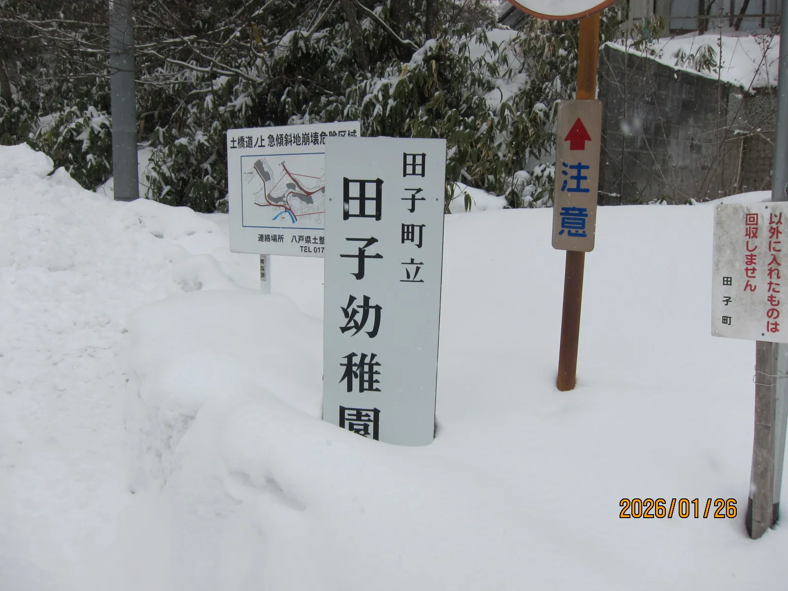
  <figcaption>
    <T>
      Takko Kindergarten Sign
      田子幼稚園の看板
      Sign
    </T>
  </figcaption>
</figure>

### <T>About Takko Kindergarten田子幼稚園についてAbout Takko Kindergarten</T>

<T>
  This is Takko Kindergarten. It's one of the last few public kindergartens in this region. It was built in the 60s, and many of the townspeople I know went there, including the current mayor! Two of the teachers who work here even attended when they were children.
  ここは田子幼稚園です。この地域に残る数少ない公立幼稚園の一つです。1960年代に建てられ、現在の町長を含め、私が知っている町の人たちの多くがここに通っていました！ここで働いている先生のうち2人も、子供の頃ここに通っていたそうです。
  This is Takko Kindergarten. It is an old school. It was built in the 1960s. Many people in this town went to this school. The town mayor went here too! The kindergarten teachers too!
</T>

<figure>
  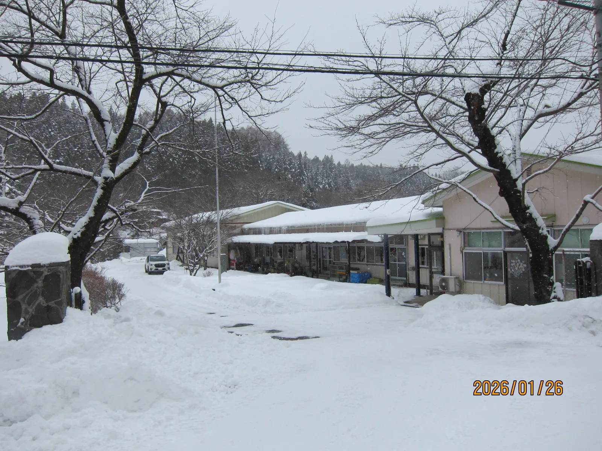
  <figcaption>
    <T>
      Takko Kindergarten
      田子幼稚園
      KINDERGARTEN
    </T>
  </figcaption>
</figure>

<Quiz
  id="school-lunch-students"
  correctAnswerIndex={0}
  question={{
    en: "How many students do you think are here?",
    ja: "園児は何人いると思いますか？",
    en_simple: "How many students?"
  }}
  options={[
    { en: "2", ja: "2人" },
    { en: "20", ja: "20人" },
    { en: "71", ja: "71人" },
    { en: "82", ja: "82人" }
  ]}
/>

<T>
  That's right, there are only two students! The school used to be full of kids, but like many other rural areas in Japan, the population has been steadily dropping in Takko, and many other schools have already closed. Actually, it's one of three remaining public kindergartens in the area, and the only public kindergarten in Takko Town. Ever since I arrived three years ago, the number of students has decreased. Takko Kindergarten is one of my favorite places in Takko, and I plan to write a blog post about it in the future, but for now it's...
  正解は、なんとたったの2人です！昔は子供たちで溢れていましたが、日本の他の多くの地方と同様に田子町でも人口が減少し続けており、多くの学校が閉校になっています。実は、この地域に残っている3つの公立幼稚園のうちの1つで、田子町では唯一の公立幼稚園なんです。私が3年前に来てからも、園児数は減ってしまいました。田子幼稚園は私のお気に入りの場所の一つなので、将来また別の記事で詳しく書きたいと思っていますが、とりあえず今は…
  Wow, only 2 students! Before, there were many children. But now, people are leaving the countryside. Many schools are closing. When I came here 3 years ago, there were more students. I like this school very much.
</T>

### <T>Lunch Time!給食の時間！Lunch Time!</T>

<T>
  A little before lunch time in Takko, the lunch center delivers to all three schools and leaves these huge metal boxes with the food inside.
  田子町ではお昼の少し前になると、給食センターが3つの学校すべてに給食を配達し、食べ物が入った大きな金属製の箱を置いていきます。
  It is lunch time! A lunch truck comes to the school. It brings big metal boxes. The food is inside.
</T>

<figure>
  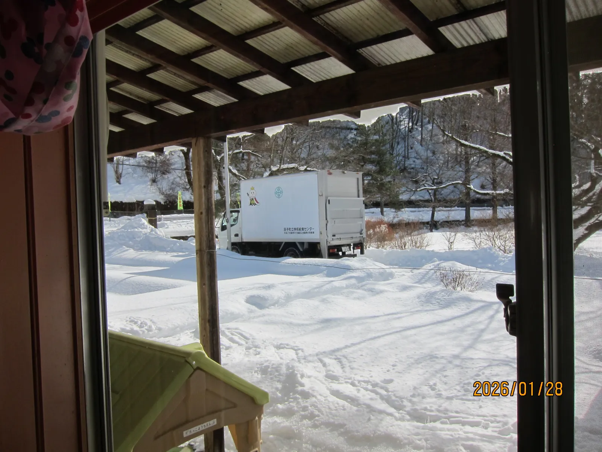
  <figcaption>
    <T>
      The lunch center staff deliver lunch to every school!
      給食センターのスタッフがすべての学校に給食を配達します！
      Lunch Truck!
    </T>
  </figcaption>
</figure>

<figure>
  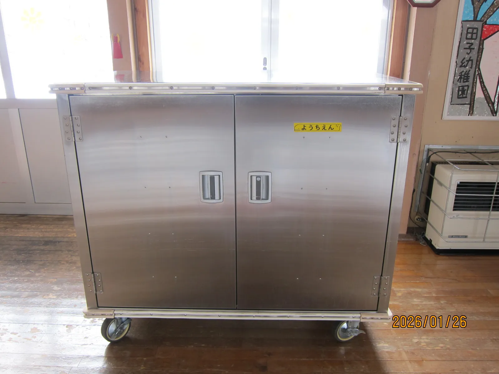
  <figcaption>
    <T>
      Lunch Container
      給食の缶
      Lunch Container
    </T>
  </figcaption>
</figure>

<T>
  At the other schools, serving the food is the students’ job. However, at kindergarten, the teachers fill the bowls and the students grab them. The only exception is the soup, because sometimes it's very hot, and the kids can be clumsy!
  他の学校では給食の配膳は生徒の仕事ですが、幼稚園では先生が器によそって、園児たちがそれを取りに行きます。ただ、スープだけは例外です。とても熱いことがありますし、子供たちがこぼしてしまうかもしれませんからね！
  At Elementary school, students serve the food. But at kindergarten, the teachers help. The soup is very hot, so it is dangerous!
</T>

<figure>
  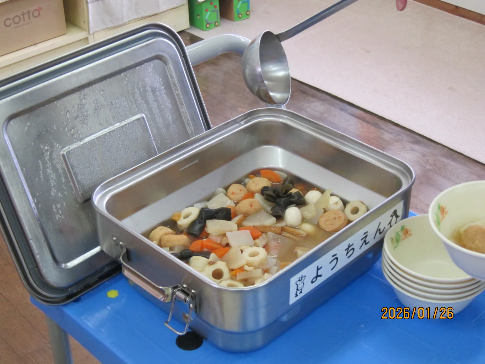
  <figcaption>
    <T>
      Serving Lunch
      給食の配膳
      Serving Lunch
    </T>
  </figcaption>
</figure>

<T>
  There are five items on the menu today: white rice, natto, a salad, soup, and milk. The lunch follows this basic pattern of carb, protein, vegetables, soup, and milk most days. There are exceptions, and Wednesdays are “International Food Days” so they are sometimes very different, but nutrition-wise it's got a bit of everything a growing kid needs.
  今日のメニューは、白米、納豆、サラダ、スープ、そして牛乳の5品です。給食はたいてい、炭水化物、タンパク質、野菜、スープ、牛乳というこの基本的なパターンに沿っています。例外もあり、水曜日は「国際食の日」なのでメニューが大きく変わることもありますが、栄養面では育ち盛りの子供に必要なものが少しずつ全部入っています。
  Today we have 5 foods: rice, natto, salad, soup, and milk. Usually, we have rice, meat or fish, vegetables, soup, and milk. It is very healthy.
</T>
### <T>Let's take a closer lookもう少し見てみようLet's look at each part!</T>

<T>
  Today's protein source is natto. Even though it's made from beans (and I love beans), it's one of the few Japanese foods that I don’t like very much. Being a fermented food, it's sticky and a bit smelly. It's unlike any food I ever had in America. By now I've gotten used to it, but it's not something I would <Explain meaning="make a special effort">go out of my way</Explain> to eat. I find the easiest way to <Explain meaning="finish eating">get it down</Explain> is by making <Explain meaning="classic and familiar">good ol'</Explain> beans and rice.
  今日のタンパク質源は納豆です。豆から作られていますが（私は豆が大好きなのですが）、数少ない私の苦手な日本食の一つです。発酵食品なのでネバネバしていて、少し匂いもあります。アメリカで食べたどの食べ物とも違いますね。今では慣れましたが、自分から進んで食べようとは思いません。一番食べやすい方法は、昔ながらの「豆ご飯」スタイルにしてかき込むことですね。
  Today we are eating natto. I like beans, but I do not like natto very much. It is sticky and smelly. We do not have natto in America. Now, I can eat it. But I usually mix it with rice.
</T>

<figure>
  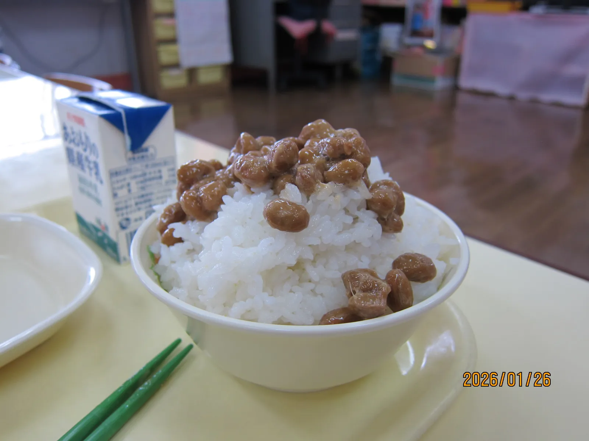
  <figcaption>
    <T>
      Natto
      納豆
      Natto
    </T>
  </figcaption>
</figure>

<T>
  Next is the rice. There is not much to say—it's rice, and Japanese people love rice! It's even grown in my town. On Wednesdays, it is often switched for bread, but otherwise, it's always there. Many people eat rice for every meal, including breakfast.
  次はご飯です。言うまでもありませんが、日本人はご飯が大好きですね！このお米は私の住む町で栽培されたものです。水曜日はパンに変わることも多いですが、それ以外はいつもご飯です。朝食を含め、毎食ご飯を食べる人も多いですよね。
  Next is rice. Japanese people love rice! This rice is from Takko. On Wednesdays, we eat bread. But usually, we eat rice. Many people eat rice for breakfast, lunch, and dinner.
</T>

<figure>
  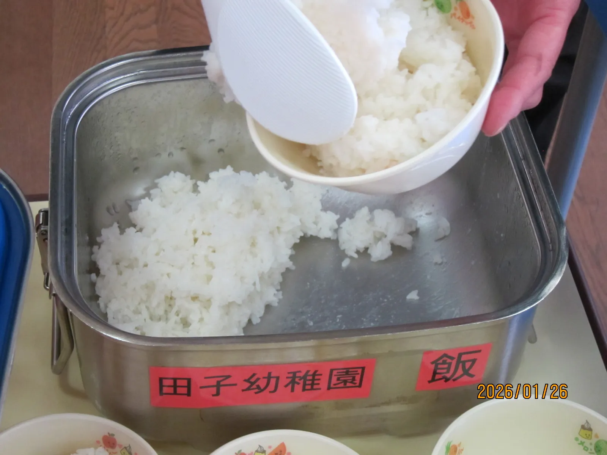
  <figcaption>
    <T>
      Rice
      ご飯
      Rice
    </T>
  </figcaption>
</figure>

<T>
  Here is our soup for today. This is a soup known as oden. It's made up of lots of different parts. If you’ve ever been to Japan, there’s a high chance you've seen it. I've even seen it served at convenience stores! My favorite part is the mochi kinchaku (a rice cake inside a tofu pouch). I like how the broth pops out when you bite into it!
  今日のスープはおでんです。たくさんの具材が入っています。日本に行ったことがあるなら、きっと見たことがあるでしょう。コンビニでも売っていますよね！私のお気に入りは餅巾着（油揚げの中にお餅が入っているもの）です。噛んだ時にジュワッとだし汁が出てくるところが好きです！
  This soup is Oden. It has many ingredients. It is famous in Japan. My favorite part is the mochi kinchaku. It is mochi inside tofu. It is delicious!
</T>

<figure>
  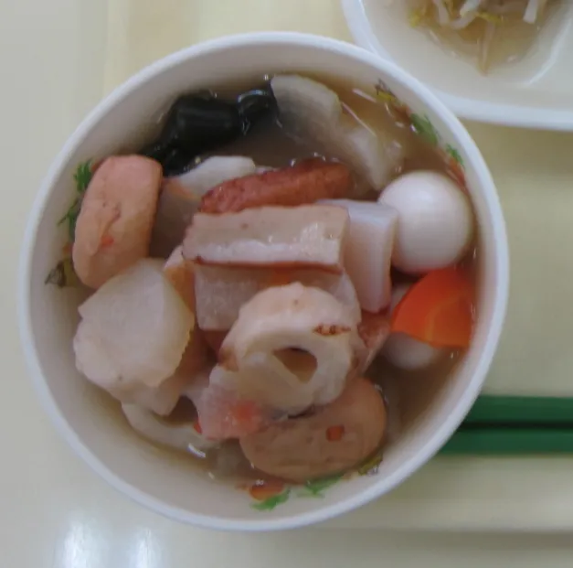
  <figcaption>
    <T>
      Oden Soup
      おでん
      Oden
    </T>
  </figcaption>
</figure>

<T>
  Next, the salad. In America, when you mention salad it almost always involves lettuce, but it's pretty different here. Today the main ingredient is bean sprouts. Other times it's beans, boiled spinach, seaweed, or even jellyfish.
  次はサラダです。アメリカでサラダと言うとたいていレタスが入っていますが、日本ではだいぶ違いますね。今日のメイン食材はもやしです。他にも豆、お浸し、海藻、さらにはクラゲが出ることもあります。
  Next is salad. In America, salad usually has lettuce. But Japanese salad is different. Today, it is bean sprouts. Sometimes we eat spinach, seaweed, or jellyfish!
</T>

<figure>
  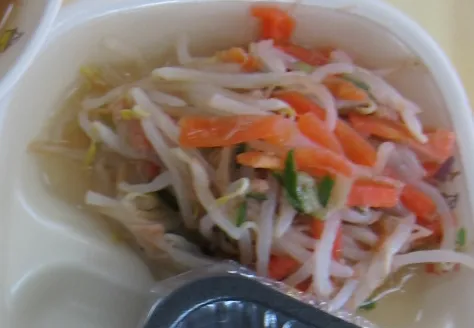
  <figcaption>
    <T>
      lots of bean sprouts salad
      サラダ
      Salad
    </T>
  </figcaption>
</figure>

<T>
  <Explain meaning="Important, even though it is last">Last but not least</Explain> is the drink. Made in Aomori (the prefecture Takko is in), it's the most delicious milk I've ever tasted! <Explain meaning="I am joking">Just kidding</Explain>, it tastes like ordinary milk to me! Sometimes it's switched for sweet yogurt drinks that the kids love, or local apple juice, since apples are what Aomori is famous for. You might notice my portions are a little big. That's because at kindergarten, there is often leftover food, and when I'm here it's my job to make sure it doesn’t <Explain meaning="be thrown away unused">go to waste</Explain>!
  最後は飲み物です。青森県産（田子町がある県です）の、今まで飲んだ中で一番美味しい牛乳です！…冗談です、私には普通の牛乳の味です！時々、子供たちが大好きな飲むヨーグルトや、青森名産のリンゴジュースに変わることもあります。私の食事が少し多いことに気づくかもしれませんが、幼稚園では給食が余ることが多いので、私が来るときは残さず食べるのが私の役目なんです！
  Last, the drink. It is Aomori milk. It tastes like normal milk. Sometimes we drink yogurt or Aomori apple juice. I got a lot of food. The kindergarten students cannot eat a lot. So, I eat the leftovers!
</T>

<figure>
  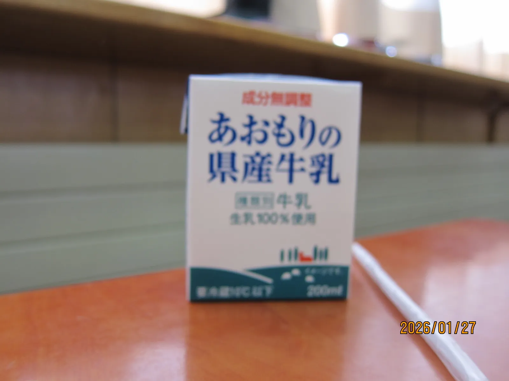
  <figcaption>
    <T>
      Blurry milk! My bad!
      ぼやけたミルクだ！ しまったな！
      Milk! It's hard to see. I'm sorry!
    </T>
  </figcaption>
</figure>

### <T>Delicious!おいしい！Delicious!</T>

<T>
  Speaking of back home, how does this lunch compare to what you ate in elementary school? Personally, as an adult, I much prefer Japanese school lunch. However, I think if I was a child, I would miss the pizzas and burgers that I remember eating. I also remember bringing my own lunch from home often, which I have never seen here. School lunch is generally very cheap or free here, and students aren’t even allowed to bring their own unless they get special permission for reasons such as allergies.
  私の故郷といえば、皆さんが小学校で食べたランチと比べてどうですか？個人的には、大人としては日本の給食の方が断然好きです。でも、もし子供だったら、昔食べていたピザやハンバーガーが恋しくなるかもしれません。あと、私はよく家からお弁当を持って行っていましたが、ここでは見たことがありません。ここでは給食はたいてい非常に安いか無料で、アレルギーなどの特別な許可がない限り、お弁当を持ってくることは禁止されています。
  What was your school lunch like? I like Japanese school lunch. But American lunch has pizza and hamburgers. Kids love that. Also, American kids bring lunch from home. In Japan, everyone eats school lunch. It is cheap and delicious.
</T>

<figure>
  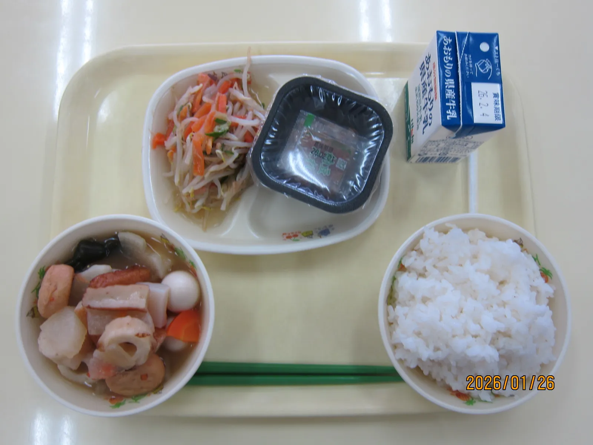
  <figcaption>
    <T>
      Everything together
      今日の給食
      School Lunch
    </T>
  </figcaption>
</figure>

<Quiz
  id="school-lunch-preference"
  question={{
    en: "Which school lunch do you prefer?",
    ja: "どっちの給食が好きですか？",
    en_simple: "Which do you like?"
  }}
  options={[
    { en: "Japanese Style", ja: "日本式" },
    { en: "American Style", ja: "アメリカ式" },
    { en: "Same / Don't Know", ja: "同じ / わからない" }
  ]}
/>

<T>
  After lunch, the kids put away their trays and utensils. Starting in elementary school, the students carry them back into the big metal boxes themselves. Something that makes school lunch here different from others within Japan is that the chopsticks are provided. I’ve been told by a teacher friend in Saitama that their students bring their own chopsticks. I wonder what else differs from school to school here.
  給食が終わると、子供たちはお盆や食器を片付けます。小学校からは、生徒たちが自分たちで大きな金属の箱まで運びます。ここの給食が日本の他の地域と違う点として、箸が用意されていることが挙げられます。埼玉県の教師の友人によると、向こうの生徒は自分の箸を持っていくそうです。他にも学校によってどんな違いがあるのか気になりますね。
  After lunch, the kids clean up. In Takko, the school gives us chopsticks. But in Saitama, students bring their own chopsticks. Every school is a little different.
</T>

<figure>
  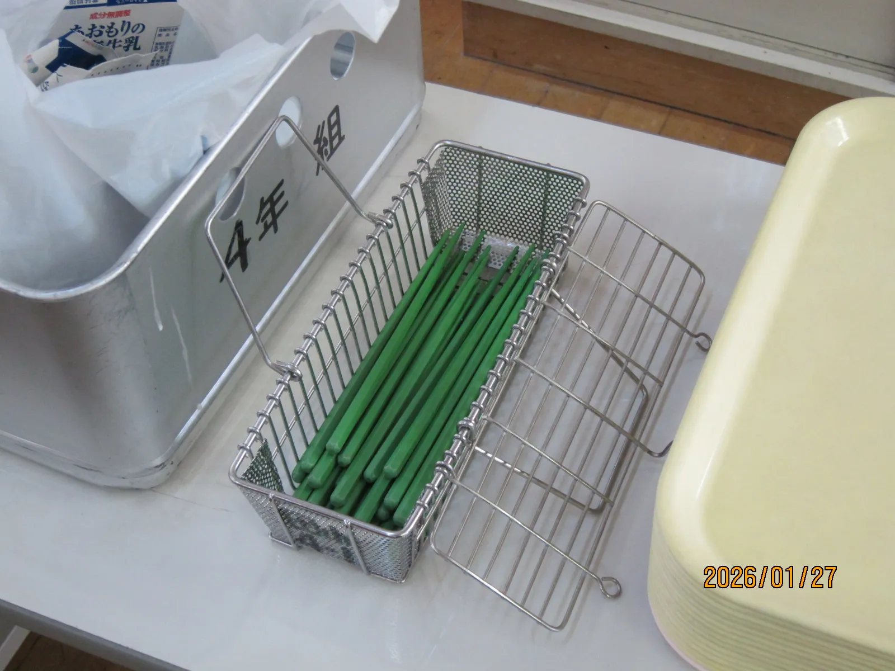
  <figcaption>
    <T>
      Chopsticks
      箸
      CHOPSTICKS
    </T>
  </figcaption>
</figure>

<T>
  After lunch, it's time for the kids to brush their teeth. People here often brush their teeth after every meal, which is very different from America. In America, we usually brush our teeth at night and in the morning. Though I have heard of people brushing after meals, it's rare in my experience.
  食後は歯磨きの時間です。ここでは毎食後に歯を磨く人が多いですが、これはアメリカとは大きく違います。アメリカでは普通、夜と朝に磨きます。食後に磨くという話も聞いたことはありますが、私の経験では稀ですね。
  After lunch, we brush our teeth. This is different from America. In America, we brush in the morning and at night. We don't usually brush after lunch.
</T>

<figure>
  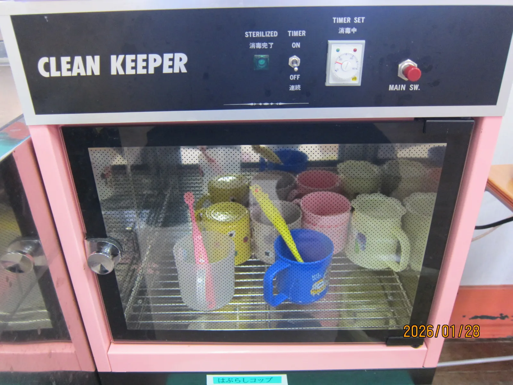
  <figcaption>
    <T>
      Toothbrush
      歯磨きセット
      TOOTHBRUSH
    </T>
  </figcaption>
</figure>

<T>
  I hope you enjoyed reading about school lunch in the Japanese countryside. It seems that even within Japan, there are small differences in how lunch time is done. I love eating school lunch here, even when it's natto day!
  日本の田舎の給食についての記事、楽しんでいただけましたか？日本国内でも、給食の時間には少しずつ違いがあるようです。私はここの給食が大好きです。納豆の日でもね！
  Did you enjoy reading about school lunch? There are many different styles in Japan. I love school lunch here. I even like natto day!
</T>

### <T>Bonus Pictures!おまけの写真！Pictures!</T>

<Gallery>
  <figure>
    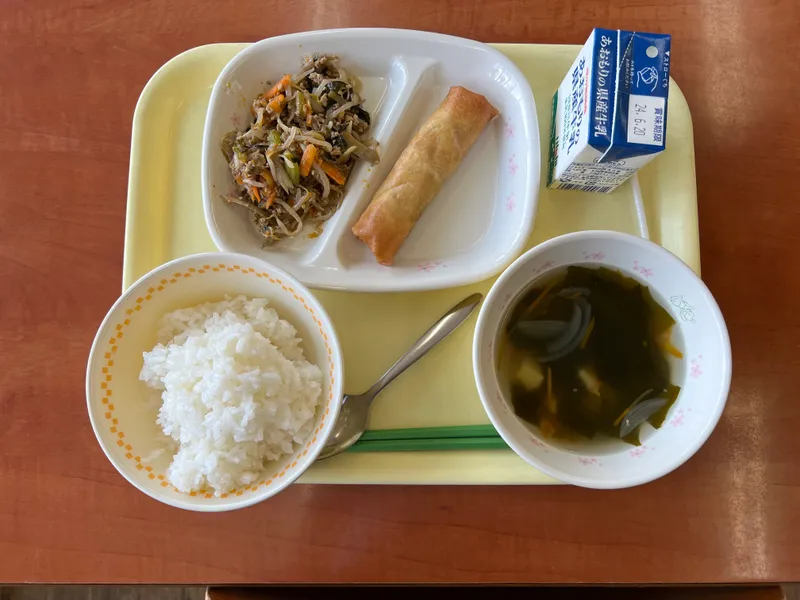
    <figcaption>
      <T>
        Eggroll Day!
        卵焼きの給食
        Eggroll!
      </T>
    </figcaption>
  </figure>

  <figure>
    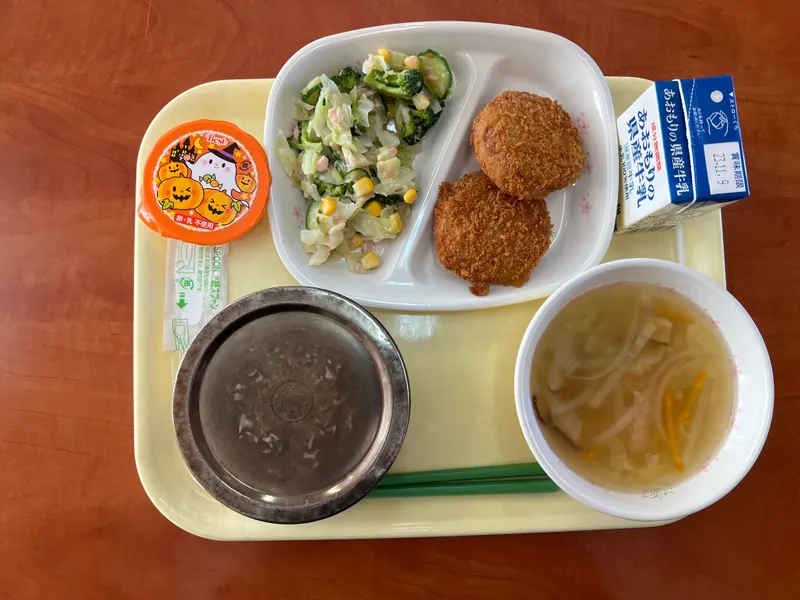
    <figcaption>
      <T>
        Halloween special dessert!
        ハロウィーン特別給食
        Halloween!
      </T>
    </figcaption>
  </figure>

  <figure>
    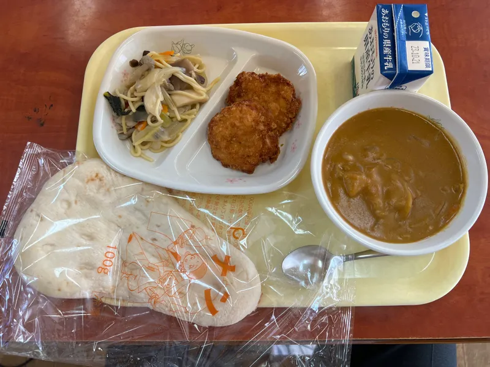
    <figcaption>
      <T>
        Naan bread
        ナンの給食
        Naan
      </T>
    </figcaption>
  </figure>

  <figure>
    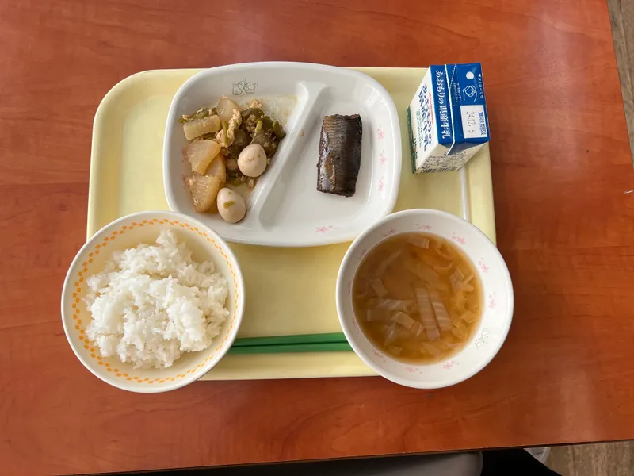
    <figcaption>
      <T>
        Grilled fish - very common!
        普通の給食
        Fish today!
      </T>
    </figcaption>
  </figure>

  <figure>
    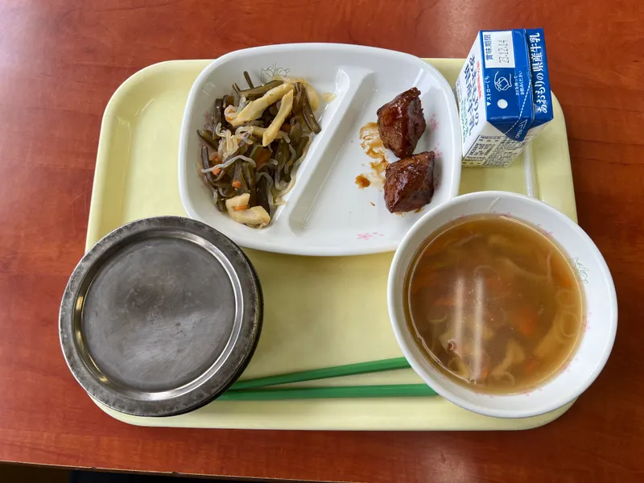
    <figcaption>
      <T>
        Seaweed Salad
        海藻の給食
        Seaweed
      </T>
    </figcaption>
  </figure>

  <figure>
    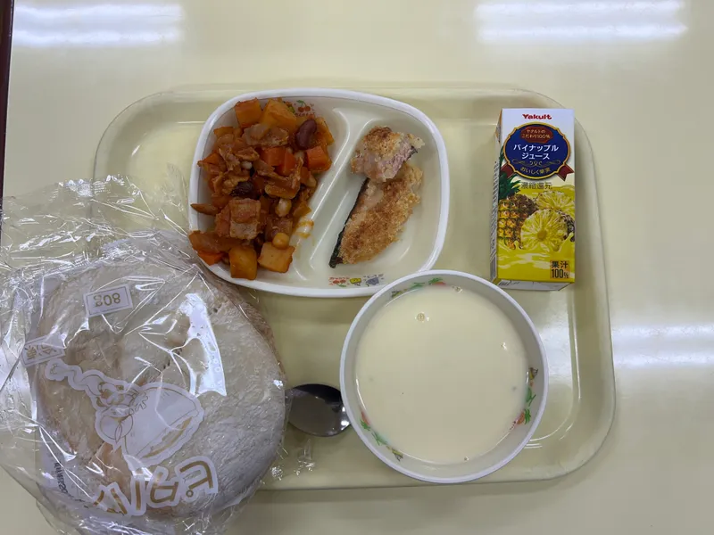
    <figcaption>
      <T>
        Special lunch today
        特別給食
        Special lunch!
      </T>
    </figcaption>
  </figure>
</Gallery>